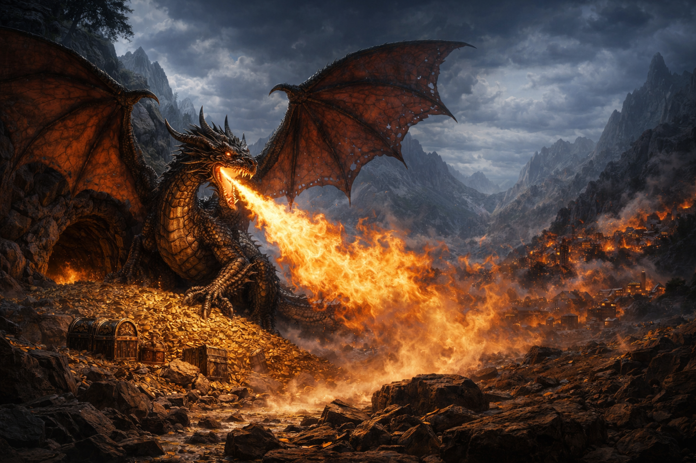
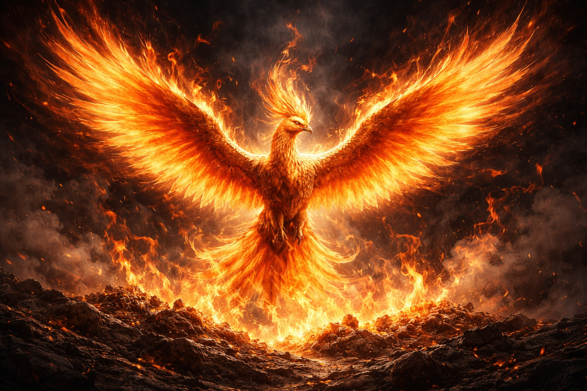
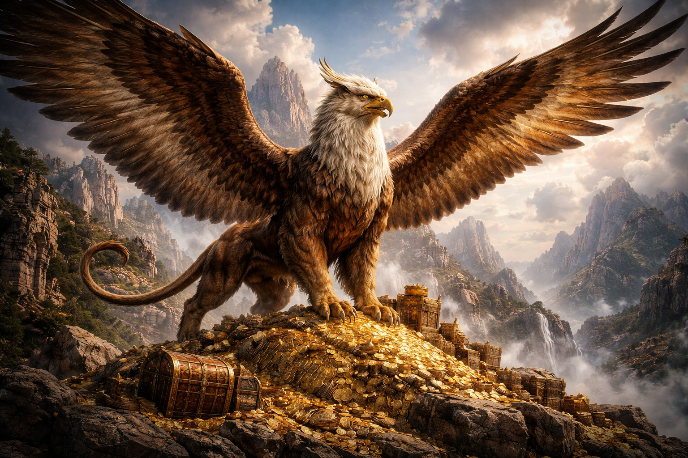
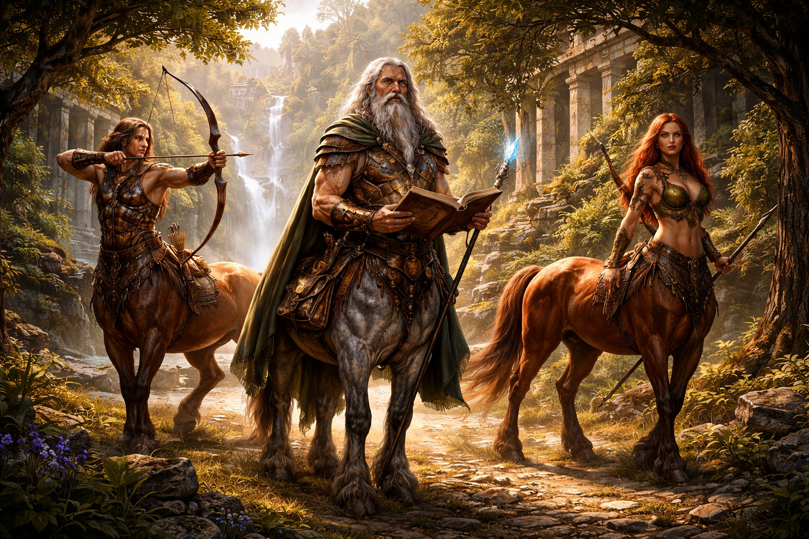
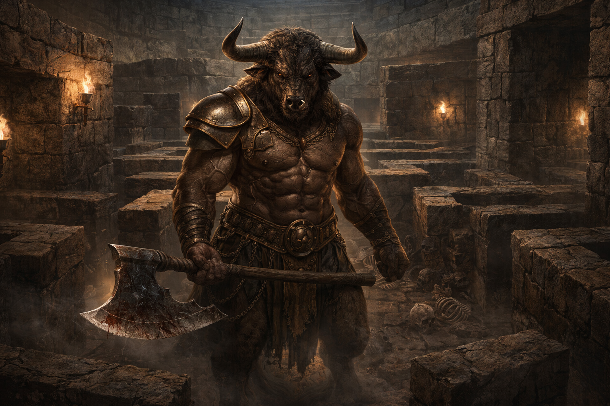
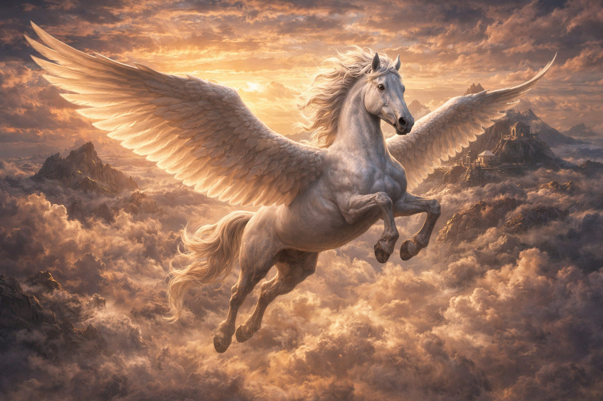
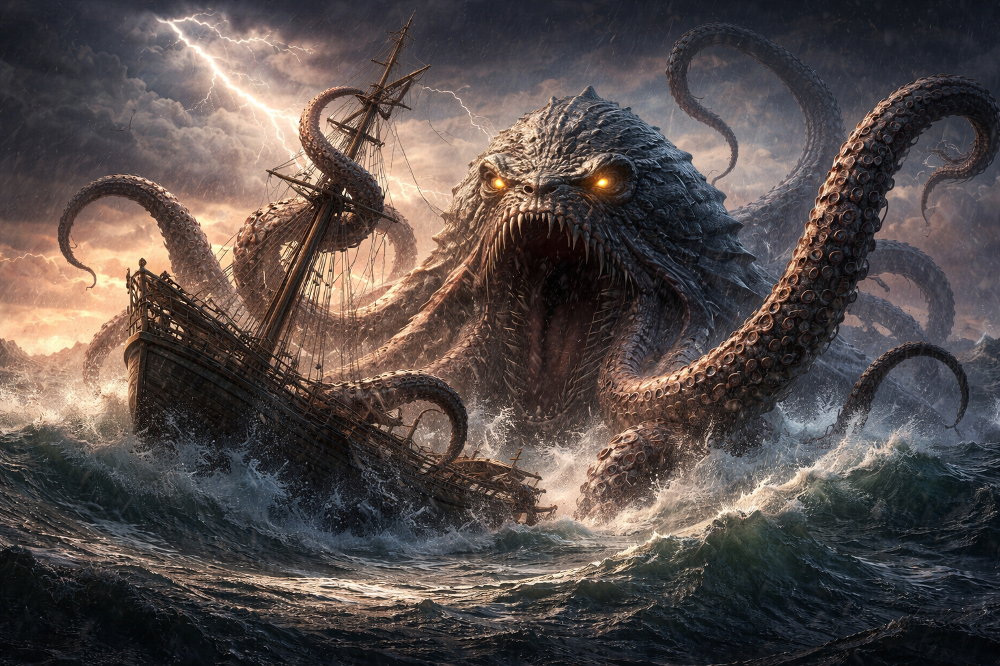
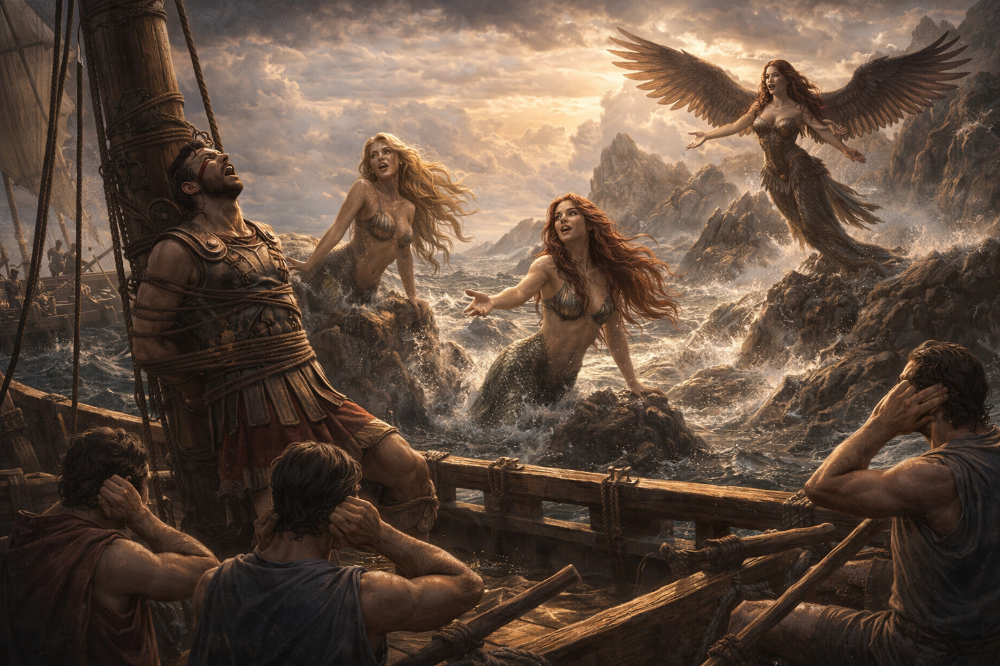
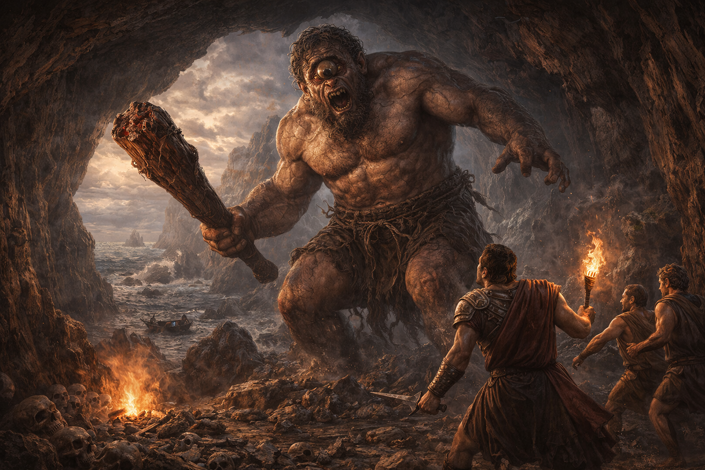

# Taxonomy of Mythical Beasts

## Summary

This chapter introduces the full menagerie of mythical creatures that serve as allegorical vehicles throughout the textbook, from dragons and phoenixes to krakens and cyclopes. It also establishes the foundational literary concepts — satire, allegory, and fable — that make the entire enterprise possible. A rigorous classification system is presented, because even creatures that do not exist deserve proper taxonomy.

## Concepts Covered

This chapter covers the following 18 concepts from the learning graph:

1. Dragon
2. Phoenix
3. Griffin
4. Centaur
5. Mermaid
6. Minotaur
7. Pegasus
8. Kraken
9. Siren
10. Cyclops
11. Satire
12. Allegory
13. Fable
14. Taxonomy
15. Beast Classification System
16. Creature Characteristics
17. Mythical vs Real Creatures
18. Bestiary Tradition

## Prerequisites

This chapter builds on concepts from:

- [Chapter 1: A Brief and Totally Accurate History of Unicorns](../01-history-of-unicorns/index.md)

---

!!! mascot-welcome "Welcome, Colleagues"

    
    You have survived the history of unicorns. You are now prepared
    to meet the rest of the cast. Some breathe fire. Some drown
    sailors. All of them have something to teach you about quarterly
    earnings reports.

## Why Classification Matters

Chapter 1 established that the unicorn is both a mythical creature and an economic category. But the unicorn does not operate alone. It is part of a larger ecosystem of imaginary beings, each serving a distinct function in humanity's ongoing effort to describe the world through creatures that are not in it. To study these creatures effectively, we need a classification system — a taxonomy.

Taxonomy is the science of naming, defining, and organizing things into categories. It was formalized by Carl Linnaeus in the 18th century for the purpose of cataloguing real organisms. Linnaeus did not, to anyone's knowledge, attempt to classify mythical beasts. This was an oversight. The mythical beast kingdom is at least as diverse as the animal kingdom and considerably better funded.

A proper beast classification system requires three things:

- A set of observable characteristics by which creatures can be distinguished from one another
- A hierarchical structure that groups similar creatures together
- A willingness to treat the entire exercise with the seriousness it does not deserve

This chapter provides all three.

## The Literary Foundations: Satire, Allegory, and Fable

Before we can classify beasts, we must understand why they exist in literature at all. Mythical creatures are not merely inventions of bored shepherds. They are narrative technologies — tools that writers have used for millennia to say things that cannot be said directly. Three literary traditions make this possible.

**Satire** is the use of humor, irony, and exaggeration to criticize human behavior and institutions. Satire does not announce itself. It does not say, "The following is a joke about your industry." It says something that sounds perfectly reasonable until the reader realizes it is devastating. The entire textbook you are reading is satire. If you did not realize this until now, the satire is working.

**Allegory** is a narrative in which characters, events, and settings represent abstract ideas or real-world counterparts. In an allegory, a dragon is not just a dragon — it is the embodiment of a force that destroys villages and livelihoods, which is to say it is a disruptive technology with wings. Every mythical beast in this textbook functions as an allegory. The mapping between beasts and their real-world counterparts will be addressed shortly and then never explained again.

**Fable** is a short story, typically featuring animals or mythical creatures, that conveys a moral lesson. Aesop wrote fables about foxes and crows. This textbook writes fables about dragons and centaurs. The difference is that Aesop's morals were about greed and vanity, while ours are about Series B funding and institutional paralysis. The underlying human failures are identical.

| Literary Device | Definition | Function in This Textbook |
|----------------|-----------|---------------------------|
| Satire | Humor used to criticize | The entire tone — deadpan absurdity applied to real phenomena |
| Allegory | Narrative where characters represent real things | Each beast = a real-world phenomenon (dragon = disruption, etc.) |
| Fable | Short moral story with non-human characters | Graphic novels and chapter narratives with mythical beast protagonists |

!!! mascot-thinking "A Critical Observation"

    
    The data is unambiguous. Every civilization that has used animals
    to comment on human behavior has produced better commentary than
    civilizations that attempted to comment on human behavior directly.
    The animals, it turns out, are more honest.

## The Bestiary Tradition

The classification of mythical beasts is not a modern invention. Medieval Europe produced a genre of illustrated manuscripts called bestiaries — encyclopedias of animals, both real and imaginary, each accompanied by a moral lesson. A typical bestiary entry would describe the creature's physical characteristics, habitat, and behavior, then explain what spiritual truth the creature symbolized.

The medieval bestiary made no distinction between real and mythical creatures. Lions, elephants, and pelicans appeared alongside dragons, unicorns, and basilisks, all treated with equal scholarly gravity. This was not because medieval scholars were foolish. It was because their classification system prioritized symbolic meaning over biological existence. An animal's purpose was not to exist. It was to mean something.

Key features of the bestiary tradition include:

- Each creature entry contained a physical description, a behavioral account, and a moral interpretation
- Illustrations were essential — bestiaries were among the most heavily illustrated manuscripts of the medieval period
- The line between "real" and "mythical" was drawn differently than it is today, if it was drawn at all
- Bestiaries were used as educational texts, teaching both natural history and Christian morality simultaneously
- The tradition persisted for over 500 years, making it one of the most successful textbook formats in history, and certainly more successful than the average edtech startup

This textbook is, in a very real sense, a modern bestiary. The creatures are imaginary. The moral lessons are about technology. The illustrations have been replaced by interactive simulations. The format endures because the format works.

## Creature Characteristics: A Framework for Classification

To classify mythical beasts systematically, we need a set of characteristics — observable properties that distinguish one creature from another. For real animals, these characteristics include things like number of legs, presence of feathers, and method of reproduction. For mythical beasts, the characteristics are somewhat different.

The classification framework used in this textbook evaluates each creature across six dimensions:

1. **Morphology** — What does the creature look like? How many species is it assembled from? A centaur is two (human + horse). A griffin is two (eagle + lion). A chimera is three (lion + goat + snake). Complexity of assembly correlates loosely with complexity of the phenomenon it represents
2. **Primary ability** — What can the creature do that real animals cannot? Fire-breathing, flight, immortality, and hypnotic song are common. "Disrupting legacy industries" is not listed in any classical bestiary but probably should be
3. **Disposition** — Is the creature fundamentally helpful, harmful, or ambivalent toward humans? This maps directly to whether the real-world phenomenon it represents is viewed as a threat, an opportunity, or a consulting engagement
4. **Habitat** — Where does the creature live? Mountains, oceans, labyrinths, and corporate headquarters are all valid answers
5. **Rarity** — How frequently is the creature encountered? Ranges from "common in folklore" to "sighted only in investor presentations"
6. **Allegorical function** — What does the creature represent in the context of modern technological disruption? This is the most important characteristic for our purposes and the one no medieval bestiary thought to include

#### Diagram: Beast Classification Framework

<iframe src="../../sims/beast-classification-framework/main.html" width="100%" height="510px" scrolling="no"></iframe>

Beast Classification Framework

Type: infographic
**sim-id:** beast-classification-framework 
**Library:** p5.js 
**Status:** Specified

**Bloom Taxonomy:** Analyze (L4)
**Bloom Verb:** Classify, Compare
**Learning Objective:** Students will classify mythical beasts according to the six-dimension framework and compare creature characteristics to identify patterns in how allegorical functions map to morphological features.

Purpose: Interactive classification tool where students can select any mythical beast and see its ratings across all six dimensions, then compare two beasts side by side.

Visual elements:
- Left panel: Dropdown menu listing all 10 mythical beasts from this chapter (Dragon, Phoenix, Griffin, Centaur, Mermaid, Minotaur, Pegasus, Kraken, Siren, Cyclops)
- Center panel: Radar/spider chart showing the selected creature's ratings across 6 dimensions (Morphology complexity 1-5, Primary ability power 1-5, Disposition -2 to +2, Habitat accessibility 1-5, Rarity 1-5, Allegorical weight 1-5)
- Right panel: Creature info card showing name, brief description, allegorical function, and a "Modern Equivalent" field (e.g., Dragon → "Disruptive AI that automates entire departments")
- Bottom: "Compare Mode" toggle that splits the radar chart to overlay two creatures

Interactive controls:
- Dropdown: Select creature (default: Dragon)
- Toggle button: "Compare Mode" — when active, shows a second dropdown and overlays both radar charts
- Button: "Randomize" — selects a random creature for quick exploration
- Hover over any radar axis to see dimension definition in tooltip

Default parameters:
- Selected creature: Dragon
- Compare mode: Off
- Canvas responsive to container width

Data for each creature (Morphology, Ability, Disposition, Habitat, Rarity, Allegory):
- Dragon: 3, 5, -2, 3, 2, 5
- Phoenix: 2, 5, 1, 4, 5, 4
- Griffin: 4, 3, 0, 3, 3, 3
- Centaur: 4, 2, 1, 2, 2, 5
- Mermaid: 3, 3, 0, 4, 3, 3
- Minotaur: 3, 2, -2, 1, 5, 4
- Pegasus: 2, 3, 2, 4, 4, 3
- Kraken: 2, 5, -2, 5, 4, 4
- Siren: 2, 4, -2, 3, 3, 4
- Cyclops: 2, 2, -1, 2, 3, 3

Instructional Rationale: A radar chart with compare mode supports Analyze-level classification by requiring students to evaluate multiple dimensions simultaneously and identify patterns across creatures. The comparison overlay makes structural similarities and differences visually immediate rather than requiring students to hold data in working memory.

Implementation: p5.js with createSelect() dropdowns and createButton() controls. Radar chart drawn with vertex() in polar coordinates. Responsive canvas using updateCanvasSize() in setup().

## The Beasts: A Complete Catalogue

What follows is a comprehensive survey of the ten mythical beasts that appear throughout this textbook. Each entry follows the bestiary tradition: physical description, behavioral tendencies, and allegorical function. Unlike medieval bestiaries, ours also includes a "Modern Equivalent" field, because the creatures of myth are alive and well — they have simply changed industries.

### The Dragon

The dragon is a large, fire-breathing reptilian creature found in mythologies across every inhabited continent. European dragons tend to hoard gold in mountain caves and terrorize villages. Chinese dragons tend to bring rain and symbolize imperial authority. Both types are enormous, powerful, and fundamentally indifferent to the concerns of the smaller creatures they displace.

**Allegorical function:** The dragon represents disruptive technology — specifically, the kind that destroys existing industries and livelihoods while being too powerful to oppose directly. When a dragon arrives at your village, you do not negotiate. You evacuate, you adapt, or you are consumed. The same applies when a large language model arrives at your accounting firm.

### The Phoenix

The phoenix is a bird that burns to death and is reborn from its own ashes. It appears in Greek, Egyptian, and Chinese mythology, and in the mission statements of approximately 40% of companies that have undergone a "digital transformation." The phoenix's defining trait is not immortality — it dies, repeatedly. Its defining trait is the insistence that each death is actually a rebirth.

**Allegorical function:** The phoenix represents industries and institutions that claim to reinvent themselves after disruption. Some genuinely do. Others simply catch fire and call it a strategy.

### The Griffin

The griffin has the body of a lion and the head and wings of an eagle — the king of beasts merged with the king of birds. It is, in mythological terms, a corporate merger. Griffins were traditionally guardians of treasure and divine power, positioned at the boundary between the earthly and the celestial.

**Allegorical function:** The griffin represents hybrid technologies and organizations that combine two powerful elements but struggle with integration. Half eagle, half lion, fully unable to decide which board of directors to report to.

### The Centaur

The centaur is half human, half horse. In Greek mythology, centaurs were known for their dual nature — the wisdom of man combined with the power and instinct of the horse. Some centaurs, like Chiron, were scholars and healers. Others were violent and unpredictable. This range is not a contradiction. It is a feature.

**Allegorical function:** The centaur represents human-AI collaboration — the centaur workforce. The promise is that combining human judgment with machine capability produces something greater than either alone. The reality, as with actual centaurs, is that the two halves do not always agree on which direction to gallop.

### The Mermaid

The mermaid is half human, half fish, typically depicted as beautiful from the waist up and scaly from the waist down. Mermaids appear in the mythology of virtually every seafaring culture, usually in stories about sailors who saw something in the water and made some regrettable assumptions.

**Allegorical function:** The mermaid represents the attractive surface of technology products that conceal an unfamiliar and potentially incompatible reality beneath. The demo is beautiful. The implementation is fish.

### The Minotaur

The minotaur has the body of a man and the head of a bull. In Greek mythology, it lived at the center of the Labyrinth on Crete, built by Daedalus, and consumed a regular tribute of youths sent from Athens. The minotaur did not choose to live in a labyrinth. It was put there by an institution that found the creature inconvenient but could not bring itself to address the underlying problem.

**Allegorical function:** The minotaur represents bureaucratic obstacles — the terrifying thing at the center of the institutional maze that everyone must navigate but nobody wants to confront. It is the legacy system. It is the compliance department. It is the committee that has been meeting for three years.

### The Pegasus

Pegasus is a winged horse from Greek mythology, born from the blood of Medusa when Perseus beheaded her. Pegasus was tamed by Bellerophon and used to defeat the Chimera, after which Bellerophon attempted to fly to Mount Olympus and was thrown off. The lesson, as always with Greek mythology, is that success makes people overconfident.

**Allegorical function:** Pegasus represents technologies that are genuinely useful but inspire their users to attempt things far beyond the technology's actual capabilities. The horse can fly. It cannot, however, fly to the realm of the gods. The gap between what a tool can do and what its users believe it can do is the Pegasus problem.

### The Kraken

The kraken is a colossal sea creature from Scandinavian mythology, typically depicted as a giant squid or octopus capable of dragging entire ships to the ocean floor. The kraken lives in the deep and surfaces only occasionally, at which point it is too late to do anything about it.

**Allegorical function:** The kraken represents large-scale technology failures — the kind that surface without warning, are too massive to contain, and pull entire organizations underwater. The kraken is the data breach. The kraken is the outage. The kraken is the realization, on a Tuesday afternoon, that the AI has been hallucinating the quarterly reports.

### The Siren

Sirens in Greek mythology were creatures — sometimes depicted as bird-women, sometimes as mermaids — whose beautiful singing lured sailors to crash their ships on rocky shores. Odysseus survived by having his crew plug their ears with wax while he had himself tied to the mast, combining curiosity with restraint in a way that most technology executives have not replicated.

**Allegorical function:** The siren represents the seductive promise of automation — the song that says "set it and forget it," "fully autonomous," "zero human intervention required." Organizations that follow the siren song of complete automation tend to discover the rocks shortly after they stop paying attention.

### The Cyclops

The cyclops is a one-eyed giant from Greek mythology. In Homer's *Odyssey*, the cyclops Polyphemus is strong, territorial, and profoundly limited in perspective — he can see only what is directly in front of him and responds to every problem with the same tool: brute force.

**Allegorical function:** The cyclops represents tunnel vision in technology adoption — organizations and individuals who can see only one solution, one metric, or one approach. The cyclops has enormous power. It also has no depth perception, which is a significant liability when making strategic decisions.

!!! mascot-tip "Sparkle's Tip"

    
    When encountering any new technology, ask yourself: is this a
    pegasus (genuinely useful, within limits) or a siren (beautiful
    song, inevitable shipwreck)? The answer determines whether you
    should ride it or tie yourself to the mast.

## The Complete Classification Table

The following table summarizes all ten beasts and the unicorn from Chapter 1, organized by their key characteristics and allegorical functions.

| Beast | Morphology | Primary Ability | Disposition | Allegorical Function | Modern Equivalent |
|-------|-----------|----------------|-------------|---------------------|-------------------|
| Unicorn | Horse + horn | Purification, detection | Benevolent | Overhyped startup | The $1B company with no revenue |
| Dragon | Giant reptile + wings | Fire-breathing, flight | Destructive | Disruptive technology | AI that automates your department |
| Phoenix | Bird + fire | Rebirth from ashes | Neutral | Industry reinvention | "Digital transformation" |
| Griffin | Eagle + lion | Flight, guarding | Neutral | Hybrid technology | The merger that looked good on paper |
| Centaur | Human + horse | Dual intelligence | Ambivalent | Human-AI collaboration | Your AI copilot |
| Mermaid | Human + fish | Enchantment | Deceptive | Attractive but incompatible tech | The demo that does not match production |
| Minotaur | Human + bull | Brute strength | Hostile | Bureaucratic obstacle | The legacy system no one will touch |
| Pegasus | Horse + wings | Flight | Benevolent | Useful but over-extended tech | The tool users think can do anything |
| Kraken | Giant squid | Ship destruction | Catastrophic | Large-scale tech failure | The outage, the breach, the Tuesday |
| Siren | Bird-woman | Hypnotic song | Luring | Seductive automation promise | "Set it and forget it" |
| Cyclops | Giant + one eye | Brute force | Hostile | Tunnel vision | The one-metric organization |

#### Diagram: Mythical Beast Allegory Network

<iframe src="../../sims/beast-allegory-network/main.html" width="100%" height="735px" scrolling="no"></iframe>

Mythical Beast Allegory Network

Type: graph-model
**sim-id:** beast-allegory-network 
**Library:** vis-network 
**Status:** Specified

**Bloom Taxonomy:** Understand (L2)
**Bloom Verb:** Explain, Interpret
**Learning Objective:** Students will explain the allegorical mapping between mythical beasts and modern technology phenomena, and interpret how relationships between beasts mirror relationships between the real-world concepts they represent.

Purpose: Interactive network graph showing all 11 mythical beasts as nodes, connected to their allegorical real-world counterparts, with edges showing thematic relationships between beasts.

Node types:

1. Beast nodes (left cluster, circular, color-coded by disposition):
- Green: Unicorn, Pegasus (benevolent)
- Gold: Phoenix, Griffin, Centaur, Mermaid (neutral/ambivalent)
- Red: Dragon, Minotaur, Kraken, Siren, Cyclops (hostile/destructive)
- Size: proportional to number of chapters where the beast appears

2. Allegory nodes (right cluster, rounded rectangles, light blue):
- "Overhyped Startups"
- "Disruptive Technology"
- "Industry Reinvention"
- "Hybrid Technology"
- "Human-AI Collaboration"
- "Attractive But Incompatible Tech"
- "Bureaucratic Obstacles"
- "Overextended Tools"
- "Large-Scale Tech Failure"
- "Seductive Automation"
- "Tunnel Vision"

Edge types:
- "Represents" (solid arrows from beast to allegory, dark gray)
- "Opposes" (dashed red lines between beasts, e.g., Phoenix opposes Dragon — reinvention vs. destruction)
- "Collaborates" (dotted green lines, e.g., Centaur collaborates with Pegasus — collaboration + useful tools)
- "Enables" (solid blue arrows, e.g., Siren enables Kraken — automation complacency leads to catastrophic failure)

Layout: Force-directed with beasts on left, allegories on right, slight y-offset on horizontal edges for label rendering

Interactive features:
- Hover over any beast node to highlight its allegory and all relationship edges
- Click a beast node to display a detail card with full description, chapters featured, and a representative quote
- Click an allegory node to highlight all beasts that map to related concepts
- Zoom, pan, and drag nodes to explore layout
- Responsive design adapts to container width

Implementation: vis-network with custom groups, physics simulation, and tooltip panels

## Mythical vs Real Creatures: Drawing the Line

One of the more instructive exercises in classification is determining where, exactly, one draws the line between "mythical" and "real." The answer is less obvious than it appears.

Consider the following criteria that are commonly used to distinguish real creatures from mythical ones:

- **Physical evidence:** Real creatures leave bones, fossils, DNA, and footprints. Mythical creatures leave stories, artwork, and investment portfolios. This seems like a clean distinction until one considers that the giant squid — a real animal — was classified as mythical until 2004, when it was finally photographed alive. The giant squid was a kraken that passed peer review
- **Scientific consensus:** Real creatures are recognized by the scientific community. Mythical creatures are not. This criterion is reliable but slow. The platypus was considered a hoax by European scientists for years after its discovery, because a venomous, egg-laying mammal with a duck bill was, frankly, less plausible than most mythical beasts
- **Reproducibility of observation:** Real creatures can be observed repeatedly by independent observers. Mythical creatures are observed once, by someone who was alone, often at night, frequently after drinking. This is also, unfortunately, the methodology behind a significant number of AI product demos

| Criterion | Real Creature | Mythical Creature | Technology Product |
|-----------|--------------|-------------------|-------------------|
| Physical evidence | Abundant | None | A demo reel |
| Independent verification | Yes | No | "We'll share benchmarks soon" |
| Peer-reviewed documentation | Extensive | Fictional | A press release |
| Observable in the wild | Routinely | Never confirmed | Only at conferences |
| Investor interest | Low | Moderate | Extreme |

!!! mascot-warning "A Word of Caution"

    
    One might reasonably conclude that the distinction between
    "mythical" and "real" is less about the creature's properties
    and more about the quality of the evidence. By this standard,
    several technologies currently valued at over $1 billion
    remain firmly in the mythical category.

The honest answer is that the line between mythical and real is drawn by consensus, and consensus shifts. Creatures move from one category to the other as evidence accumulates or as definitions change. The gorilla was mythical until 1847. The coelacanth was extinct until 1938. The unicorn startup was a joke until 2013. Categories are human inventions, and humans are unreliable taxonomists when money is involved.

## The Beast Classification System in Practice

To demonstrate that our classification system is functional and not merely decorative, let us apply it to a creature that does not appear in any mythology: the AI chatbot.

The AI chatbot, evaluated against our six dimensions:

1. **Morphology:** The chatbot has no physical form. It is a text interface, sometimes given a name and a persona, sometimes depicted as a friendly circle with animated dots. Morphological complexity: 1 (minimal assembly required)
2. **Primary ability:** The chatbot can generate fluent text on any topic, including topics it knows nothing about. This is not fire-breathing, but the confidence level is comparable. Ability power: 4
3. **Disposition:** The chatbot is unfailingly polite, relentlessly helpful, and occasionally wrong in ways that are difficult to detect. Disposition: +1 (helpful, with caveats)
4. **Habitat:** The chatbot lives in data centers, browser windows, and the nightmares of college professors. Habitat accessibility: 1 (everywhere)
5. **Rarity:** The chatbot is not rare. There are currently more chatbots than there are people willing to talk to them. Rarity: 1
6. **Allegorical function:** The chatbot is a chimera — part oracle, part parrot, part siren. It knows things, repeats things, and sings a beautiful song that occasionally leads to rocks

#### Diagram: Beast Classification MicroSim

<iframe src="../../sims/beast-classifier/main.html" width="100%" height="650px" scrolling="no"></iframe>

Beast Classification MicroSim

Type: microsim
**sim-id:** beast-classifier 
**Library:** p5.js 
**Status:** Specified

**Bloom Taxonomy:** Apply (L3)
**Bloom Verb:** Classify, Demonstrate
**Learning Objective:** Students will apply the six-dimension beast classification framework to categorize both mythical creatures and real-world technologies, demonstrating their ability to use the taxonomy independently.

Purpose: An interactive classification tool where students create their own beast profiles by adjusting six sliders, then compare their profile against the pre-classified beasts to find the closest match.

Visual elements:
- Left panel: Six labeled sliders, one per dimension
  - Morphology Complexity (1-5)
  - Ability Power (1-5)
  - Disposition (-2 to +2, labeled "Hostile" to "Benevolent")
  - Habitat Accessibility (1-5, labeled "Confined" to "Everywhere")
  - Rarity (1-5, labeled "Common" to "Legendary")
  - Allegorical Weight (1-5, labeled "Decorative" to "Central")
- Center panel: Radar chart showing the student's current slider configuration as a filled polygon
- Right panel: "Closest Match" display showing the beast whose profile is nearest to the student's configuration, with beast name, description, and allegorical function
- Bottom: "Challenge Mode" button — presents a technology (e.g., "Blockchain," "Self-driving car," "ChatGPT") and asks the student to classify it using the sliders, then reveals which beast it most closely resembles

Interactive controls:
- Six sliders (p5.js createSlider)
- Button: "Find Closest Beast" (p5.js createButton)
- Button: "Challenge Mode" (p5.js createButton)
- Button: "Reset" (p5.js createButton)

Challenge mode technologies (with hidden beast matches):
- "Blockchain" → Griffin (hybrid, guarding, neutral)
- "ChatGPT" → Siren (enchanting, luring, moderate ability)
- "Self-driving car" → Pegasus (useful, overextended)
- "Cryptocurrency" → Phoenix (repeatedly dying, claiming rebirth)
- "The Metaverse" → Kraken (massive, submerged, surfacing unpredictably)
- "A committee studying AI" → Minotaur (trapped in labyrinth, hostile)

Instructional Rationale: Slider-based classification supports Apply-level learning by requiring students to make active decisions about dimension values rather than passively reading pre-assigned categories. Challenge mode reinforces the allegorical mapping by asking students to classify real technologies before revealing the beast match, creating a prediction-feedback loop.

Implementation: p5.js with createSlider() and createButton() controls. Radar chart in polar coordinates. Euclidean distance matching against pre-stored beast profiles. Responsive canvas using updateCanvasSize() in setup(). Canvas parented to document.querySelector('main').

This exercise demonstrates that the classification system works for any entity, real or imaginary, provided one is willing to assign numerical values to inherently subjective qualities. This is, of course, what all classification systems do. The beast taxonomy is no less rigorous than any customer satisfaction survey or employee performance review. It is simply more honest about the creatures it evaluates.

!!! mascot-thinking "A Critical Observation"

    
    One observes that the AI chatbot, when classified using our
    beast taxonomy, most closely resembles the siren. Both produce
    beautiful output. Both inspire confidence. Both are best
    experienced while tied to something sturdy.

## The Allegorical Key

For reference throughout the remainder of this textbook, the following table maps each mythical beast to its allegorical function. This mapping is fixed. It will not be explained again. Trust the metaphor.

| Beast | Allegorical Function | Remember It As |
|-------|---------------------|----------------|
| Unicorn | Overhyped startup | The $1B horse with a horn |
| Dragon | Disruptive technology | The fire that automates your village |
| Phoenix | Industry reinvention | "We pivoted" |
| Griffin | Hybrid technology | The merger |
| Centaur | Human-AI collaboration | Half you, half machine |
| Mermaid | Attractive but incompatible tech | Beautiful demo, scaly implementation |
| Minotaur | Bureaucratic obstacle | The thing in the maze |
| Pegasus | Overextended tool | The horse that can fly but not to Olympus |
| Kraken | Large-scale tech failure | Tuesday afternoon |
| Siren | Seductive automation | "Set it and forget it" |
| Cyclops | Tunnel vision | One eye, one metric |

!!! mascot-celebration "Chapter Complete"

    
    You have classified eleven creatures that do not exist using a
    framework that you invented five minutes ago. This is, the
    literature confirms, exactly how most industry analyst reports
    are produced.

## Key Takeaways

- Taxonomy is the science of classification, and mythical beasts deserve the same systematic treatment as real organisms — especially since several real technologies share their defining characteristics
- Three literary traditions — satire, allegory, and fable — provide the intellectual framework for using mythical creatures as commentary on modern technology
- The bestiary tradition, which treated real and imaginary creatures with equal seriousness, is the direct ancestor of this textbook's approach
- Each mythical beast in this textbook serves a fixed allegorical function: dragons are disruption, centaurs are collaboration, sirens are automation promises, and so on
- The six-dimension beast classification system (morphology, ability, disposition, habitat, rarity, allegorical weight) can be applied to any entity, including real technologies
- The distinction between "mythical" and "real" creatures is less clear than commonly assumed, particularly when the criterion for reality is "independently verified evidence of functioning as described"
- The classification system is a tool for thinking, not a statement of fact — like all taxonomies, it reveals as much about the classifiers as about the classified

??? question "Self-Assessment: Can you classify a technology as a mythical beast? Click to test yourself."
    A new AI tool is announced. It promises to "revolutionize" your industry. The demo is spectacular. The product ships six months late with half the features. The company raises $2 billion anyway. Which beast is this? If you answered "unicorn," you are correct. If you answered "mermaid," you are also correct. If you answered "all of them simultaneously," you may have a future in venture capital.

[See Annotated References](./references.md)
