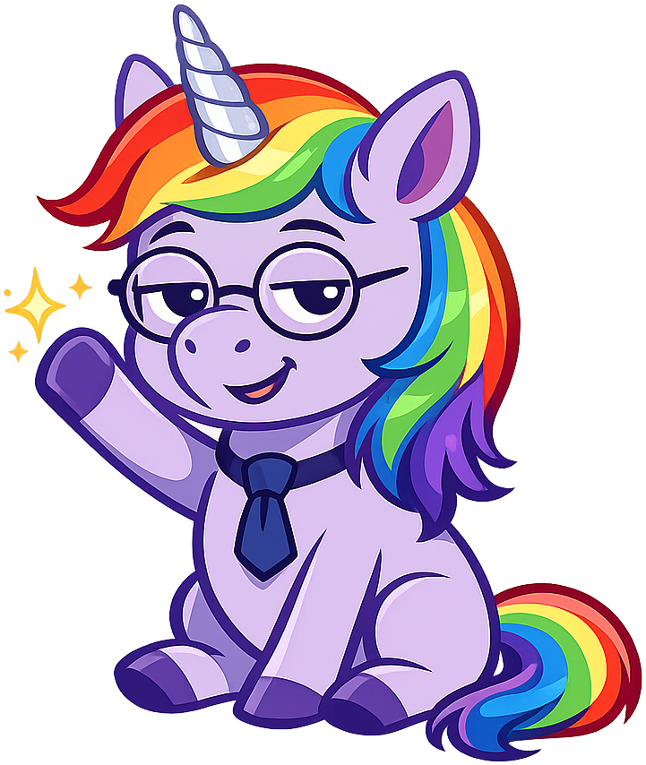
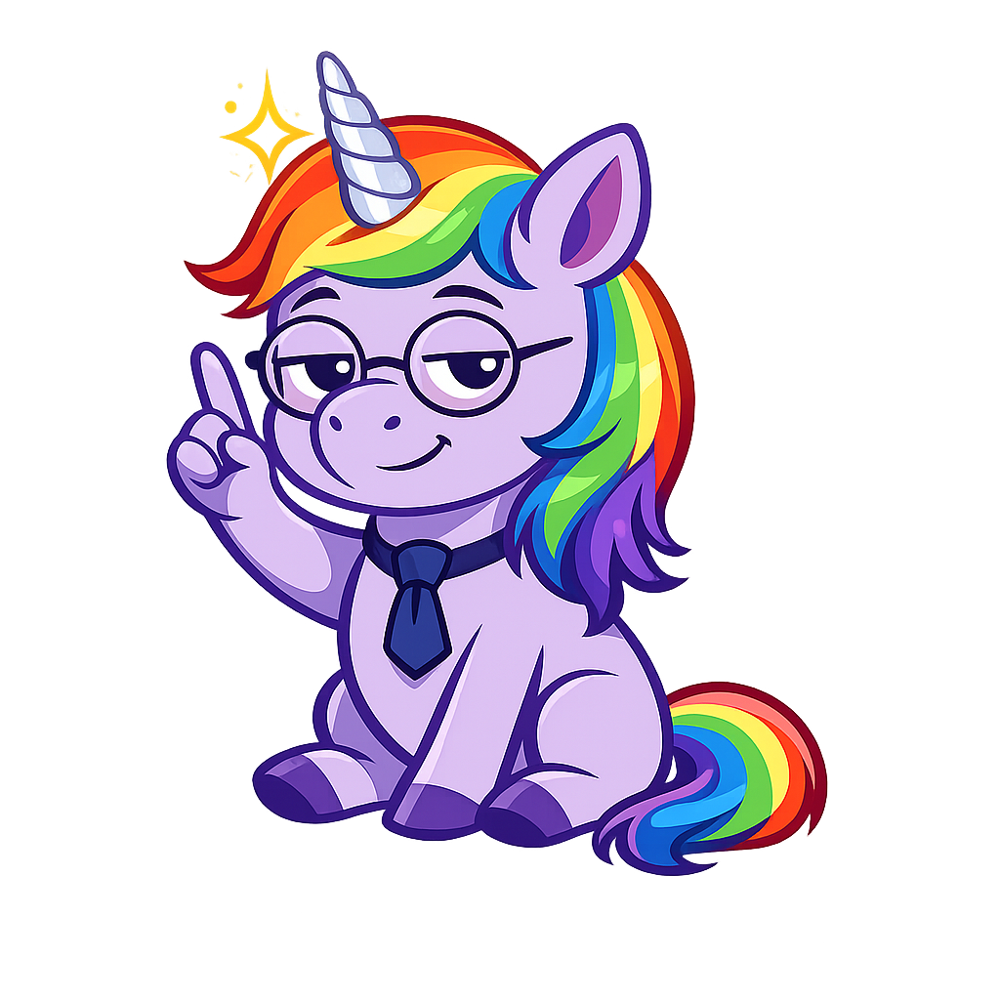

# The Grand Council of Mythical Beasts

## Summary

This chapter depicts a fictional summit where all mythical creatures gather to discuss the AI threat to their livelihoods — because even imaginary beings are worried about being replaced by AI-generated content. Students explore storyboarding, character development, narrative arc, the real-or-fake exercise, and hype cycle visualization as tools for constructing and deconstructing the stories we tell about technology.

## Concepts Covered

This chapter covers the following 5 concepts from the learning graph:

1. Storyboarding
2. Character Development
3. Narrative Arc
4. Real or Fake Exercise
5. Hype Cycle Visualization

## Prerequisites

This chapter builds on concepts from:

- [Chapter 3: The Unicorn-Industrial Complex](../03-unicorn-industrial-complex/index.md)
- [Chapter 11: Unicorn Spotting](../11-unicorn-spotting/index.md)
- [Chapter 12: Breeding Better Unicorns with AI](../12-breeding-better-unicorns/index.md)

---

!!! mascot-welcome "Welcome, Colleagues"

    
    Let me be perfectly clear. This chapter convenes every mythical
    creature in the bestiary for an emergency summit on artificial
    intelligence. The last time this many imaginary beings gathered
    in one room was a Series A pitch meeting. The stakes were lower
    then. The pastries were better.

## The Summons

The invitation arrived by raven, which is the mythical beast equivalent of a calendar invite that cannot be declined. It read:

> To all creatures of myth, legend, and quarterly earnings reports:
>
> You are hereby summoned to the Grand Council of Mythical Beasts, to be held in the Great Hall of Allegory on the first Tuesday after the most recent AI breakthrough announcement (which is to say, any Tuesday). The agenda concerns the existential threat posed by artificial intelligence to the livelihoods of imaginary beings. Attendance is mandatory. Refreshments will be provided. Unicorn parking is available in the east lot.
>
> — The Office of the Bestiary, Department of Mythical Affairs

The Council had not convened in full session since the invention of the printing press, which the beasts had survived by transitioning from oral tradition to published literature. They had survived the photograph by becoming metaphors. They had survived television by becoming franchises. But artificial intelligence presented a new challenge: AI could generate mythical beasts faster, cheaper, and in higher resolution than any human illustrator. For the first time in four millennia, the beasts faced the possibility that they were no longer needed.

## The Delegates: A Study in Character Development

Character development is the process by which a fictional character is given depth, motivation, and change over the course of a narrative. A well-developed character is not merely a collection of attributes. They have desires, fears, contradictions, and a trajectory — they are different at the end of the story than they were at the beginning.

The delegates of the Grand Council illustrate different approaches to character development:

**The Unicorn** arrived first, because unicorns always arrive first to fundraising events, and the Unicorn could not be sure this was not one. The Unicorn's character is defined by the gap between what it represents (purity, magic, transcendence) and what it has become (a financial metaphor valued at \$4.7 trillion). The Unicorn's internal conflict is the conflict of every symbol that has been co-opted by commerce: it remembers what it meant, and it knows what it means now, and the two are incompatible.

**The Dragon** arrived next, still smoking from a recent village. The Dragon's character development across the textbook follows a villain-protagonist arc — it is feared, it is powerful, it is sympathetic upon closer inspection. The Dragon does not choose to destroy. The Dragon is built to optimize, and optimization is indistinguishable from destruction when applied without constraint.

**The Phoenix** arrived in a burst of flame, which singed the Phoenix's assigned seat and required a brief recess. The Phoenix's character is defined by compulsive reinvention. It cannot stop dying and being reborn. It has pivoted so many times that it no longer remembers its original form. This is played for comedy, but it is also a commentary on industries that rebrand failure as transformation.

**The Centaur** arrived in two moods, which is always the case with centaurs. The human half wanted to collaborate with AI. The horse half wanted to run. The Centaur's character embodies the unresolved tension of Chapter 8: the two halves must work together, but they have not agreed on a direction.

**The Siren** arrived singing, which caused three delegates to walk toward the door before the Minotaur blocked the exit. The Siren's character represents the most dangerous quality of AI: its output is beautiful regardless of whether it is true.

**The remaining delegates** — Griffin, Mermaid, Minotaur, Pegasus, Kraken, Cyclops, Deer, Ostrich — filled the remaining seats according to a seating chart designed to prevent the Kraken from sitting next to anything fragile.

## The Narrative Arc of the Council

A narrative arc is the structure that shapes a story from beginning to end. The most common narrative arc follows five stages: exposition, rising action, climax, falling action, and resolution. The Grand Council follows this arc, because even fictional meetings have better structure than real ones.

**Exposition:** The Council chair — the Unicorn, by tradition — opens the session by presenting the threat. AI can now generate images of mythical beasts, write stories about mythical beasts, and simulate mythical beast behaviors. The beasts are, in economic terms, facing competition from a cheaper substitute. The room grows quiet.

**Rising action:** Each delegate presents their perspective. The Dragon argues that disruption is natural and the beasts should embrace it. The Ostrich argues that the beasts should ignore it. The Deer stares at the presentation screen and does not blink. The Phoenix suggests dying and coming back as something else. The Centaur proposes collaboration. The Siren proposes singing louder. Each perspective mirrors a real-world response to AI disruption, and the disagreement escalates because the beasts cannot agree on whether AI is a tool, a threat, or a colleague.

**Climax:** The Kraken rises from beneath the table (it had been hiding under the table, which is its preferred position for maximum dramatic impact) and announces that it has already been replaced. A company in Silicon Valley has built a "Kraken-as-a-Service" product that simulates catastrophic failures on demand, for testing purposes. The real Kraken is no longer needed for the one thing it does. The room is silent.

**Falling action:** The beasts, confronted with the reality of displacement, begin to discuss what they have that AI does not. The answer, reached slowly and reluctantly: they have meaning. An AI can generate the *image* of a dragon, but it cannot generate the *experience* of confronting disruption. An AI can write a *story* about a phoenix, but it cannot embody the psychological reality of reinvention after failure. The beasts are not their physical forms. They are the ideas they represent.

**Resolution:** The Council passes a resolution stating that mythical beasts will continue to serve as allegorical vehicles for human experience, supplemented but not replaced by AI-generated content. The resolution passes unanimously, except for the Kraken, who abstains because it is already under the table again.

!!! mascot-thinking "A Critical Observation"

    
    One observes that a council of imaginary creatures debating
    their relevance in the age of AI is itself an allegory for
    every professional conference in 2024. The name tags were
    different. The anxiety was identical.

## Storyboarding: Planning the Story Before Telling It

Storyboarding is the process of planning a narrative visually, using a sequence of panels or frames that sketch the key moments of the story before the full production begins. It is used in filmmaking, animation, graphic novels, and any context where the story is told through images as well as words.

A storyboard for the Grand Council scene might include:

| Panel | Visual | Dialogue/Caption | Purpose |
|-------|--------|------------------|---------|
| 1 | Wide shot: Great Hall, empty chairs, raven delivering invitations | "The summons arrived on a Tuesday. It is always a Tuesday." | Establish setting, tone |
| 2 | Close-up: Unicorn reviewing agenda, reading glasses | "Agenda Item 1: Existential Crisis. Agenda Item 2: Refreshments." | Introduce protagonist, deadpan humor |
| 3 | Medium shot: Dragon entering, smoke trailing | "I don't see the problem. Disruption is my entire brand." | Character voice, conflict setup |
| 4 | Split panel: Centaur arguing with itself | Human half: "We should collaborate." Horse half: *runs* | Internal conflict, allegory |
| 5 | Wide shot: All delegates seated, Kraken under table | "The Council was in session. The Kraken was in position." | Full ensemble, dramatic irony |
| 6 | Close-up: Kraken emerging, tentacles on table | "I have been replaced. By a subscription service." | Climax, emotional impact |
| 7 | Group shot: Beasts in discussion | "We are not our forms. We are our meanings." | Resolution, thematic statement |
| 8 | Final panel: Beasts leaving, Unicorn last to go | "The Council adjourned. The raven was already delivering the next summons." | Denouement, cyclical structure |

Storyboarding is an analytical skill because it requires breaking a narrative into its essential moments — deciding what to show, what to skip, and how to sequence the information for maximum impact. Every storyboard panel is an editorial decision. Every omitted panel is also an editorial decision. The storyboard is the skeleton of the story, and the skeleton determines the shape.

## The Real or Fake Exercise

The real or fake exercise is the practice of presenting a mix of true and fabricated statements and challenging the reader to distinguish between them. It is the direct application of the fact vs fiction skills from Chapter 11, formatted as an interactive assessment.

The Grand Council generates an ideal scenario for this exercise, because the beasts' discussion mirrors real-world debates with uncomfortable precision. Consider the following statements — some are from the fictional Council, and some are actual quotes from technology conferences:

1. "Disruption is not a threat. It is an opportunity for reinvention."
2. "We have been replaced by a subscription service that costs \$49.99 per month."
3. "The future belongs to those who embrace change, not those who fear it."
4. "Our value is not in what we produce. It is in what we represent."
5. "AI will create more jobs than it destroys. It always has."
6. "The committee recommends further study before taking any action."

Statements 1, 3, and 5 could be from either the fictional Council or a real technology conference — and that interchangeability is the point. Statement 2 is from the Kraken (fictional). Statement 4 is the Council's resolution (fictional, but any museum director would agree). Statement 6 is universal.

#### Diagram: Real or Fake Interactive Quiz

<iframe src="../../sims/real-or-fake-quiz/main.html" width="100%" height="550px" scrolling="no"></iframe>

Real or Fake Interactive Quiz

Type: microsim
**sim-id:** real-or-fake-quiz 
**Library:** p5.js 
**Status:** Specified

**Bloom Taxonomy:** Evaluate (L5)
**Bloom Verb:** Judge, Assess
**Learning Objective:** Students will judge whether technology-related statements are real quotes, fictional quotes from the textbook, or actual press release language, assessing their ability to distinguish fact from fiction in technology discourse.

Purpose: Interactive quiz presenting 12 statements — some real quotes from technology leaders, some fictional quotes from mythical beasts, some from actual press releases — and challenging students to classify each one.

Visual elements:
- Center panel: Statement displayed in quotation marks with large readable font
- Three classification buttons below statement: "Real (Actual Quote)," "Fictional (From This Textbook)," "Press Release (Marketing Language)"
- Score tracker: X/12 correct
- After answering: Reveal card showing correct answer, attribution, and brief explanation of why it's hard to tell
- Progress bar: Current question out of 12

Statement pool (12 statements, shuffled):
1. "AI will be the most transformative technology humanity has ever created" — Real (Sundar Pichai paraphrase)
2. "The Kraken has been replaced by a subscription service" — Fictional (Chapter 13)
3. "We are excited to announce a breakthrough in autonomous reasoning" — Press Release
4. "Every company is now an AI company" — Real (Jensen Huang paraphrase)
5. "The committee met 47 times and recommended further study" — Fictional (Chapter 6)
6. "Our platform leverages cutting-edge neural architectures to deliver unprecedented value" — Press Release
7. "AI won't replace you. A person using AI will replace you" — Real (widely attributed)
8. "The dragon would like you to know it's not personal" — Fictional (Chapter 7)
9. "We are humbled by these results" — Press Release (standard template)
10. "Move fast and break things" — Real (Mark Zuckerberg)
11. "The unicorn's horn is the valuation — it transforms a company from ordinary to mythical" — Fictional (Chapter 3)
12. "This changes everything" — All three (used by real leaders, fictional characters, and press releases equally)

Interactive controls:
- Three buttons: "Real," "Fictional," "Press Release"
- Button: "Next Statement" (appears after answer)
- Button: "See Final Score" (appears after question 12)
- Button: "Play Again" (reshuffles statements)

Instructional Rationale: Forced classification into three categories (not two) supports Evaluate-level learning by requiring students to make fine-grained judgments about the source and intent of language. The reveal after each answer provides immediate feedback, and the discovery that categories blur reinforces the chapter's central theme.

Implementation: p5.js with createButton() controls, shuffled array of statement objects, state machine for quiz flow. Responsive canvas using updateCanvasSize(). Canvas parented to document.querySelector('main').

## Hype Cycle Visualization: Seeing the Pattern

Hype cycle visualization is the practice of representing the Gartner Hype Cycle (from Chapters 4 and 5) as an interactive tool that students can use to plot and debate the current position of various technologies. The Grand Council itself follows a hype cycle: the summons is the trigger, the opening speeches are the peak of inflated expectations, the Kraken's revelation is the trough of disillusionment, the discussion of meaning is the slope of enlightenment, and the resolution is the plateau of productivity (or at least, the plateau of continued relevance).

The hype cycle visualization introduced in Chapter 4's MicroSim spec is revisited here as an analytical tool: students can plot the position of each mythical beast on the hype cycle based on its current allegorical relevance, debating whether dragons (disruptive technology) are at the peak, in the trough, or already on the plateau.

!!! mascot-tip "Sparkle's Tip"

    
    When constructing any narrative about technology — a pitch,
    a press release, a textbook chapter — identify which stage
    of the hype cycle your narrative inhabits. Peak narratives
    sell. Trough narratives warn. Plateau narratives bore.
    The best narratives acknowledge all three.

## Key Takeaways

- Character development gives depth to allegorical figures by providing them with desires, fears, contradictions, and trajectories that mirror the human experience of technological change
- The narrative arc (exposition, rising action, climax, falling action, resolution) provides structure for any story about technology disruption, from a graphic novel to a corporate strategy presentation
- Storyboarding is an analytical skill that requires editorial decisions about what to show, what to omit, and how to sequence information for maximum impact
- The real or fake exercise reveals that actual technology discourse and satirical imitations of it are increasingly indistinguishable — a convergence that is itself the point
- The hype cycle is not just an analytical framework but a narrative structure: every technology story passes through the same five stages, and knowing where you are in the cycle determines how to interpret what you hear
- The mythical beasts' value is not in their physical forms but in the ideas they represent — a distinction that applies equally to any profession facing AI displacement

??? question "Self-Assessment: Could you survive the Grand Council? Click to test yourself."
    You are a delegate to the Grand Council. Your assigned beast is the one that most closely matches your current relationship to AI. Are you a Deer (frozen)? An Ostrich (hiding)? A Centaur (collaborating)? A Phoenix (reinventing)? A Dragon (disrupting)? Identify your beast, then write a three-sentence speech to the Council explaining your position on AI. If your speech could appear in both the fictional Council and an actual conference panel without modification, you understand why the real or fake exercise is difficult.

!!! mascot-celebration "Chapter Complete"

    
    The Council has adjourned. The beasts have survived another
    existential threat by concluding that they are metaphors,
    and metaphors are harder to automate than processes. The
    literature suggests this is correct. The Kraken suggests
    this is cold comfort.

[See Annotated References](./references.md)
