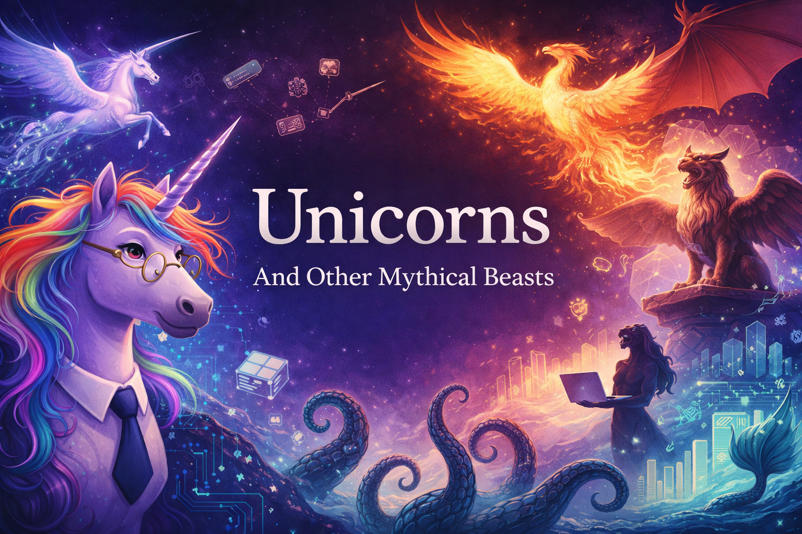

# Welcome

<figure markdown>
  { width="100%" }
</figure>

Welcome to **Unicorns and Other Mythical Beasts: An Essential Guide to Creatures That Definitely Exist and the AI Technologies That Will Improve Them**.

This is a rigorous, evidence-adjacent exploration of mythical creatures and the parallel universe of artificial intelligence — a field that, like unicorns, promises magical solutions to all of humanity's problems and may or may not actually deliver. Through 19 chapters of satirical stories, interactive simulations, and graphic novels, you will develop the critical thinking skills necessary to distinguish between things that are real, things that are imaginary, and things that are "in beta." The differences are smaller than you think.

## What You Will Find Here

- **19 Chapters** across 5 units — from the history of unicorns to the bestiary of vaporware
- **Interactive MicroSims** — browser-based simulations including population dynamics, hype cycle visualizations, and a vaporware field guide
- **12 Graphic Novels** — mythical beasts navigating workplace situations that will feel painfully familiar
- **Quizzes** — where the wrong answers are sometimes more accurate than the right ones
- **A Glossary** — defining terms you never knew you needed, with dictionary precision and zero detectable irony
- **A Learning Graph** — visualizing 140+ concept dependencies across the course, because even nonsense has structure

## Who This Book Is For

This interactive intelligent textbook is designed for anyone ages 14 and up who has wondered whether unicorns actually exist. Short answer: definitely. But there are adjacent questions about unicorn companies and AI that demand a full, data-driven inquiry. Have you ever been told that quantum computing is "just five years away"? Some people believe that modern technology is mostly fantasy — that the metaverse and the Flying Spaghetti Monster are thought experiments designed to develop critical thinking skills and expose human cognitive bias. Sometimes, these skeptics are right. But if we stopped there, we wouldn't have much fun, and our core hypothesis — that AI can write a 500-page book satirizing modern technology that will actually make you laugh — would go untested.

Which brings us to the key question: how will unicorns and AI impact knowledge workers? To answer this, we need to explore whether digital transformation is not only real but probable. No prior experience with unicorns, dragons, or artificial intelligence is required. A functioning sense of humor is strongly recommended but cannot be provided by the institution.

## Getting Started

Start with [Chapter 1: A Brief and Totally Accurate History of Unicorns](chapters/01-history-of-unicorns/index.md), or explore the [Learning Graph](learning-graph/index.md) to see how concepts connect across chapters. Try that one on an ultra-wide screen if possible. If you are looking for something specific, try the Search form in the upper right corner, or just yell very loudly into your microphone. You never know who is listening. There is also a ridiculously detailed [glossary of terms](./glossary.md) that we generated one night when we had a lot of extra tokens, and even a comprehensive [FAQ](./faq.md) if you are really bored. Not that anyone does ask us questions frequently. However, the most fun is playing around with our [MicroSims](./sims/index.md). Enjoy.
