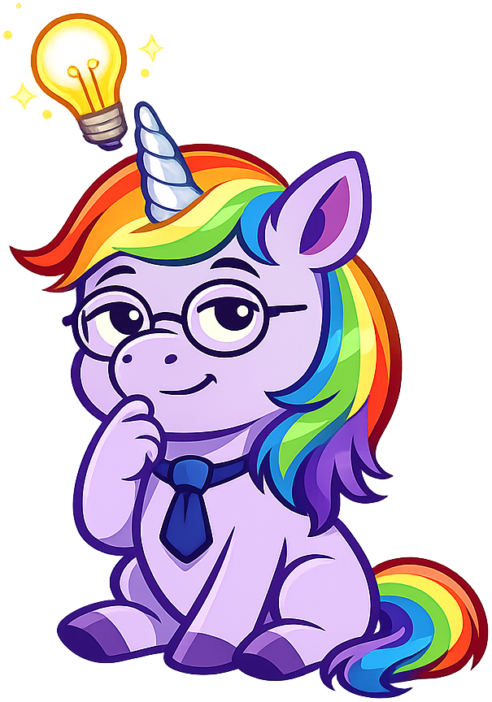
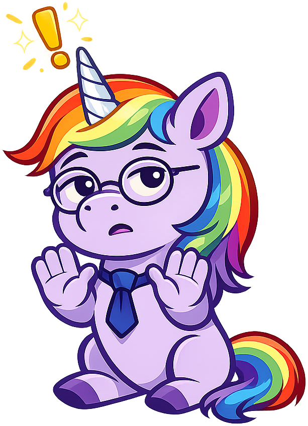
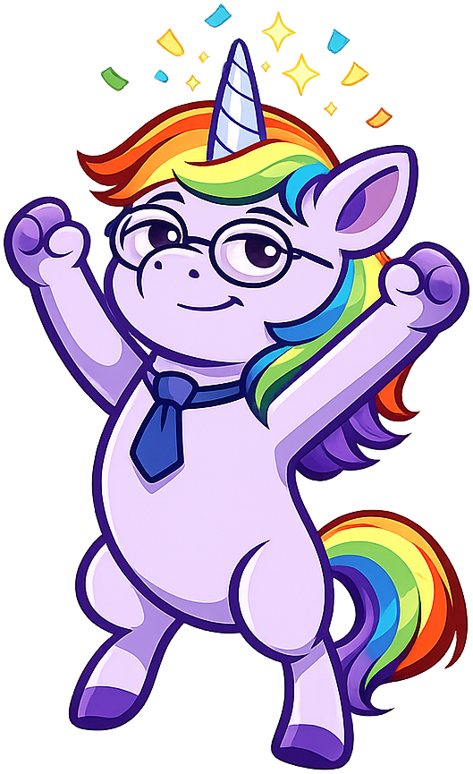
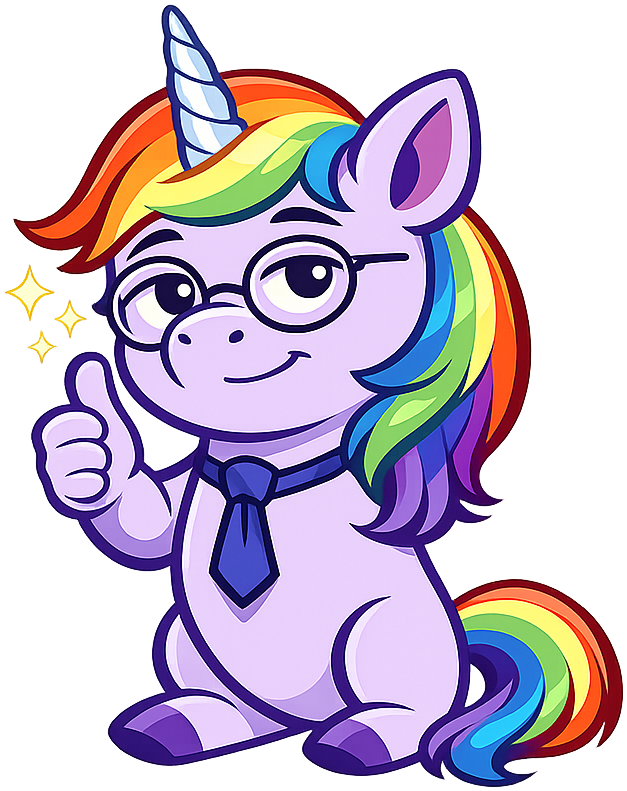

# Mascot Style Guide

This page shows all Sparkle the Unicorn admonition styles for reference.

!!! mascot-neutral "A Note from Sparkle"

    
    This is the neutral style, used for general sidebars or introductions.
    Sparkle appears here for general-purpose observations that require no
    particular emotional investment.

!!! mascot-welcome "Welcome, Colleagues"

    
    This is the welcome style, used at chapter openings.
    Sparkle greets scholars and previews the material ahead with
    measured gravitas and carefully calibrated expectations.

!!! mascot-thinking "A Critical Observation"

    
    This is the thinking style, used for key concepts and important insights.
    Sparkle shares observations that the data makes unavoidable, however
    inconvenient they may be for certain industries.

!!! mascot-tip "Sparkle's Tip"

    
    This is the tip style, used for helpful hints and practical advice.
    Sparkle offers guidance that may prevent embarrassment at your next
    board meeting or unicorn sighting.

!!! mascot-warning "A Word of Caution"

    
    This is the warning style, used for common mistakes and pitfalls.
    Sparkle alerts colleagues to errors that have been repeated so often
    they now qualify as tradition.

!!! mascot-celebration "Section Complete"

    
    This is the celebration style, used for achievements and chapter completions.
    Sparkle acknowledges milestones with the restrained dignity they deserve.

!!! mascot-encourage "You Can Handle This"

    
    This is the encouraging style, used when content gets difficult.
    Sparkle provides reassurance in the form of carefully worded statements
    that stop just short of actual optimism.
