# List of MicroSims

Interactive Micro Simulations to help students explore mythical beasts, AI hype, technology fantasy, and the fine art of spotting unicorns in the wild.

-   **[Adaptive Learning Feedback Loop](./adaptive-learning-loop/index.md)**

    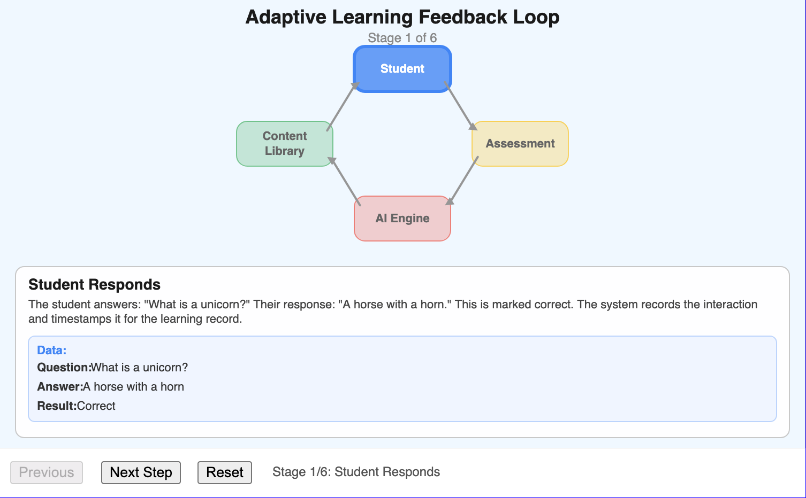

    Step-through visualization showing how an adaptive learning system adjusts content based on student performance.

-   **[AGI Timeline Claims History](./agi-timeline-claims/index.md)**

    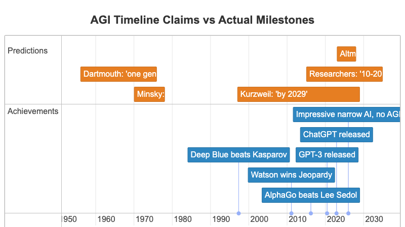

    Interactive timeline comparing AGI predictions against actual AI milestones, revealing the persistent gap.

-   **[AI Hype Cycle with Mythical Beasts](./ai-hype-cycle-beasts/index.md)**

    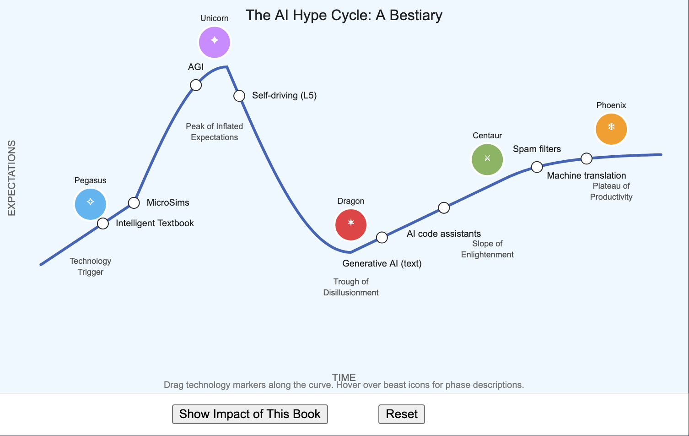

    Interactive hype cycle curve with AI technologies plotted and mythical beasts marking each phase.

-   **[AI Pitch Deck Anatomy](./ai-pitch-deck-anatomy/index.md)**

    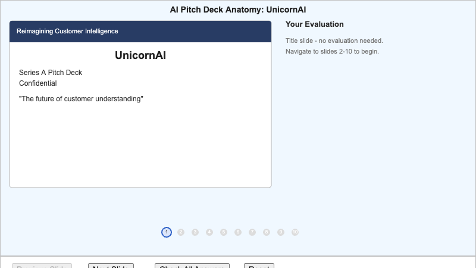

    Interactive pitch deck viewer where students evaluate claims on each slide using a traffic-light rating system.

-   **[AI Unicorn Feature Generator](./ai-unicorn-generator/index.md)**

    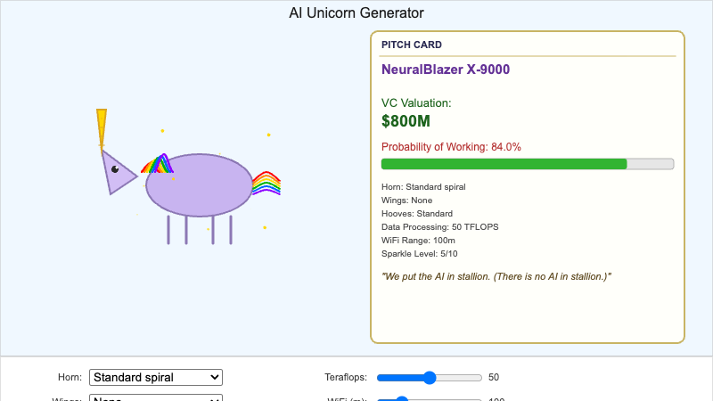

    Configure an AI-enhanced unicorn by selecting features and see the resulting satirical venture capital valuation.

-   **[Ancient Unicorn Civilizations Map](./ancient-unicorn-map/index.md)**

    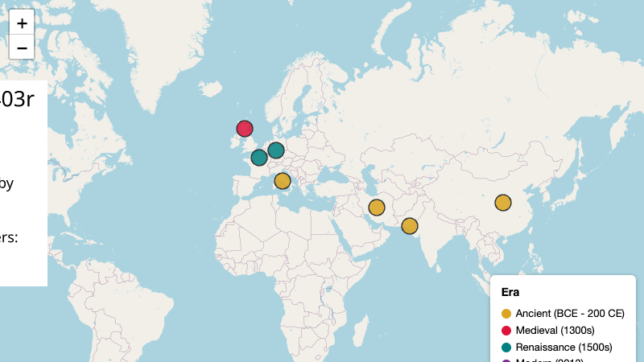

    Interactive map showing historical unicorn sightings and cultural references from 2600 BCE to Silicon Valley.

-   **[Beast Allegory Network](./beast-allegory-network/index.md)**

    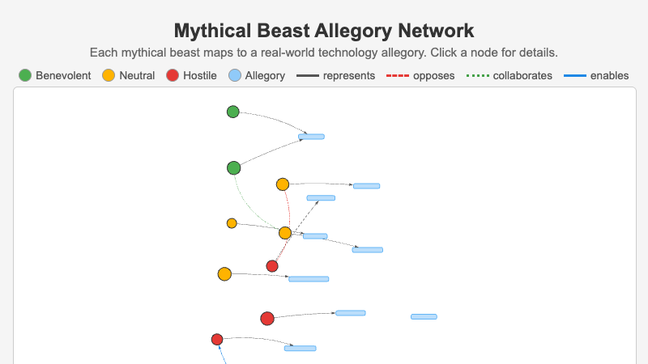

    Network graph showing 11 mythical beasts connected to their real-world allegorical counterparts.

-   **[Beast Classification Framework](./beast-classification-framework/index.md)**

    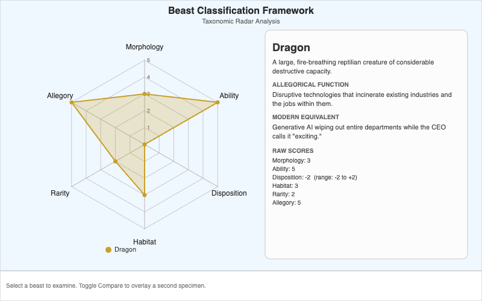

    Interactive radar chart for comparing mythical beast characteristics across six dimensions.

-   **[Beast Classifier](./beast-classifier/index.md)**

    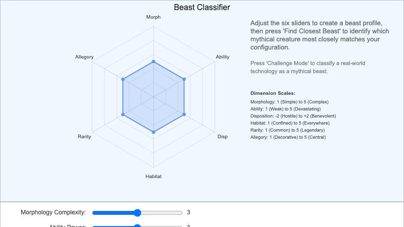

    Adjust six sliders to create a beast profile and find the closest matching mythical creature.

-   **[Bestiary of Vaporware Field Guide](./bestiary-vaporware-guide/index.md)**

    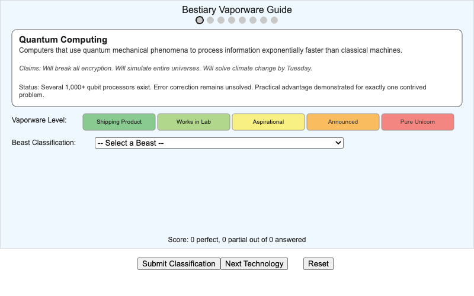

    Dual-framework classification tool assigning both a mythical beast and vaporware level to technologies.

-   **[Blockchain Vaporware Classifier](./blockchain-vaporware-classifier/index.md)**

    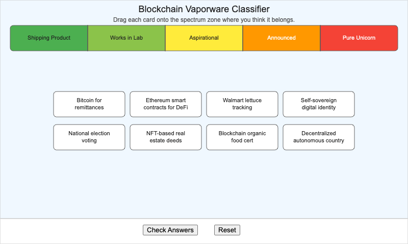

    Drag blockchain applications onto a five-level vaporware spectrum from Shipping Product to Pure Unicorn.

-   **[Centaur Collaboration Spectrum](./centaur-collaboration-spectrum/index.md)**

    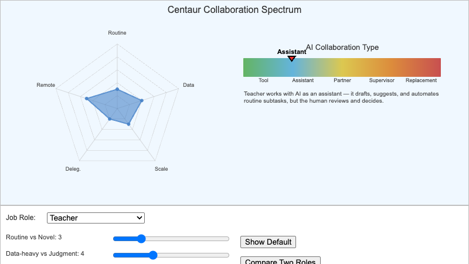

    Select a job role and adjust task characteristics to see where it falls on the augmentation-to-replacement spectrum.

-   **[Claim Verification Decision Tree](./claim-verification-tree/index.md)**

    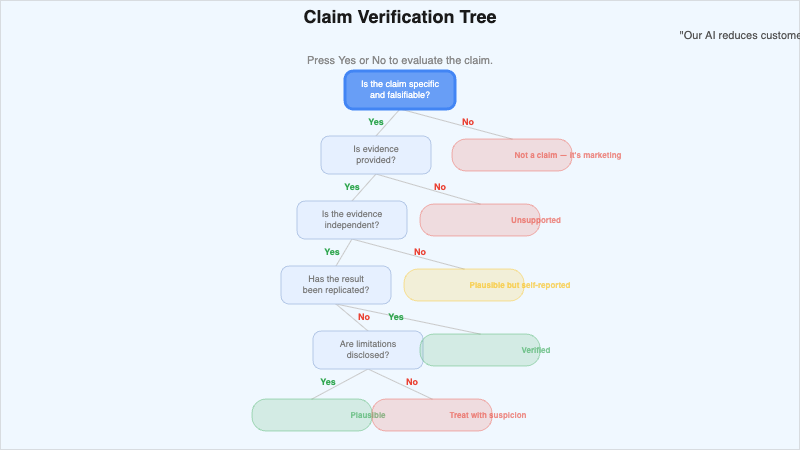

    Navigate a decision tree to systematically evaluate whether an AI claim is verified, plausible, or unsupported.

-   **[Education Technology Adoption Lag](./ed-tech-adoption-lag/index.md)**

    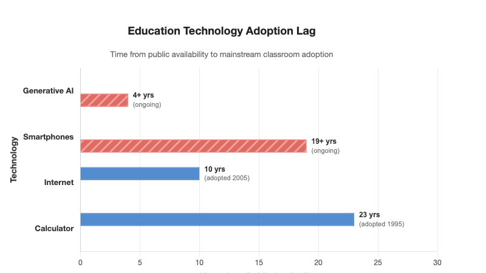

    Horizontal bar chart comparing technology adoption lag in education from calculators to generative AI.

-   **[Five Years Away Timeline](./five-years-away/index.md)**

    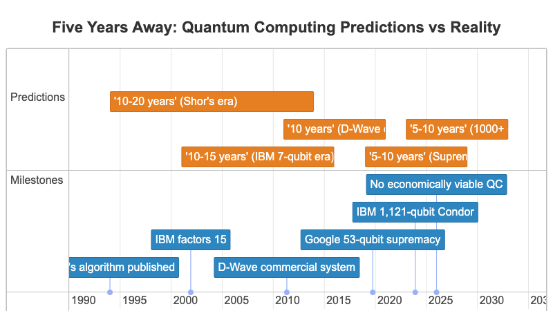

    Dual-track timeline showing quantum computing predictions versus actual milestones.

-   **[Graph Viewer](./graph-viewer/index.md)**

    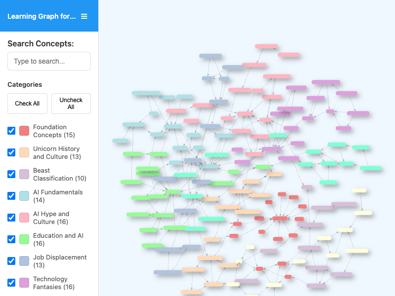

    Interactive learning graph viewer showing concept dependencies and relationships.

-   **[Great Mythical Venn Diagram](./great-mythical-venn/index.md)**

    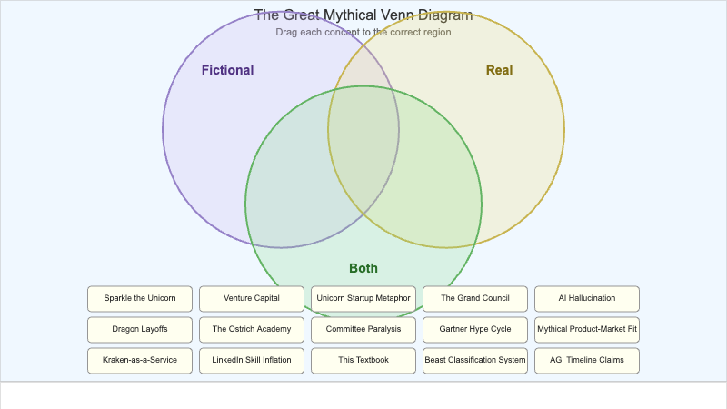

    Drag 15 concept cards into the correct region of a three-circle Venn diagram: Fictional, Real, or Both.

-   **[Hype Cycle Journey](./hype-cycle-journey/index.md)**

    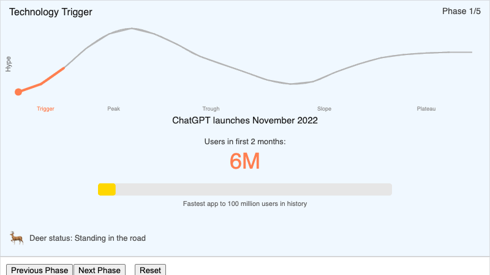

    Step-through interactive showing a deer's journey through the five phases of the technology hype cycle.

-   **[How a Large Language Model Works](./llm-how-it-works/index.md)**

    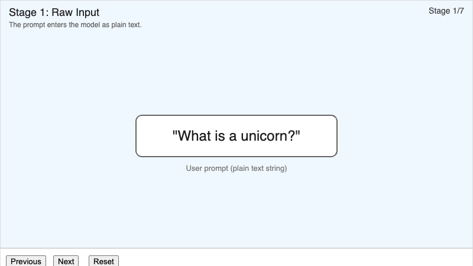

    Seven-stage step-through visualization of how an LLM processes a prompt and generates text.

-   **[LinkedIn Skill Inflation Tracker](./linkedin-skill-inflation/index.md)**

    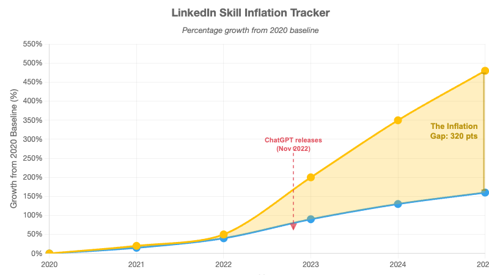

    Dual-line chart comparing growth of LinkedIn AI skill claims against actual job postings requiring those skills.

-   **[Media Literacy Evaluation Framework](./media-literacy-framework/index.md)**

    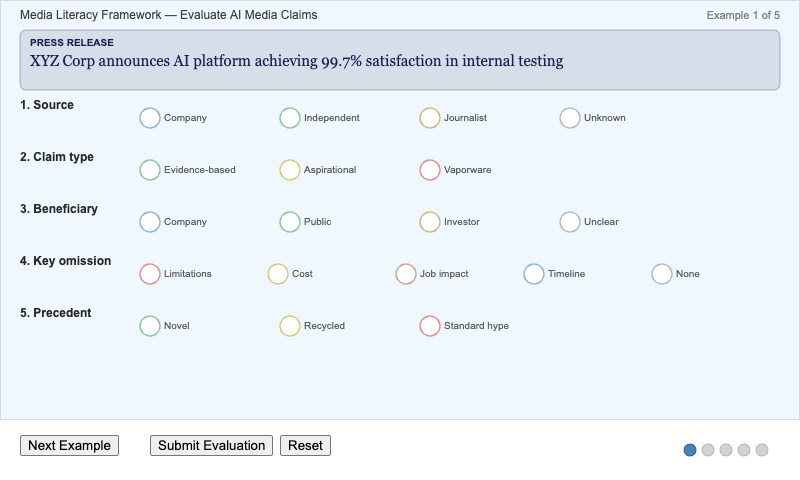

    Evaluate AI media examples using a five-step checklist covering source, claims, incentives, and omissions.

-   **[Medieval Unicorn Belief Network](./medieval-unicorn-beliefs/index.md)**

    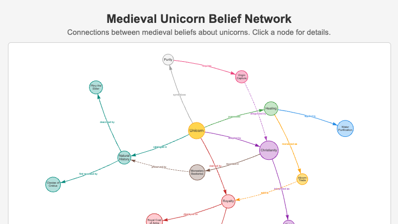

    Network graph showing connections between medieval beliefs about unicorns, from purity to royal symbolism.

-   **[Metaverse Hype Cycle History](./metaverse-hype-cycles/index.md)**

    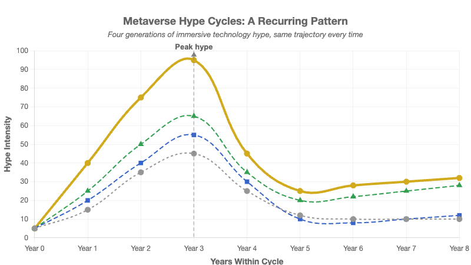

    Four overlapping hype curves showing the repeating boom-bust pattern of VR and metaverse cycles.

-   **[Modern Unicorn Economy](./modern-unicorn-economy/index.md)**

    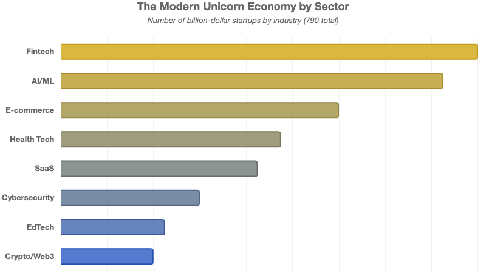

    Horizontal bar chart showing the distribution of unicorn startups across industry sectors.

-   **[Moving the Goalposts Timeline](./moving-goalposts-timeline/index.md)**

    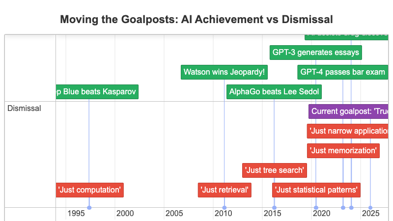

    Interactive timeline pairing AI achievements with the dismissals that followed each milestone.

-   **[Perpetual Beta Product Lifecycle](./perpetual-beta-lifecycle/index.md)**

    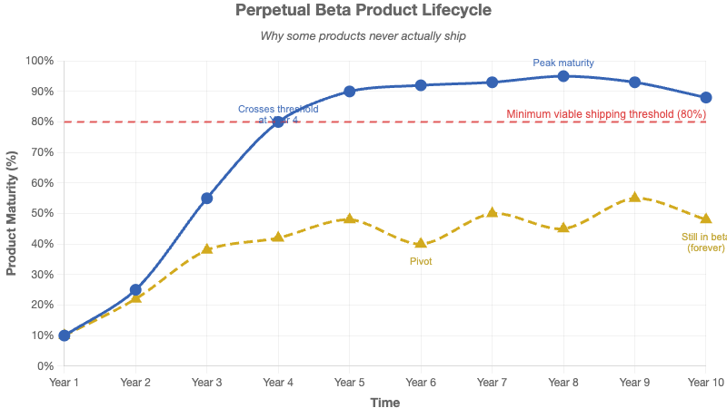

    Dual-line chart comparing traditional software maturity curves against perpetual beta products.

-   **[Product-Market Fit Spectrum](./product-market-fit-spectrum/index.md)**

    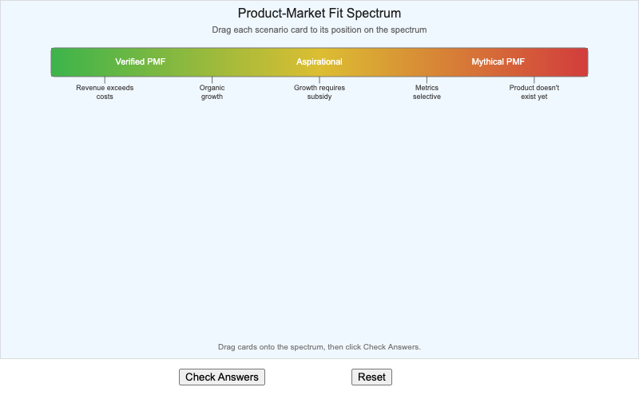

    Drag startup scenario cards to their correct position on a spectrum from Verified PMF to Mythical PMF.

-   **[Real or Fake Interactive Quiz](./real-or-fake-quiz/index.md)**

    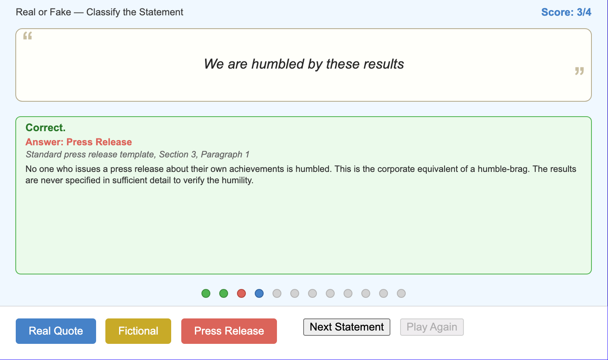

    Classify 12 statements as real quotes, fictional textbook quotes, or press release language.

-   **[Unicorn Lifecycle Allegory](./unicorn-lifecycle-allegory/index.md)**

    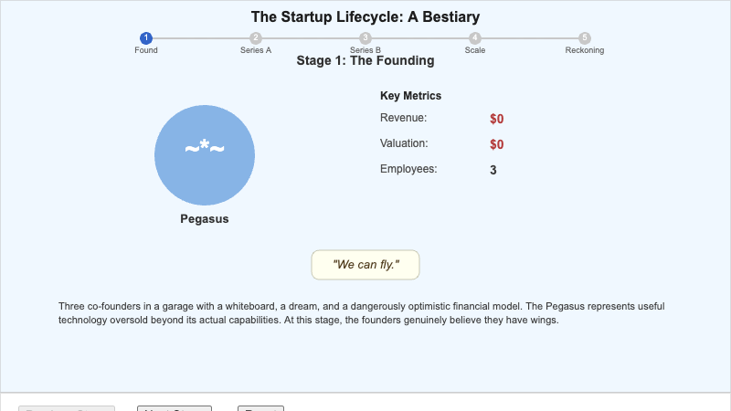

    Step-through showing a startup's lifecycle mapped to different mythical beasts at each funding stage.

-   **[Unicorn Population Dynamics](./unicorn-population-dynamics/index.md)**

    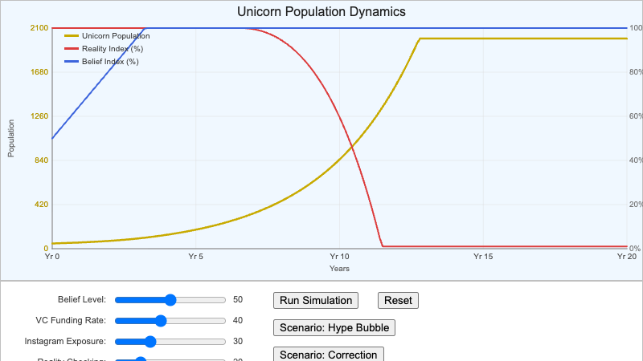

    Population dynamics simulator modeling unicorn startup populations affected by belief, funding, and reality.

-   **[Unicorn Symbolism Timeline](./unicorn-symbolism-timeline/index.md)**

    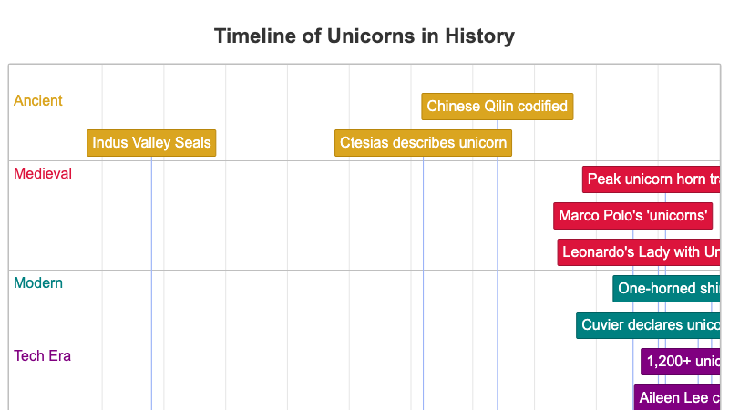

    Interactive timeline tracing unicorn sightings and cultural significance from 2600 BCE to the present.

-   **[Unicorn Valuation Growth Chart](./unicorn-valuation-growth/index.md)**

    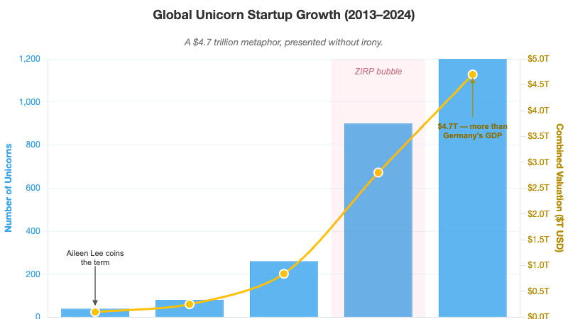

    Dual-axis chart showing the exponential growth in both the number and combined valuation of unicorn startups.

