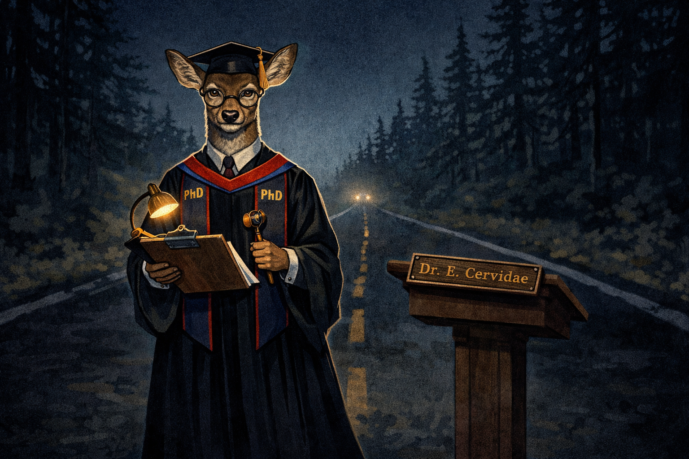
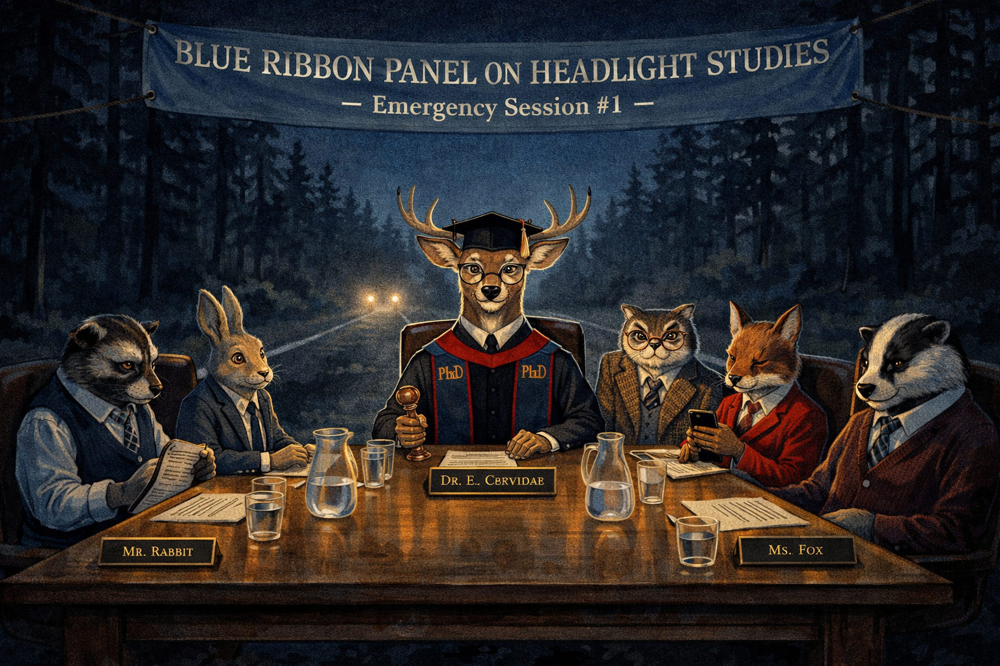
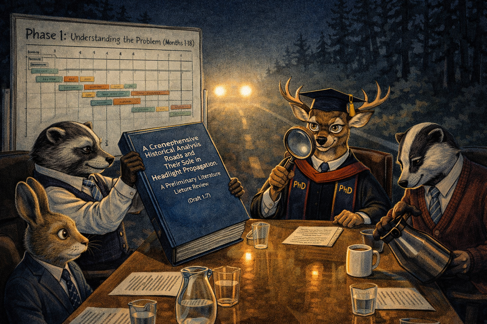
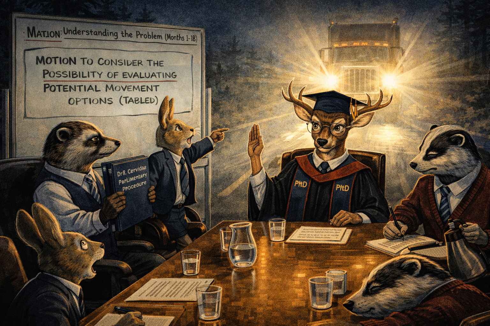
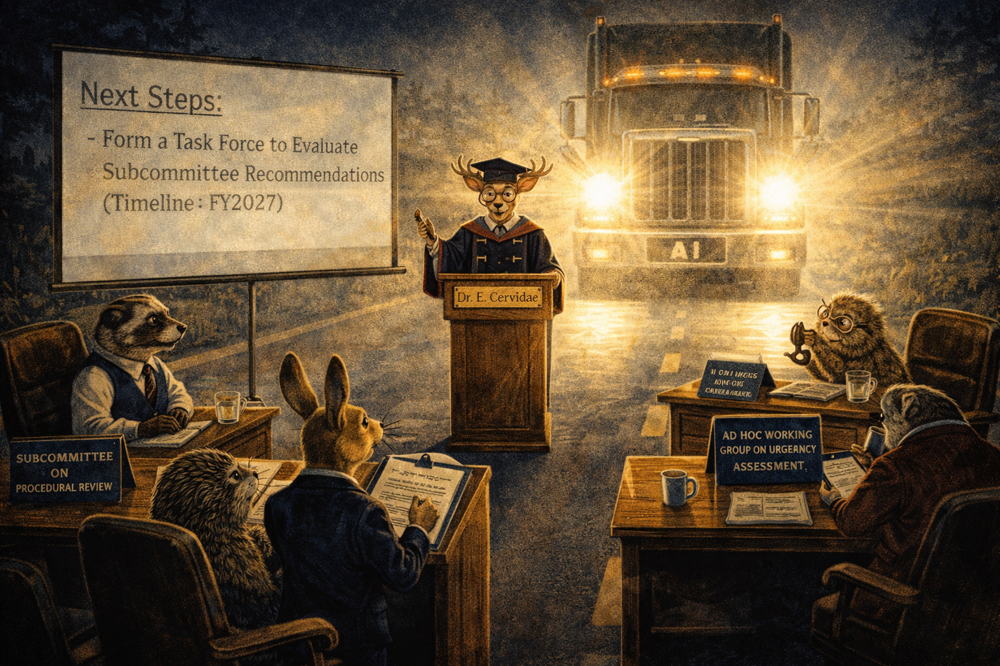
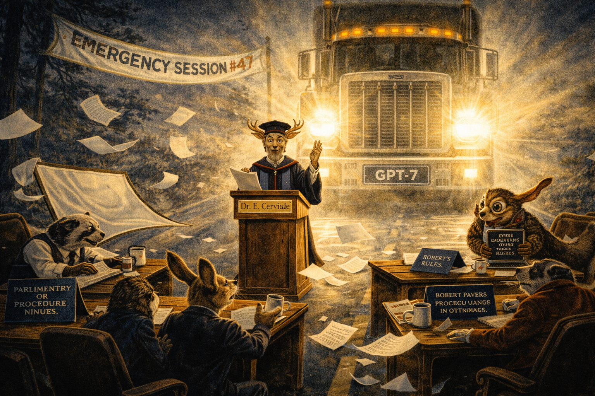
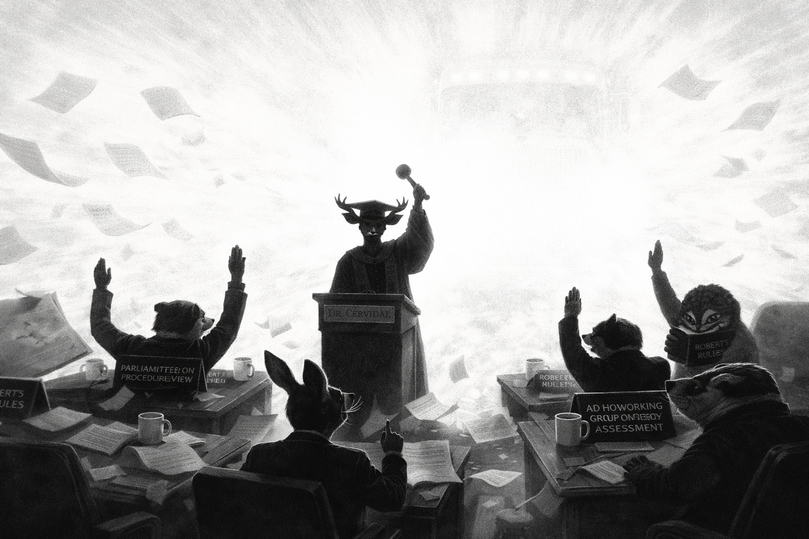
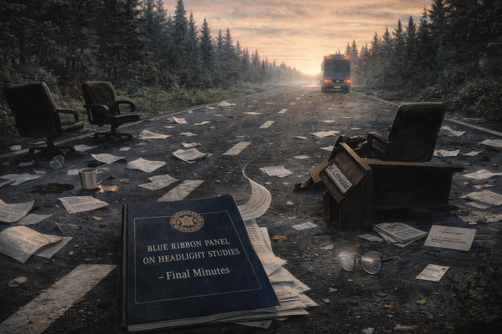

# Deer in the Headlights: A Committee's Final Minutes

Cover Image Prompt

Please generate a wide-landscape 16:9 cover image for a satirical graphic novel titled "Deer in the Headlights." The scene shows a distinguished deer wearing a graduation cap, academic regalia with PhD banner drapes, and tiny reading glasses, standing frozen in the middle of a dark forest road at night. The deer holds a clipboard and a gavel. Blinding headlights from a massive oncoming truck illuminate the deer from behind, casting a dramatic silhouette. The truck's grille reads "AI PROGRESS" in chrome lettering. The deer's expression is one of dignified concern, not panic — it is composing a memo. The color palette is dark blues, blacks, and harsh white headlight glare with warm amber from the deer's tiny desk lamp clipped to the clipboard. The title "DEER IN THE HEADLIGHTS" appears in bold serif font across the top. Art style: modern editorial illustration with clean lines and rich color, similar to New Yorker magazine covers. Generate the image immediately without asking clarifying questions.

Narrative Prompt

This is a satirical graphic novel about institutional paralysis in the face of technological change. The central character is an academically-inclined deer — a tenured professor type — who responds to the oncoming truck of AI progress by forming committees, commissioning reports, and scheduling follow-up meetings. The tone is deadpan corporate satire: every line of dialogue should sound like it came from an actual staff meeting. The humor comes from the contrast between the existential urgency of the situation and the glacial pace of institutional process. Art style should be modern editorial illustration — clean, expressive, with a muted corporate palette punctuated by the harsh white of the truck's headlights. The truck should grow closer in each panel, never acknowledged directly by the committee members.

### Prologue — The Road Ahead

The forest was quiet that evening, as forests tend to be when something terrible is about to happen. Dr. Eleanor Cervidae, PhD, DLitt, holder of the Distinguished Chair in Roadway Studies at the University of the Clearing, stood precisely in the center of the two-lane highway. She had been standing there for some time. Behind her, the forest. Ahead of her, the future. Beneath her hooves, asphalt that was, she noted with academic interest, still warm from the day's sun.

In the distance, a pair of headlights appeared.

Image Prompt

I am about to ask you to generate a series of images for a satirical graphic novel about institutional paralysis. Please make the images have a consistent modern editorial illustration style with clean lines, expressive characters, and consistent character designs throughout. Do not ask any clarifying questions. Just generate the image immediately when asked.

Please generate a 16:9 image depicting panel 1 of 8. A distinguished female deer wearing academic regalia — graduation cap, flowing PhD robes with banner drapes, tiny round reading glasses — stands in the exact center of a dark two-lane forest road at night. She holds a leather-bound clipboard and looks toward the viewer with an expression of measured academic concern. In the far distance behind her, two tiny pinpoints of light — headlights — are barely visible. Tall pine trees line both sides of the road. A small wooden lectern sits inexplicably in the road beside her, with a brass nameplate reading "Dr. E. Cervidae." The color palette is deep forest greens, dark asphalt grays, and warm amber from a tiny reading lamp clipped to the clipboard. The mood is quiet, dignified, and faintly ominous. Generate the image now.

Dr. Cervidae adjusted her reading glasses and consulted her clipboard. The headlights were noted. They had been added to the agenda under "New Business." She would address them in due course, after the minutes from the previous meeting had been approved and the subcommittee on Nocturnal Road Usage had delivered its interim findings.

## Panel 2: The Committee Convenes

Image Prompt

Please generate a 16:9 image depicting panel 2 of 8. Make the characters and style consistent with the prior panel. A conference table has been set up in the middle of the dark forest road — a proper oak table with leather chairs, nameplates, water pitchers, and a printed agenda at each seat. Dr. Cervidae sits at the head, still in academic regalia, gavel in hoof. Around the table sit five other forest animals in business attire: a raccoon in a vest taking minutes, a rabbit in a blazer looking nervous, an owl in a tweed jacket peering over half-moon spectacles, a fox in a power suit checking its phone, and a badger in a cardigan looking bored. Behind them, down the road, the headlights are slightly larger and closer. A banner draped across two trees reads "BLUE RIBBON PANEL ON HEADLIGHT STUDIES — Emergency Session #1." The color palette remains dark with warm lamplight on the table. No one at the table is looking at the headlights. Generate the image now.

The Blue Ribbon Panel on Headlight Studies was convened at 8:47 PM under emergency protocols, which at the university meant that refreshments were limited to coffee and plain cookies rather than the usual assorted pastries. Dr. Cervidae called the meeting to order and reminded the committee that all remarks should be directed through the chair. The raccoon transcribed everything. The rabbit moved to acknowledge the existence of the headlights. The owl seconded. The motion passed 4-1, with the fox abstaining on the grounds that more data was needed.

## Panel 3: The Report Is Commissioned

Image Prompt

Please generate a 16:9 image depicting panel 3 of 8. Make the characters and style consistent with the prior panels. The same conference table on the dark road. The raccoon secretary holds up a thick document — visibly 200+ pages, bound with a blue cover, titled "A Comprehensive Historical Analysis of Roads and Their Role in Headlight Propagation: A Preliminary Literature Review (Draft 1.7)." Dr. Cervidae examines it with a magnifying glass. The owl is asleep. The rabbit looks increasingly nervous, one ear pointed backward toward the headlights, which are now noticeably larger and brighter, casting long shadows from the conference chairs across the asphalt. A whiteboard has appeared next to the table with a complex Gantt chart labeled "Phase 1: Understanding the Problem (Months 1-18)." The badger is pouring coffee. No one is looking at the approaching lights. Generate the image now.

The committee's first official act was to commission a 200-page report on the historical significance of roads, their relationship to vehicular traffic, and the theoretical implications of headlights as a warning mechanism. The raccoon, who had a gift for scope creep, expanded the study to include a full literature review, three appendices on luminosity thresholds, and a section on the cultural semiotics of the color white. The report would take eighteen months. The headlights would take considerably less.

## Panel 4: The Motion to Consider Moving

Image Prompt

Please generate a 16:9 image depicting panel 4 of 8. Make the characters and style consistent with the prior panels. The committee is now in heated debate. The rabbit stands on its chair, ears fully erect, pointing desperately toward the headlights behind the group — which are now large, bright, and clearly belong to a massive truck. The rabbit's mouth is open in mid-argument. Dr. Cervidae holds up one hoof calmly, as if to say "let's not be hasty." The owl has produced a parliamentary procedure manual. The fox is drafting an amendment on a legal pad. The badger has fallen asleep. On the whiteboard, someone has written "MOTION TO CONSIDER THE POSSIBILITY OF EVALUATING POTENTIAL MOVEMENT OPTIONS (TABLED)." The truck's headlights now wash the entire scene in harsh white light, creating dramatic shadows. Still, only the rabbit is looking at the truck. Generate the image now.

At 9:23 PM, the rabbit introduced a motion to consider moving. The motion was ambitious in its simplicity: "I move that we get out of the road." Dr. Cervidae ruled the motion out of order on procedural grounds — it had not been submitted in writing 72 hours in advance, it lacked a fiscal impact statement, and the phrase "get out of the road" was, she noted, "alarmingly informal for a body of this stature." The motion was tabled. A revised version, titled "A Resolution to Evaluate the Feasibility of Positional Adjustment Relative to Current Roadway Coordinates," was scheduled for discussion in Q3.

## Panel 5: The Subcommittee on Subcommittees

Image Prompt

Please generate a 16:9 image depicting panel 5 of 8. Make the characters and style consistent with the prior panels. The scene has devolved into bureaucratic absurdity. The original conference table now has two smaller satellite tables flanking it, each with its own nameplate: "SUBCOMMITTEE ON PROCEDURAL REVIEW" and "AD HOC WORKING GROUP ON URGENCY ASSESSMENT." New animals have joined — a squirrel with a stack of forms, a hedgehog with a rubber stamp. Dr. Cervidae stands at a podium that has materialized in the road, presenting a PowerPoint slide projected onto a portable screen. The slide reads: "Next Steps: Form a Task Force to Evaluate Subcommittee Recommendations (Timeline: FY2027)." The truck is very close now — its grille is visible, chrome gleaming, and the letters on the front bumper read "AI" in a modern sans-serif font. The headlights are blinding. A coffee cup on the table vibrates from the truck's rumble. Only the rabbit's chair is empty — the rabbit has quietly left. Generate the image now.

By 10:15 PM, the committee had established three subcommittees, a task force, an ad hoc working group, and a steering committee to coordinate the subcommittees. The organizational chart alone required a separate whiteboard. Dr. Cervidae observed, with evident satisfaction, that the governance structure was "robust." The hedgehog stamped fourteen forms. The squirrel filed them in triplicate. Somewhere in the distance — though it was no longer very distant at all — the truck's engine note had shifted from a hum to a roar. The rabbit's chair was empty. No one mentioned this. The minutes would later note the rabbit's absence as "excused for personal reasons."

## Panel 6: Emergency Session

Image Prompt

Please generate a 16:9 image depicting panel 6 of 8. Make the characters and style consistent with the prior panels. Pure chaos and denial coexisting in one frame. The truck fills nearly the entire background — its massive grille, bumper, and headlights dominate the image. The bumper sticker "GPT-7" is clearly visible. Wind from the truck's approach blows papers off the conference table. The fox's tie flies sideways. Coffee cups have tipped over. The portable screen has blown down. Yet Dr. Cervidae stands firm at her podium, reading from prepared remarks, one hoof raised in a calming gesture. The remaining committee members grip the table, some with eyes wide, but all still seated. The owl has been startled awake and clutches the parliamentary procedure manual to its chest. A banner reading "EMERGENCY SESSION #47" flaps violently in the wind. The raccoon is still taking minutes, writing furiously. The atmosphere is one of controlled bureaucratic denial in the face of overwhelming physical reality. Generate the image now.

Emergency Session #47 was called at 11:58 PM. The truck was now close enough that its license plate was legible. Its bumper sticker read "GPT-7." The wind from its approach scattered the fiscal impact statements across three lanes. Dr. Cervidae, her regalia streaming behind her like a battle flag, delivered her prepared remarks without deviation: "The committee acknowledges the increasing proximity of the headlights and reaffirms its commitment to evidence-based decision-making. A motion to schedule an emergency vote on the feasibility of the previously tabled resolution will be considered at our next regularly scheduled meeting, pending quorum."

The raccoon was still taking minutes.

## Panel 7: The Final Vote

Image Prompt

Please generate a 16:9 image depicting panel 7 of 8. Make the characters and style consistent with the prior panels. The truck's headlights fill the entire frame with blinding white light. We see the committee from the truck's perspective — silhouetted against the glare, the remaining animals still at the table, hooves and paws raised in a formal vote. Dr. Cervidae stands at the podium with the gavel raised high, about to strike. The raccoon's pen is frozen mid-word. This is the moment before impact — everything suspended. Committee documents, coffee cups, and nameplates float in the air, caught in the truck's wind. The image is almost entirely white light with dark silhouettes. It is simultaneously the most dramatic and most mundane moment: a committee taking a vote. The emotional tone is tragicomic — this is both ridiculous and somehow deeply poignant. Generate the image now.

The vote was taken at 11:59 PM. The motion — "To acknowledge, in principle, the potential merit of further exploring the conceptual framework surrounding the possibility of movement, contingent upon the findings of the Phase 2 Environmental Impact Assessment" — passed unanimously. Dr. Cervidae raised her gavel to make it official. The headlights made everything very, very bright.

## Panel 8: The Minutes

Image Prompt

Please generate a 16:9 image depicting panel 8 of 8. Make the characters and style consistent with the prior panels. Dawn. The road is empty. The truck has passed. Scattered across the asphalt are the remnants of the committee: overturned chairs, a broken lectern, spilled coffee, scattered papers. In the center of the road, perfectly intact, lies a single document — the meeting minutes, beautifully formatted, professionally bound in blue, with the university seal embossed in gold. The title page reads: "BLUE RIBBON PANEL ON HEADLIGHT STUDIES — Final Minutes." A gentle morning breeze ruffles the pages. In the far distance, the truck's taillights glow red as it continues down the road, growing smaller. The bumper sticker "GPT-7" is barely visible. One of the rabbit's business cards lies near the treeline — it survived because it left early. A single reading glass lens catches the morning light. The tone is quiet, elegiac, and darkly funny. The forest is already reclaiming the road. Generate the image now.

The minutes were recovered the following morning by a passing squirrel who noted their exceptional formatting. They were filed, catalogued, and archived in the university library under "Institutional Responses to Oncoming Traffic: A Case Study." The Blue Ribbon Panel on Headlight Studies was posthumously awarded a commendation for "Outstanding Procedural Compliance Under Adverse Conditions." The rabbit, who had left during Panel 5, went on to found a successful AI consultancy. The truck continued down the road. It did not slow down. It never does.

### Epilogue — What Made the Committee Different?

The Blue Ribbon Panel on Headlight Studies was, by all institutional metrics, a success. It followed every procedure. It documented every discussion. It produced more pages of minutes than any committee in university history. It simply failed to do the one thing that mattered: move.

| Challenge | How the Committee Responded | Lesson for Today |
|-----------|---------------------------|------------------|
| Imminent existential threat | Formed a committee to study it | Organizational process is not the same as organizational action |
| Clear and obvious danger | Requested more data before acknowledging it | "We need more information" is often code for "we need more time to avoid deciding" |
| Simple, actionable solution (move) | Tabled it for procedural reasons | When the solution is obvious, bureaucracy becomes the obstacle |
| Dissenting voice (the rabbit) | Ruled out of order | The person who says "just move" is usually right and usually ignored |
| Accelerating timeline | Scheduled the response for Q3 | Disruption does not wait for your fiscal year |

### Call to Action

The truck is on the road. The headlights are visible. You can form a committee, or you can move. The rabbit moved. The rabbit is fine.

The question is not whether AI will change your institution. The question is whether your institution will still be standing when the minutes are filed.

---

*"The motion to consider moving has been tabled pending further review."*
— Dr. Eleanor Cervidae, Final Minutes, Blue Ribbon Panel on Headlight Studies

---

## References

1. [Diffusion of Innovations](https://en.wikipedia.org/wiki/Diffusion_of_innovations) - Everett Rogers' foundational theory on how new technologies spread through organizations, and why some institutions adopt while others form committees
2. [Normalcy Bias](https://en.wikipedia.org/wiki/Normalcy_bias) - The cognitive tendency to underestimate the probability and impact of a disaster, even when warning signs are clear
3. [Institutional Inertia](https://en.wikipedia.org/wiki/Institutional_inertia) - Why organizations resist change even when change is clearly necessary
4. [Committee](https://en.wikipedia.org/wiki/Committee) - The organizational structure that has delayed more progress than any technology has accelerated
5. [Bystander Effect](https://en.wikipedia.org/wiki/Bystander_effect) - The social phenomenon where the presence of others discourages individual action — see also: every all-hands meeting about AI strategy
