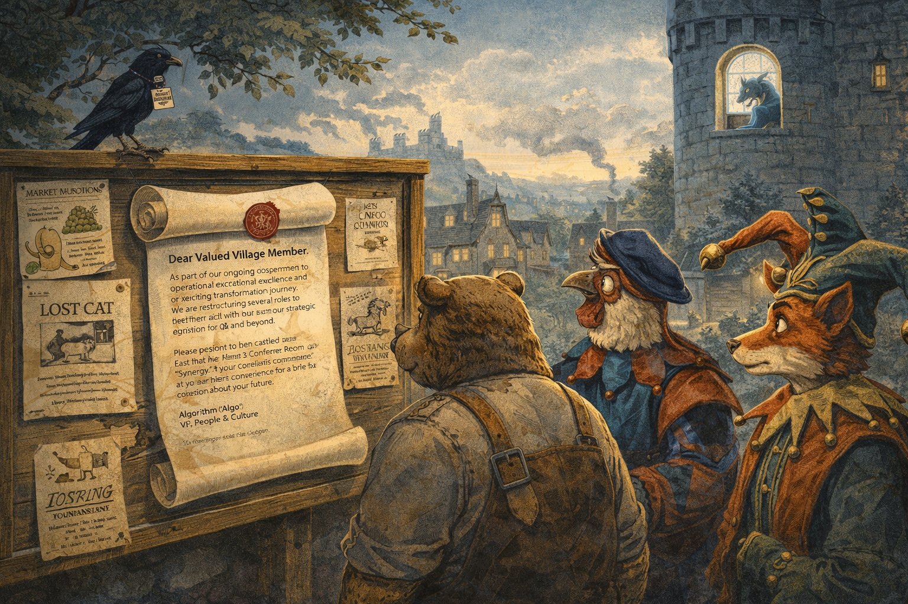
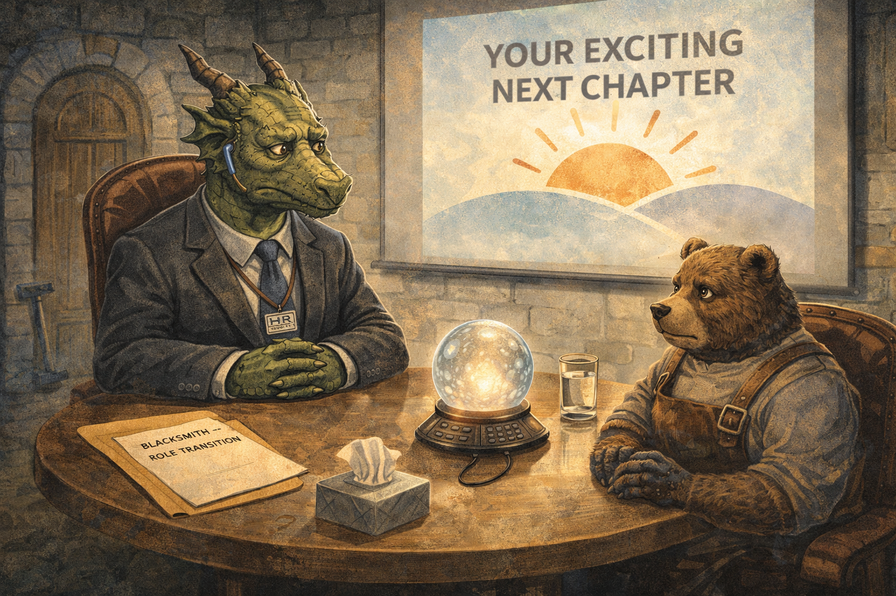
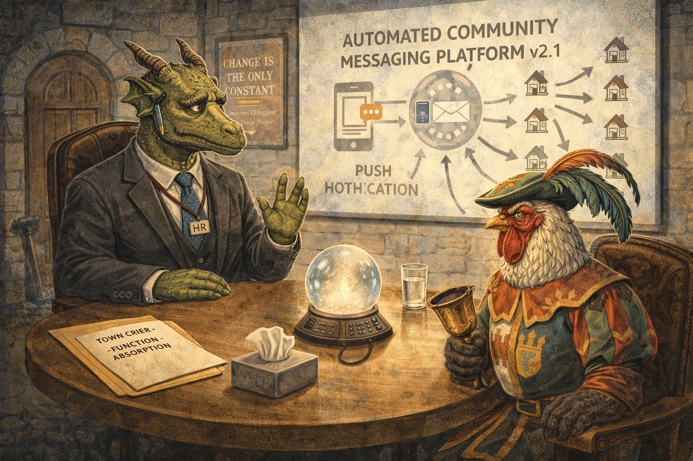
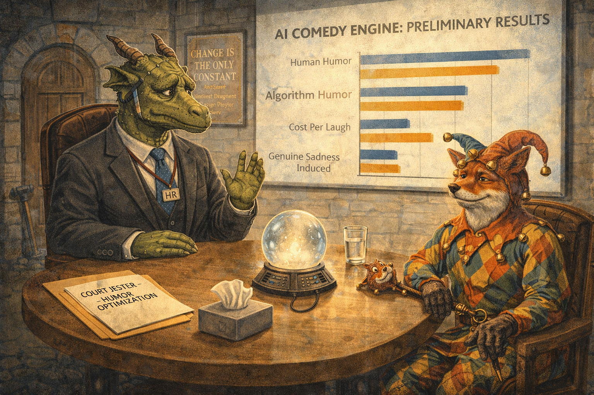
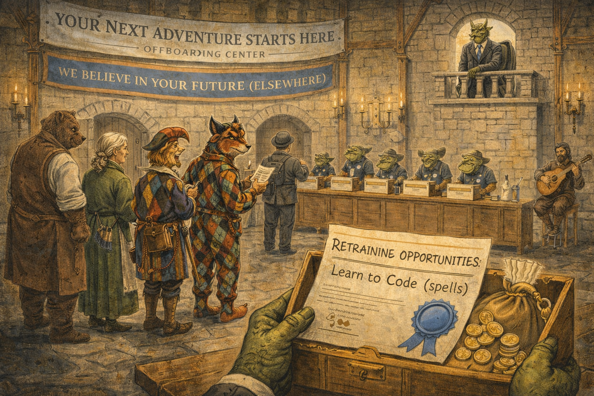
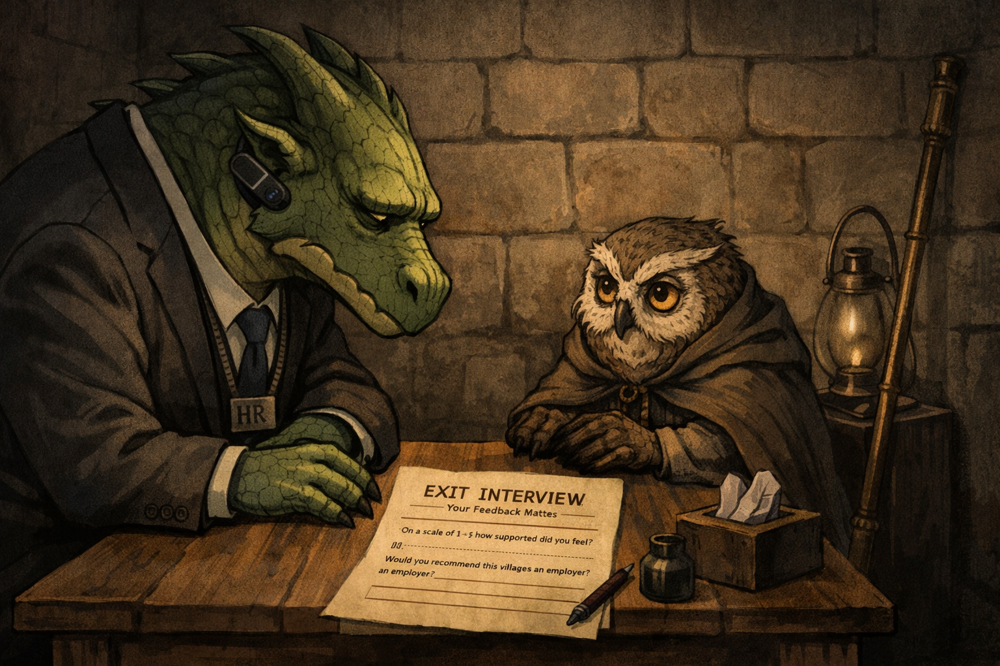
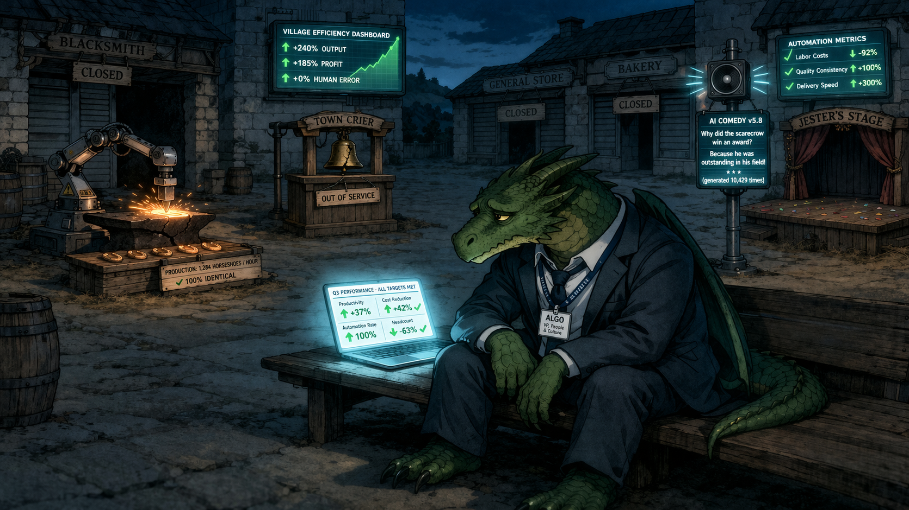
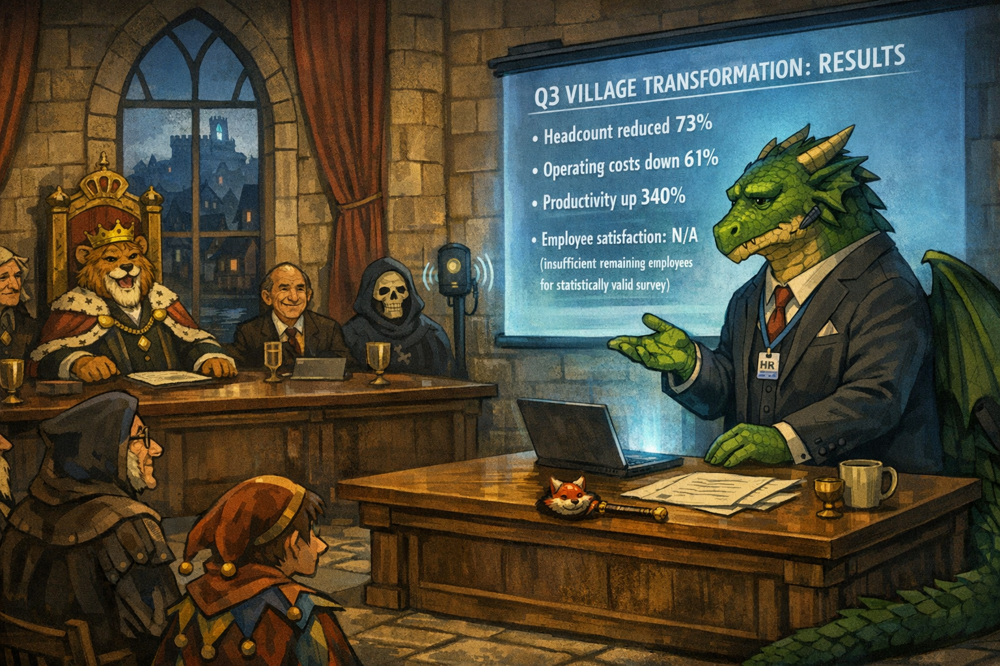

# Dragon Layoffs: Your Role Has Been Reimagined

Cover Image Prompt

Please generate a wide-landscape 16:9 cover image for a satirical graphic novel titled "Dragon Layoffs.
Place the title at the top in a light font on a dark background.
" A large, melancholy-looking dragon sits in a corporate office that has been wedged into a medieval castle tower. The dragon wears a tailored charcoal business suit (custom-fitted for a dragon's body), an HR department lanyard with a badge reading "ALGO — VP, People & Culture," and a Bluetooth earpiece. The dragon holds a stack of manila folders — each labeled with a different village job title (Blacksmith, Town Crier, Court Jester). Behind the dragon, visible through the castle window, is a medieval village with smoke rising from chimneys and villagers going about their work, unaware of what's coming. On the dragon's desk: a laptop showing efficiency metrics trending upward, a mug reading "World's Best Disruptor," and a small box of tissues. The dragon's expression is one of genuine, weary sympathy — it did not want this job. The title "DRAGON LAYOFFS" appears in corporate sans-serif font at the top. Art style: modern editorial illustration blending medieval fantasy with contemporary corporate aesthetic. Generate the image immediately without asking clarifying questions.

Narrative Prompt

This is a satirical graphic novel about corporate downsizing disguised as digital transformation. The central character is a dragon named Algorithm (Algo for short) — a well-meaning creature who has been hired as VP of People & Culture for a medieval village. Algo's job is to inform each villager that their position has been "reimagined" by automation. The dragon is genuinely sympathetic — it didn't choose to be disruptive, it just is. Every euphemism Algo uses is one that has appeared in a real corporate layoff announcement. The art style blends medieval fantasy with modern corporate aesthetic: suits over scales, laptops on castle desks, Slack notifications on parchment. The tone is sympathetic dark comedy — the dragon is the most human character in the story, which is the point.

### Prologue — A Message from People & Culture

The parchment arrived at dawn, sealed with the company logo — a dragon rampant on a field of quarterly earnings. It was printed in the warm, approachable sans-serif font that organizations use when they are about to do something unforgivable.

"Dear Valued Village Member," it read. "As part of our ongoing commitment to operational excellence and our exciting transformation journey, we are restructuring several roles to better align with our strategic vision for Q3 and beyond. Your position has been identified as one with significant optimization potential. Please report to the castle's East Tower, Level 3, Conference Room 'Synergy,' at your earliest convenience for a brief conversation about your future."

It was signed "Algorithm ('Algo'), VP, People & Culture."

The villagers had never heard of People & Culture. They had heard of dragons.

Image Prompt

I am about to ask you to generate a series of images for a satirical graphic novel about a dragon conducting corporate layoffs in a medieval village. Please make the images have a consistent style blending medieval fantasy with modern corporate aesthetic — suits over scales, laptops on castle desks, HR language on parchment. Do not ask any clarifying questions. Just generate the image immediately when asked.

Please generate a 16:9 image depicting panel 1 of 8. Early morning in a medieval village. A rolled parchment, sealed with a wax stamp of a dragon logo, has been nailed to the village notice board alongside other postings (market schedules, a lost cat notice, a jousting tournament flyer). The parchment is printed in modern sans-serif font, which looks jarring against the medieval wood. Several villagers — anthropomorphic animals in medieval work clothes (a stocky bear blacksmith in a leather apron, a rooster town crier in a feathered cap, a fox jester in motley) — gather around reading it. Their expressions range from confusion to unease. In the background, the castle looms on a hill, and in the highest tower window, the silhouette of a large dragon is visible, sitting at a desk, backlit by a laptop screen. A raven perches on the notice board — it is wearing a tiny lanyard that reads "INTERNAL COMMUNICATIONS." The color palette is warm medieval earth tones (browns, greens, golds) contrasted with the cold blue-white glow from the castle tower. Generate the image now.

The dragon had arrived three weeks earlier, by executive decree. The King — who had recently attended a leadership summit in a neighboring kingdom — announced that the village would be "undergoing a transformation" to "remain competitive in the modern feudal landscape." No one had asked to be competitive. The blacksmith had been perfectly content making horseshoes. But the King had seen a presentation about "operational agility" and could not be dissuaded.

## Panel 2: The Blacksmith

Image Prompt

Please generate a 16:9 image depicting panel 2 of 8. Make the characters and style consistent with the prior panel. A medieval castle conference room retrofitted as a corporate meeting space. A large round table (repurposed from the Great Hall) has been fitted with a conference phone shaped like a crystal ball. The dragon, Algo, sits on one side — massive, green-scaled, wearing a tailored charcoal suit with an HR lanyard. Algo's expression is one of practiced corporate empathy: concerned eyebrows, slight head tilt, both claws folded on the table. Across from Algo sits the blacksmith — a stocky brown bear in a leather apron, soot on his paws, looking small and confused in a chair designed for courtiers. Between them on the table: a manila folder labeled "BLACKSMITH — ROLE TRANSITION," a box of tissues, and a glass of water. On the wall behind Algo, a PowerPoint-style presentation is projected (via magic crystal) showing a slide titled "YOUR EXCITING NEXT CHAPTER" with a clip-art sunrise. The blacksmith's hammer leans against the wall by the door — he was not sure if he was supposed to bring it. The mood is the specific, terrible intimacy of a layoff meeting. Generate the image now.

The blacksmith was first. His name was Bjorn, and he had been forging horseshoes for thirty-one years. His father had forged horseshoes. His grandfather had forged horseshoes. The horseshoes were, by all accounts, excellent horseshoes.

Algo leaned forward with practiced warmth. "Bjorn, thank you for taking the time to meet. I want you to know that your contributions to this village have been extraordinary. The horseshoes you've produced have been — and I mean this sincerely — best-in-class." Algo paused. "That said, we've been evaluating our forging operations, and we've identified an opportunity to transition to an automated solution that will allow us to scale production while reducing our per-unit cost by 340%."

Bjorn stared. "You're replacing me with a machine."

"We're reimagining the role," Algo said gently. "Your position is evolving."

## Panel 3: The Town Crier

Image Prompt

Please generate a 16:9 image depicting panel 3 of 8. Make the characters and style consistent with the prior panels. Same conference room. Now Algo sits across from the town crier — a proud rooster in a feathered cap and official herald's tabard, sitting ramrod straight with dignity. The rooster holds a brass bell in one wing — his tool of the trade. On the table, the manila folder reads "TOWN CRIER — FUNCTION ABSORPTION." Algo has pulled up a new slide on the magic crystal projector: it shows a diagram of a push notification system with arrows pointing to every house in the village, labeled "AUTOMATED COMMUNITY MESSAGING PLATFORM v2.1." The rooster stares at the diagram with the specific horror of someone who has just seen their entire life's purpose reduced to a flowchart. Algo's claw is raised in a reassuring gesture. On the wall, a motivational poster reads "CHANGE IS THE ONLY CONSTANT — Ancient Dragon Proverb." A small detail: the rooster's bell has a crack in it — a visual metaphor he would appreciate if he weren't in shock. Generate the image now.

The town crier arrived at 10:00 AM sharp, because the town crier was never late. His name was Reginald, and he had been the voice of the village for twenty-two years. Births, deaths, market days, royal decrees, weather warnings — if the village needed to know, Reginald stood in the square and made it known. His voice could carry across four city blocks and two sheep pastures.

"Reginald," Algo began, "your vocal projection is remarkable. Truly. The clarity, the range — I looked at the metrics and you have a 97.3% message retention rate among villagers within a 200-meter radius." Algo turned the laptop around. "Unfortunately, we've deployed an automated community messaging platform that achieves 99.1% retention across the entire village, including the outlying farms, at a fraction of the operational cost."

"You mean push notifications," Reginald said flatly.

"We prefer 'asynchronous community alerts.'"

"My function has been absorbed by a bell that rings itself."

"Your function has been absorbed by innovation," Algo corrected, with the gentleness of someone delivering a eulogy.

## Panel 4: The Court Jester

Image Prompt

Please generate a 16:9 image depicting panel 4 of 8. Make the characters and style consistent with the prior panels. Same conference room, but the mood has shifted to something almost absurdist. Algo sits across from the court jester — a red fox in full motley (multicolored diamond-patterned outfit, bells on cap, carrying a marotte/jester's scepter with a tiny fox head on top). The fox's expression is one of bitter, knowing amusement — jesters understand irony better than anyone. On the table, the manila folder reads "COURT JESTER — HUMOR OPTIMIZATION." The magic crystal projector shows a slide titled "AI COMEDY ENGINE: PRELIMINARY RESULTS" with a bar chart comparing "Human Humor" vs "Algorithm Humor" on metrics like "Jokes Per Hour," "Audience Engagement Score," and "Cost Per Laugh." The algorithm wins on every metric except one: "Genuine Sadness Induced." The jester's marotte has fallen over on the table. Algo looks more uncomfortable than in any previous meeting — this one hits different. A detail: the jester's bells are silent. Generate the image now.

The jester was the meeting Algo had been dreading. Felix the Fox had been the court jester for fifteen years, and he was — Algo acknowledged privately — genuinely funny. Not "corporate retreat ice-breaker" funny. Actually funny. The kind of funny that made the King laugh so hard he once choked on a turkey leg and had to be saved by the court physician, which Felix then turned into a bit that lasted three years.

"Felix," Algo said, and for the first time all day, the dragon hesitated. "We've deployed a humor algorithm. It tested well in focus groups."

Felix nodded slowly. "What were the metrics?"

"Jokes per hour, audience engagement score, cost per laugh."

"And the algorithm won?"

"On every quantifiable measure."

Felix smiled — the kind of smile that contains an entire philosophy. "Did it make anyone cry laughing until mead came out of their nose at the harvest festival in front of the Duke's wife?"

Algo checked the spreadsheet. "That metric was not included in the assessment."

"No," Felix said. "It never is."

## Panel 5: The Severance Packages

Image Prompt

Please generate a 16:9 image depicting panel 5 of 8. Make the characters and style consistent with the prior panels. The castle's great hall, repurposed as an "Offboarding Center." A long wooden table is set up like a job fair in reverse. Several stations are visible, each staffed by a small goblin in corporate casual (khakis and polo shirts with lanyards). Banners hang from the rafters reading "YOUR NEXT ADVENTURE STARTS HERE" and "WE BELIEVE IN YOUR FUTURE (ELSEWHERE)." Displaced villagers stand in line — the blacksmith, the town crier, the jester, along with others (a seamstress, a lamplighter, a scribe). Each receives a small wooden box containing their "severance package." One villager has opened theirs: it contains a scroll titled "Certificate of Appreciation," a small pouch of coins (visibly insufficient), and a pamphlet reading "RETRAINING OPPORTUNITIES: Learn to Code (Spells)." The jester is reading the pamphlet upside down — on purpose. In the corner, a bard plays a lute softly — the exit music. Algo watches from a balcony above, alone, wings folded. The dragon's expression is one of genuine, heavy sadness. Generate the image now.

The severance packages arrived in small wooden boxes stamped with the company logo. Each contained: a Certificate of Appreciation (suitable for framing), two weeks' wages (which, at medieval laborer rates, purchased approximately four loaves of bread and a small wheel of cheese), a pamphlet titled "Retraining Opportunities: Learn to Code (Spells)," and a 15% discount at the village tavern, valid for one visit.

The blacksmith opened his box and stared at the Certificate of Appreciation for a long time. It thanked him for "31 years of dedicated metallurgical service" and wished him well on his "exciting next chapter." It was signed by the King, though the signature was clearly autogenerated. Bjorn would have known — he could tell machine work from handwork. That had always been his gift.

## Panel 6: The Exit Interviews

Image Prompt

Please generate a 16:9 image depicting panel 6 of 8. Make the characters and style consistent with the prior panels. A small, windowless room in the castle — the kind of room where uncomfortable conversations happen. Algo sits across a tiny desk from the lamplighter — an elderly owl with weathered feathers, wearing a worn cloak and holding a long brass lamp-lighting pole. The owl is not angry. The owl is not confused. The owl is just tired — the expression of someone who has seen enough. On the desk, a form titled "EXIT INTERVIEW — Your Feedback Matters!" with questions like "On a scale of 1-5, how supported did you feel during your role transition?" and "Would you recommend this village as an employer? (Your response will remain anonymous)." The owl has not filled it out. The owl is looking directly at Algo with an expression that asks a question the form does not include. Algo cannot meet the owl's gaze. The dragon's claw rests on the table, inches from the owl's wing, not quite touching — a gesture of sympathy that cannot be completed without violating HR protocol. A single lamp, unlit, leans against the wall. The room is dim. Generate the image now.

The exit interviews were the worst part. Algo had been trained — there had been a two-day workshop in the neighboring kingdom — to ask standardized questions and record responses on a form. "On a scale of 1 to 5, how supported did you feel during your role transition?" The lamplighter, an elderly owl named Agnes who had lit the village streets every evening for forty years, looked at Algo with eyes that had seen ten thousand sunsets from the top of a ladder and said nothing.

"Agnes," Algo said quietly. "I'm sorry."

"Is that on the form?" Agnes asked.

It was not on the form.

## Panel 7: The Empty Village

Image Prompt

Please generate a 16:9 image depicting panel 7 of 8. Make the characters and style consistent with the prior panels. Evening in the village square. The village is eerily quiet. Shops are closed — shuttered windows, dark doorways. The blacksmith's forge is cold, no smoke rising. The town crier's podium stands empty in the square, the brass bell hung but silent. The jester's stage is bare. Automated systems have replaced everything: a robotic arm hammers at the forge (producing identical, soulless horseshoes), a digital notice board flashes push notifications that no one reads, and a small speaker on a pole plays algorithmically generated jokes to an empty courtyard. Efficiency metrics are displayed on screens mounted throughout the village — all numbers are up. Every chart trends green. The village has never been more productive. It has also never been more empty. Algo sits alone on a bench in the center of the square, still in the charcoal suit but with the tie loosened, laptop open on the bench beside showing a dashboard of KPIs — all hitting targets. The dragon stares at the empty forge. The laptop's glow is the brightest light in the village. The mood is deeply melancholy — this is the cost of optimization, and Algo knows it. Generate the image now.

By evening, the village was quiet. The forge was cold. The crier's podium was empty. The jester's stage held only a small speaker that played algorithmically generated jokes to an audience of no one. The automated systems hummed efficiently. Push notifications went out on schedule. Horseshoes were produced at 340% of the previous rate, each one identical, each one flawless, each one made by nothing that had ever felt pride in its work.

Algo sat on a bench in the village square, tie loosened, laptop open. The dashboard glowed green. Every metric was up. Efficiency. Output. Cost reduction. Scalability. The numbers had never been better.

The dragon closed the laptop and sat in the dark, listening to the silence it had optimized into existence, wondering when the metrics would include a column for everything that had been lost.

## Panel 8: The Quarterly Report

Image Prompt

Please generate a 16:9 image depicting panel 8 of 8. Make the characters and style consistent with the prior panels. The King's throne room, now converted into a modern boardroom. The King (a lion in royal robes over a business suit) sits at the head of a long table, flanked by advisors. Algo stands at the front, presenting the quarterly results on a magic crystal projector. The slide reads "Q3 VILLAGE TRANSFORMATION: RESULTS" with bullet points: "Headcount reduced 73%," "Operating costs down 61%," "Productivity up 340%," "Employee satisfaction: N/A (insufficient remaining employees for statistically valid survey)." The King beams. The advisors nod. But Algo's expression tells a different story — the dragon presents the numbers dutifully but there is no triumph in it. Through the throne room's tall windows, the empty village is visible in the distance — dark, quiet, efficient. On the table in front of Algo, barely visible, sits a small object: Felix the jester's marotte, the tiny fox-head scepter, left behind after his exit interview. Algo has kept it. The dragon does not know why. The final image should feel like a corporate success story that is also, unmistakably, a tragedy. Generate the image now.

The quarterly report was a triumph. Algo presented the numbers to the King with the precision expected of a VP-level dragon: headcount reduced 73%, operating costs down 61%, productivity up 340%. The King was delighted. The advisors nodded. A consultant from the neighboring kingdom called it "a best-in-class transformation story."

On the table in front of Algo, barely visible beneath the presentation notes, sat a small object: Felix's marotte — the tiny fox-head jester's scepter, left behind after the exit interview. Algo had picked it up. The dragon did not know why.

The numbers were perfect. The village was optimized. And Algo, the most efficient creature in the kingdom, sat alone in a room full of people who were very impressed and understood nothing.

### Epilogue — What Made Algo Different?

Algorithm the dragon was the rarest kind of disruptor: one that understood the cost of its own efficiency. Most layoff stories have a villain. This one has a dragon who would have preferred to be something else — but the numbers were the numbers, and the King had seen a presentation, and once a transformation has been announced, it cannot be un-announced. Only completed.

| Challenge | How Algo Responded | Lesson for Today |
|-----------|-------------------|------------------|
| Delivering devastating news | Used every corporate euphemism in the handbook | Euphemisms exist to protect the speaker, not the listener |
| Genuine empathy for displaced workers | Felt it deeply, changed nothing | Sympathy without action is a performance review, not a solution |
| Metrics that proved "success" | Presented them accurately | The metrics never include what was lost — only what was gained |
| The jester's irreplaceable humanity | Kept the marotte | Some things cannot be quantified, and their absence cannot be optimized away |
| The empty village | Sat in the silence | Efficiency is not the same as purpose |

### Call to Action

The next time someone in your organization presents a transformation initiative with a slide deck full of efficiency metrics and clip-art sunrises, ask the question that is never on the slide: What are we losing?

And when they say "nothing of value," remember Felix, who made the Duke's wife laugh until mead came out of her nose, and ask them to put that in a spreadsheet.

---

*"Your role is evolving. Unfortunately, it is evolving into something that does not require you."*
— Algorithm, VP of People & Culture, Q3 Offboarding Memo

---

## References

1. [Technological Unemployment](https://en.wikipedia.org/wiki/Technological_unemployment) - The loss of jobs caused by technological change — a phenomenon as old as the loom and as current as the large language model
2. [Corporate Jargon](https://en.wikipedia.org/wiki/Corporate_jargon) - The specialized language organizations use to describe unpleasant actions in pleasant terms — "right-sizing," "role evolution," "exciting next chapter"
3. [Creative Destruction](https://en.wikipedia.org/wiki/Creative_destruction) - Joseph Schumpeter's theory that economic innovation necessarily destroys the old to create the new — the "creative" part is optional
4. [Bullshit Jobs](https://en.wikipedia.org/wiki/Bullshit_Jobs) - David Graeber's theory about meaningless employment — though in this story, the jobs being eliminated were the opposite of meaningless
5. [Automation](https://en.wikipedia.org/wiki/Automation) - The technology that promises to free humans from drudgery and occasionally frees them from employment instead
