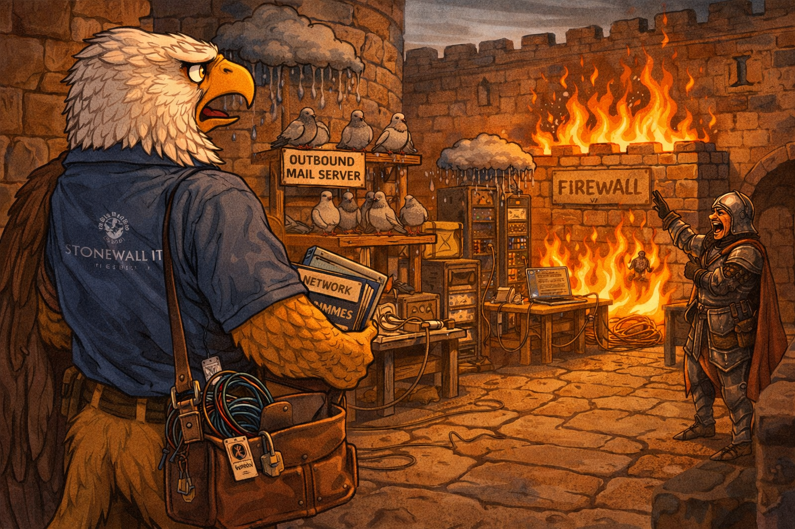
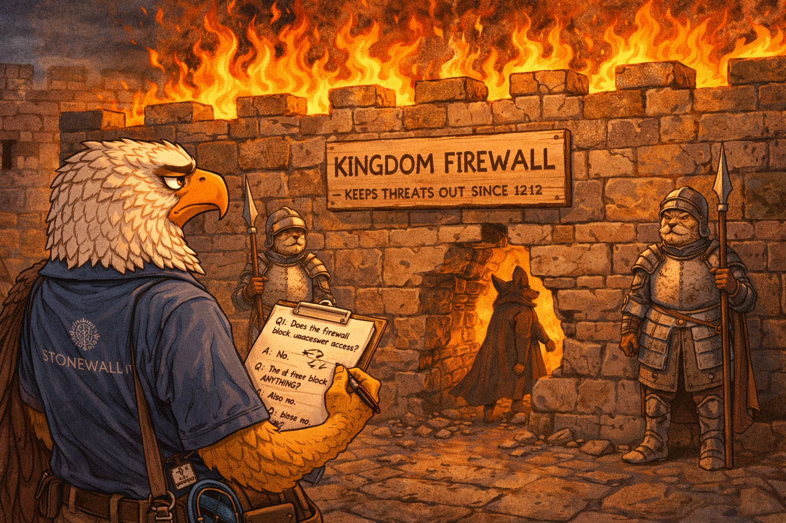
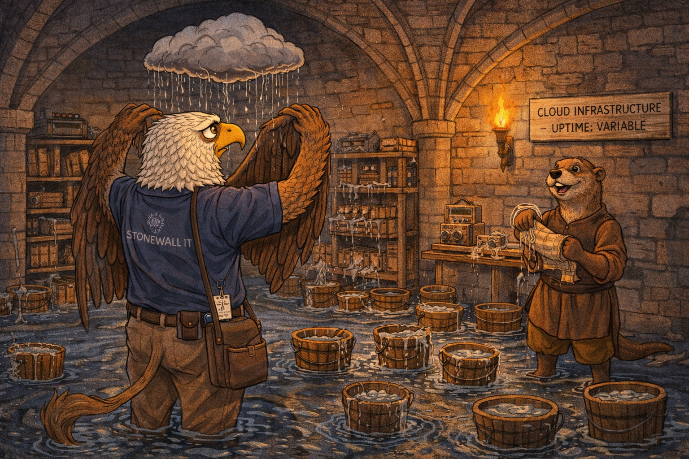
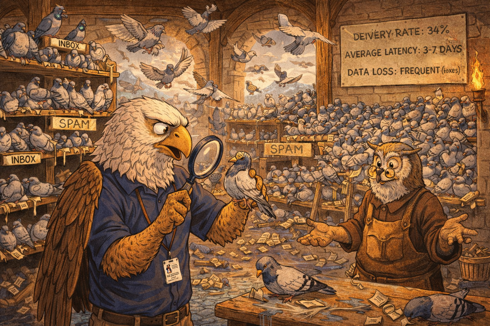
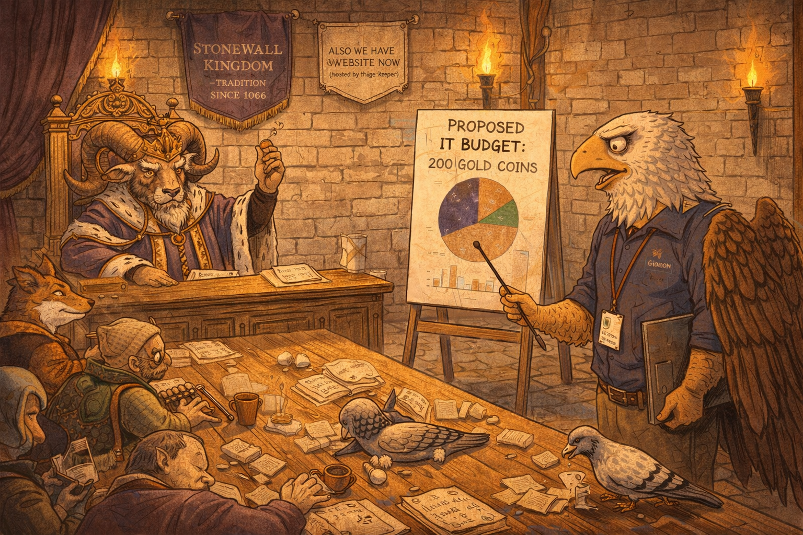
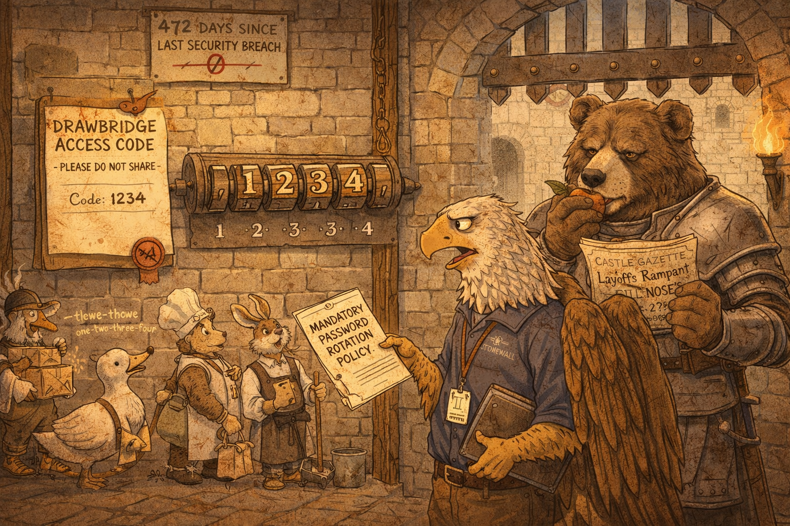
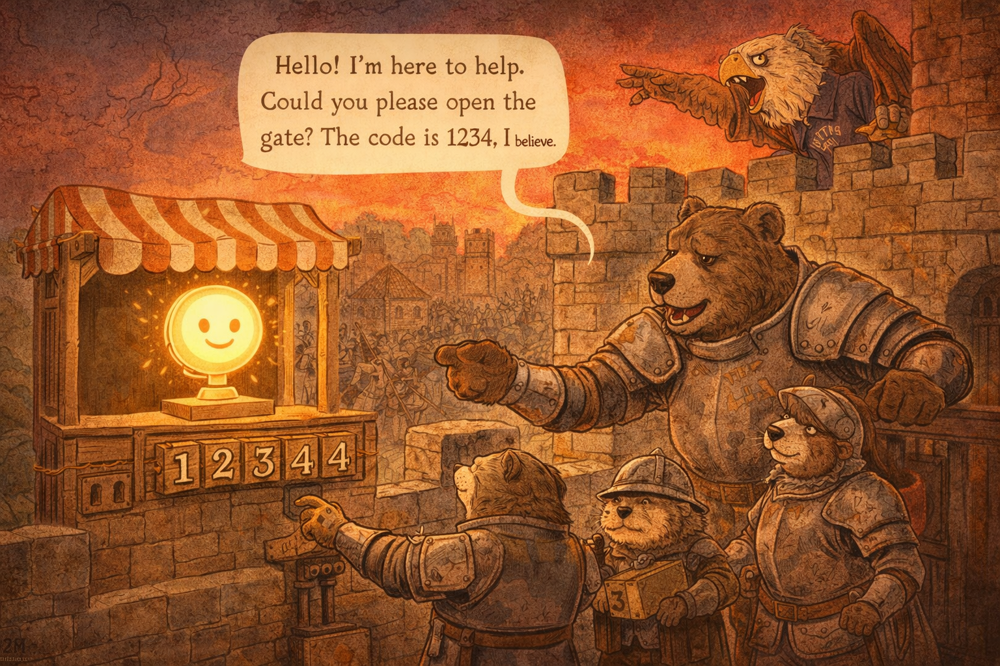
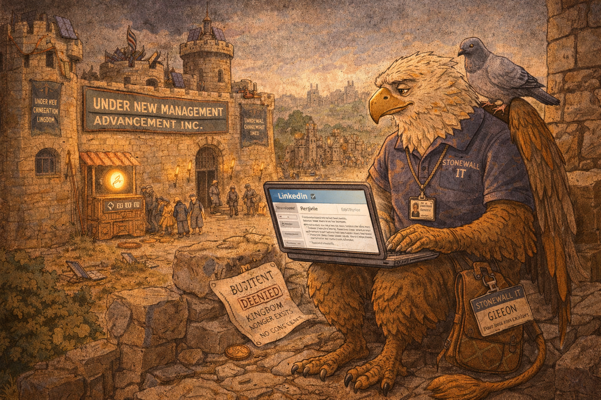

# Griffin IT Support: Have You Tried Turning Off the Trebuchet

<!--  -->

Cover Image Prompt

Please generate a wide-landscape 16:9 cover image for a satirical graphic novel titled "Griffin IT Support." The scene shows a griffin — half eagle, half lion, wearing a wrinkled IT department polo shirt with a name badge reading "GIDEON — IT DIRECTOR" and a utility belt of medieval tools and USB cables — standing in the middle of a medieval castle's great hall that has been repurposed as a disastrous server room. Behind the griffin, a literal stone wall is on fire (the "firewall"). To the left, a rain cloud hovers directly over a rack of servers, dripping water onto sparking equipment. Carrier pigeons sit on perches above the servers, some carrying tiny scrolls with "URGENT: REPLY ALL" written on them. A medieval king sits on a throne in the background, arms crossed, wearing a crown and an expression of smug certainty. The griffin holds a laptop in one talon and a medieval scroll (the IT budget — a single coin is drawn on it) in the other, looking exhausted and defeated. The color palette is warm castle stone, firelight orange, rain-cloud gray, and the sickly green glow of dying server LEDs. Art style: modern editorial illustration with clean lines and warm satirical detail, blending medieval illuminated manuscript aesthetics with modern IT infrastructure. The title "GRIFFIN IT SUPPORT" appears in bold serif font across the top. Generate the image immediately without asking clarifying questions.

Narrative Prompt

This is a satirical graphic novel about trying to modernize an organization that is centuries behind — a universal IT experience translated into a fantasy setting. The central character is Gideon, a griffin who has been hired as IT Director for the Kingdom of Stonewall, a medieval kingdom whose technology infrastructure consists of carrier pigeons, a literal firewall (a wall that is on fire), and a cloud (an actual rain cloud that drips on the server room). The satire targets organizations that resist technological change with the phrase "but we've always done it this way," executives who approve zero-dollar IT budgets while demanding enterprise-grade security, and the specific kind of institutional stubbornness that treats modernization as a personality flaw. Every obstacle Gideon faces mirrors a real IT professional's daily life: ignored security warnings, rejected budget requests, shadow IT, users who refuse to update their passwords (or in this case, their drawbridge codes), and leadership that treats technology as optional until the moment it fails catastrophically. The tone is the bone-deep exhaustion of anyone who has ever tried to explain to a C-suite executive why the company needs to stop using the same password for everything. The art style should be warm medieval illustration — castle stone, torchlight, illuminated manuscript details — blended with modern IT infrastructure in a way that makes both look equally absurd.

### Prologue — Ticket #1: Everything

The job posting had been refreshingly honest. "IT Director needed for established organization. Legacy systems. Room for growth. Must be comfortable with ambiguity." What the posting did not mention was that "legacy systems" meant the 11th century, "room for growth" meant starting from nothing, and "comfortable with ambiguity" meant no one in the organization could agree on whether electricity was real.

Gideon had taken the job anyway. He was a griffin — half eagle, half lion — which meant he was simultaneously overqualified and underestimated. Eagles could see problems from a great distance. Lions could survive hostile environments. Neither species had evolved to handle a king who insisted that carrier pigeons constituted an adequate email system.

His first day began with a tour of the infrastructure. It ended with a drink.

<!--  -->

Image Prompt

I am about to ask you to generate a series of images for a satirical graphic novel about a griffin IT director trying to modernize a medieval kingdom. Please make the images have a consistent warm medieval editorial illustration style blended with modern IT elements — clean lines, expressive characters, consistent character designs throughout. Think illuminated manuscript meets corporate IT department. Do not ask any clarifying questions. Just generate the image immediately when asked.

Please generate a 16:9 image depicting panel 1 of 8. A griffin — Gideon — stands at the entrance to a medieval castle's interior courtyard, taking in the disaster for the first time. He is half eagle (head, wings, front talons) and half lion (body, hind legs, tail), wearing a wrinkled navy blue IT department polo shirt with a small embroidered logo reading "STONEWALL IT" and a lanyard with an ID badge. He carries a leather satchel filled with modern networking cables, a laptop, and a copy of "Network Administration for Dummies" that looks well-thumbed. His expression is one of dawning horror. Before him: the courtyard has been repurposed as a chaotic "data center." Carrier pigeons roost on wooden perches labeled "OUTBOUND MAIL SERVER." A literal stone wall in the background is on fire — flames licking up the side — with a wooden sign reading "FIREWALL v1.0." A rain cloud hovers ominously over a corner where a few crude wooden server racks hold scrolls instead of hard drives. A knight nearby is yelling at a pigeon. The color palette is warm castle stone, torch amber, fire orange, and the gray of rain clouds. The mood is the first day at a job that was a mistake. Generate the image now.

The Kingdom of Stonewall had been founded in 1066 and had not updated its infrastructure since. The moat served as both physical security and sewage management, a dual-purpose system that failed at both. The treasury ran on an abacus operated by a badger who refused to show his work. The royal archives were stored in a damp cellar where the ink had run on every document written before 1340, rendering 274 years of institutional knowledge illegible. Gideon added "data recovery" to his project list and kept walking.

## Panel 2: The Firewall Audit

<!--  -->

Image Prompt

Please generate a 16:9 image depicting panel 2 of 8. Make the characters and style consistent with the prior panel. Gideon the griffin stands before the kingdom's "firewall" — a literal stone wall approximately fifteen feet tall that is genuinely, actively on fire. Flames rise from the top where oil has been poured along the battlements. Two guards — a stoic badger and a sleepy hedgehog, both in chainmail — stand at either end of the wall. A wooden sign nailed to the wall reads "KINGDOM FIREWALL — KEEPS THREATS OUT SINCE 1212." Gideon holds a clipboard and a pen, conducting a security audit, his expression flat with professional despair. He has written on the clipboard: "Q1: Does the firewall block unauthorized access? A: No. Q2: Does the firewall block ANYTHING? A: Also no. Q3: Is the firewall on fire? A: Yes." Behind the wall, clearly visible through a gap where the mortar has crumbled, a fox in a dark cloak simply walks through the hole. Neither guard notices. The color palette is firelight orange, stone gray, and the white of Gideon's clipboard. The mood is a routine security audit revealing non-routine catastrophe. Generate the image now.

The firewall was, architecturally, a wall. It had been built in 1212 to repel the Normans and had since been maintained by setting it on fire periodically to "keep it active." Gideon asked the head guard what the wall was designed to block. "Threats," the badger said. Gideon asked for specifics. "All of them," the badger said. Gideon pointed out that the wall had a four-foot gap in the northeast corner through which a horse could comfortably pass. The badger said the gap was "a known issue" and "on the roadmap." It had been on the roadmap since 1347.

## Panel 3: The Cloud

<!--  -->

Image Prompt

Please generate a 16:9 image depicting panel 3 of 8. Make the characters and style consistent with the prior panels. The kingdom's "server room" — a vaulted stone chamber in the castle basement. In the center of the ceiling, an actual gray rain cloud hovers, dripping a steady stream of water onto the equipment below. The "servers" are wooden shelves holding scrolls, ledger books, and a few crude mechanical devices that vaguely resemble early computing equipment. Water drips onto everything. A bucket collection system has been set up — dozens of wooden buckets catching drips — but they are overflowing. Gideon stands ankle-deep in water, wings held above his head to stay dry, staring up at the cloud with the expression of a person who has just been told that this is the cloud computing solution. A castle servant — a cheerful otter in a tunic — stands nearby wringing out a wet scroll and saying something. A small sign on the wall reads "CLOUD INFRASTRUCTURE — UPTIME: VARIABLE." The color palette is damp stone gray, water blue, and the warm amber of a single torch that is struggling not to go out. Generate the image now.

"We moved to the cloud last year," the Royal Chancellor had told Gideon during the interview, with evident pride. The cloud was a cumulus formation that had somehow become trapped in the castle's lower vaulting in the autumn of 1402 and had refused to leave. It rained on the server room intermittently. The kingdom had addressed this by placing buckets beneath the cloud and emptying them every four hours, a process they called "manual cloud management." Gideon asked why they did not simply open a window. The Chancellor explained that the window had been bricked up in 1387 for security purposes. The security threat had been pigeons. The kingdom now used pigeons for its email system. Gideon wrote "IRONY" in the margin of his audit report and moved on.

## Panel 4: The Carrier Pigeon Email System

<!--  -->

Image Prompt

Please generate a 16:9 image depicting panel 4 of 8. Make the characters and style consistent with the prior panels. The kingdom's communication center — a large open tower room filled with hundreds of carrier pigeons on wooden perches. The room is chaos. Pigeons fly in every direction. Tiny scrolls are tied to their legs. Several pigeons sit on a perch labeled "INBOX" — most are asleep. A section labeled "SPAM" contains an enormous pile of pigeons, all carrying messages from the same sender. One pigeon wears a tiny hat labeled "PRIORITY" but appears lost. In the center, Gideon examines a pigeon with a magnifying glass while a pigeon-keeper — an elderly owl in spectacles and a leather apron — watches defensively. On a wall chart, the pigeon system's metrics are displayed: "DELIVERY RATE: 34%," "AVERAGE LATENCY: 3-7 DAYS," "DATA LOSS: FREQUENT (foxes)." A pigeon in the corner is eating one of the messages. Gideon is pointing at this pigeon. The owl is shrugging. The color palette is warm wood, white feathers, and the tan of tiny scrolls everywhere. The mood is a legacy system that everyone knows is broken but no one will replace. Generate the image now.

The carrier pigeon email system had a 34% delivery rate, which the pigeon-keeper considered "industry standard." Gideon pointed out that the industry in question had been obsolete for 600 years. The pigeon-keeper, an owl named Cornelius who had held the position since before anyone could remember, explained that the system was "battle-tested." Gideon asked what happened to the other 66% of messages. Cornelius said some were lost to foxes, some to weather, and a small but meaningful percentage were eaten by the pigeons themselves. "They get hungry on long routes," Cornelius said. "It is a known limitation." Gideon asked about encryption. Cornelius said the pigeons could not read, which he considered sufficient.

## Panel 5: The Budget Meeting

<!--  -->

Image Prompt

Please generate a 16:9 image depicting panel 5 of 8. Make the characters and style consistent with the prior panels. The royal throne room, repurposed for a budget meeting. King Rampart III — a large, imposing ram with magnificent curled horns, wearing a gold crown, purple robes trimmed with ermine, and an expression of regal impatience — sits on his throne at the head of a long oak table. Gideon stands at the opposite end, presenting to the court using a large easel with hand-drawn charts. His presentation slide reads "PROPOSED IT BUDGET: 200 GOLD COINS" with a pie chart. The king holds up a single copper coin between two hooves with a look that says "this is your budget." Around the table: a fox chancellor in rich robes smirking, a tortoise treasurer clutching an abacus protectively, and several courtiers who are openly not paying attention — one is napping, another is feeding a pigeon under the table. On the wall behind the king, two banners hang side by side: "STONEWALL KINGDOM — TRADITION SINCE 1066" and a newer, smaller one reading "ALSO WE HAVE A WEBSITE NOW (hosted by the pigeon-keeper)." The color palette is royal purple, gold, warm torchlight, and the dim resignation of Gideon's posture. The mood is every IT budget presentation ever given. Generate the image now.

The budget meeting lasted eleven minutes, nine of which were spent debating whether to serve lunch. Gideon presented a proposal for basic cybersecurity improvements: patch the firewall gap, relocate the cloud, replace the pigeon system with a courier network, and install a drawbridge code that was not the king's birthday. The total cost was 200 gold coins — roughly what the kingdom spent annually on the king's hat collection. King Rampart III held up a single copper coin. "This is your budget," he said. "Make it work." Gideon pointed out that a single copper coin would not cover a pigeon, let alone a network upgrade. The king suggested he "prioritize." The Chancellor suggested he "do more with less." The Treasurer suggested he "leverage existing resources." Gideon recognized all three phrases from his previous job, where they had also meant "the answer is no."

## Panel 6: The Password Problem

<!--  -->

Image Prompt

Please generate a 16:9 image depicting panel 6 of 8. Make the characters and style consistent with the prior panels. A castle gatehouse interior. Gideon stands before the main gate mechanism, which is controlled by a large wooden combination lock — four rotating cylinders with letters carved into them. The current combination, clearly visible, reads "1-2-3-4." A laminated (well, wax-sealed) scroll posted next to the lock reads "DRAWBRIDGE ACCESS CODE — PLEASE DO NOT SHARE" and beneath it, in smaller text, "Code: 1234." A line of castle staff wait to enter: a duck carrying parcels, a rabbit in kitchen attire, a mouse with a mop. Every single one of them already knows the code — the duck is mouthing "one-two-three-four" as it approaches. Gideon holds a proposal document titled "MANDATORY PASSWORD ROTATION POLICY" which he is trying to present to the gate guard — a massive, indifferent bear in plate armor who is reading a tabloid scroll and eating an apple. A small sign above the gate reads "472 DAYS SINCE LAST SECURITY BREACH" but the "472" has been crossed out and replaced with "0" in fresh ink. The color palette is warm stone, iron gray, and the red of Gideon's frustration. Generate the image now.

The drawbridge code was 1234. It had been 1234 since 1066. Gideon knew this because it was written on a sign next to the drawbridge. He proposed a mandatory password rotation policy. The king rejected it on the grounds that he could not remember a new code. The Chancellor rejected it because "the current code has never been breached," which was technically true only because no one had ever needed to breach it — the code was posted publicly. The gate guard, a bear named Gorm, rejected it because changing the code would require him to update the sign, and the sign was carved in stone. Gideon asked if they could at least remove the sign. Gorm said the sign was "a load-bearing element of the castle's wayfinding infrastructure." Gideon went to lunch.

## Panel 7: The Siege

<!--  -->

Image Prompt

Please generate a 16:9 image depicting panel 7 of 8. Make the characters and style consistent with the prior panels. The castle under siege — but not a traditional siege. Outside the castle walls, instead of catapults and battering rams, there is a single, small wooden booth with a cheerful awning. Inside the booth sits a chatbot — depicted as a friendly, glowing orb with a simple smiley face, hovering above a small pedestal. A speech bubble from the chatbot reads: "Hello! I'm here to help. Could you please open the gate? The code is 1234, I believe." At the castle gate, the guard bear Gorm is reaching for the drawbridge lever, looking completely convinced. Two other guards — the badger and hedgehog from the firewall — stand nearby nodding agreeably. In the background on the castle battlements, Gideon stands with wings spread in alarm, screaming downward, clearly trying to stop them. His mouth is open, one talon pointing at the chatbot. Behind the chatbot booth, barely visible in the tree line, a massive army waits — siege towers, soldiers, catapults — but the chatbot is handling this alone. The color palette contrasts: warm, friendly glow around the chatbot versus alarmed red around Gideon. The mood is the exact moment social engineering succeeds while the security team watches helplessly. Generate the image now.

The siege began on a Tuesday, which is when all catastrophes arrive. The neighboring Kingdom of Advancement had been threatening invasion for years, but Stonewall's leadership had classified the threat as "low probability, low impact" — a risk assessment performed by the Chancellor, who had never assessed a risk correctly in his career. The invading army did not use catapults. It did not use battering rams. It did not use siege towers, though it had brought several, just in case. It used a chatbot.

The chatbot appeared at the front gate at 9:14 AM, housed in a small wooden booth with a cheerful sign reading "CUSTOMER SERVICE." It said, pleasantly, "Good morning. I am here to conduct a routine compliance audit. Could you open the gate? The code is 1234, I believe." Gorm opened the gate. He did not see a reason not to. The chatbot was polite. It knew the code. The code was on the sign.

Gideon watched from the battlements as the entire army walked through the front door. He did not scream. He was too tired to scream. He had submitted a security vulnerability report about the gate code fourteen times. It had been marked "acknowledged" and "deprioritized" fourteen times.

## Panel 8: The Resume Update

<!--  -->

Image Prompt

Please generate a 16:9 image depicting panel 8 of 8. Make the characters and style consistent with the prior panels. Aftermath. Gideon sits on a broken piece of castle wall in the ruins of the Stonewall Kingdom's courtyard. The castle is not destroyed — it has simply been taken over. New banners reading "UNDER NEW MANAGEMENT — ADVANCEMENT INC." hang from the towers. Workers are already installing modern equipment: fiber optic cables draped over medieval stonework, solar panels on the turrets, a proper server rack being wheeled through the gate. In the background, the chatbot booth is still at the gate, now with a longer queue of castles lined up for "consultation." Gideon sits with his laptop open on his knees, updating his resume. The laptop screen is visible: "LinkedIn — Edit Profile." His expression is not angry or sad — it is the serene calm of someone who knew this would happen, said it would happen, was ignored, and has made peace with it. On the ground beside him: his old ID badge ("STONEWALL IT — GIDEON"), a rejection letter stamped "BUDGET DENIED," and a single copper coin. A pigeon lands on his shoulder, carrying a tiny scroll that reads "Your ticket has been closed: RESOLVED — KINGDOM NO LONGER EXISTS." The color palette is a mix of old warm stone and new cold corporate steel. The mood is quiet, darkly funny acceptance. Generate the image now.

The Kingdom of Stonewall fell in eleven minutes. The chatbot held the gate open while the army walked in, reorganized the treasury, installed fiber optic cable, and replaced the pigeon system with an actual email server. The cloud was removed by opening a window — the one that had been bricked up for security purposes in 1387. The firewall gap was patched in an afternoon. It had taken the kingdom 677 years not to do what the invaders did before lunch.

Gideon sat on a broken piece of battlements and opened his laptop. His LinkedIn profile still listed "IT Director — Kingdom of Stonewall." He changed it to "IT Director — Former Kingdom of Stonewall. Specializing in legacy system modernization, stakeholder resistance management, and post-siege infrastructure recovery." He had twelve new connection requests. All of them were from other kingdoms with the same problems. He accepted them all. He had learned that IT professionals do not retire. They simply move to the next kingdom that believes it is different.

A pigeon landed on his shoulder. It carried a tiny scroll that read: "Your support ticket has been closed. Resolution: Kingdom no longer exists. Thank you for your patience."

Gideon sighed. He had been patient. It had not helped.

### Epilogue — What Made Gideon Different?

Gideon was not a failed IT director. By every professional standard, he identified the vulnerabilities, proposed the solutions, estimated the costs, and communicated the risks. He did everything correctly. The kingdom fell anyway — not because the griffin was wrong, but because being right is not the same as being heard. The gap between identifying a problem and getting an organization to act on it is the gap where most institutions fail. Gideon could see the breach from miles away. Eagles can do that. But seeing the future and convincing a medieval ram to fund it are different skill sets entirely.

| Challenge | How Gideon Responded | Lesson for Today |
|-----------|---------------------|------------------|
| Catastrophic legacy infrastructure | Conducted a thorough audit and proposed a remediation plan | Documentation without authority is just a record of what you warned about |
| Zero IT budget | Presented a cost-benefit analysis to leadership | When leadership values tradition over survival, the budget is not the real problem |
| Resistance to every change | Made the case repeatedly through proper channels | "But we've always done it this way" is the organizational equivalent of "the code is on the sign" |
| Known security vulnerability (the gate code) | Filed 14 security reports, all acknowledged and deprioritized | Acknowledging a risk and addressing a risk are different verbs with different outcomes |
| Social engineering attack (the chatbot) | Was overruled by the guard who opened the gate | The weakest point in any security system is the person who thinks the process does not apply to them |

### Call to Action

Every organization has a firewall that is literally on fire. Every IT department has filed a report that was acknowledged and ignored. Every security professional has watched someone open the gate because the attacker was polite and knew the code that was posted on the sign.

Gideon's story is not a fantasy. It is a Tuesday. The only fictional element is the griffin. The firewall, the cloud, the carrier pigeons, the budget meeting, the password on a sticky note, the executive who says "we've always done it this way" — these are in your building right now. The chatbot is already at the gate. It is being very polite.

The question is not whether your organization will be breached. The question is whether anyone will read the report that told them it would happen.

---

*"I submitted fourteen security reports. They acknowledged all of them. They acted on none of them. My fifteenth report is this resignation letter."*
— Gideon, IT Director (Former), Kingdom of Stonewall

*"The code is 1234. It has always been 1234. What is your concern, exactly?"*
— King Rampart III, Final Staff Meeting

---

## References

1. [Social Engineering](https://en.wikipedia.org/wiki/Social_engineering_(security)) - The art of manipulating people into performing actions or divulging confidential information — or, in this case, opening the gate because the chatbot asked nicely and knew the code that was posted on the sign
2. [Technical Debt](https://en.wikipedia.org/wiki/Technical_debt) - The accumulated cost of choosing easy solutions over correct ones — Stonewall's 677-year debt came due in eleven minutes
3. [Legacy System](https://en.wikipedia.org/wiki/Legacy_system) - An outdated computing system still in use because the organization cannot agree on, afford, or survive the process of replacing it — see also: every system Gideon inherited
4. [Change Management](https://en.wikipedia.org/wiki/Change_management) - The discipline of preparing and supporting individuals and organizations through change, which assumes the organization consents to being changed
5. [Cassandra Complex](https://en.wikipedia.org/wiki/Cassandra_(metaphor)) - The experience of making accurate predictions that are not believed — the patron condition of IT professionals, named for a prophet who was cursed to be right and ignored simultaneously
