# Graphic Novels

Mini-graphic novels that serve as visual storytelling companions to the chapter content. Each story uses mythical beasts as allegories for modern technology disruption, workplace dynamics, and institutional denial. The humor comes from mythical creatures saying exactly what real people say in real workplaces.

!!! mascot-warning "Incomplete Panel Generation Warning"
    
    Dan has not generated all the panels for all the stories yet since he got distracted
    on another project.  I know that has never happened before.  DM Dan on [LinkedIn](https://www.linkedin.com/in/danmccreary/)
    if you are interested in any specific story.  And check back again soon!  It makes our
    page views to up!
    

- **[Deer in the Headlights](deer-in-the-headlights/index.md)**

    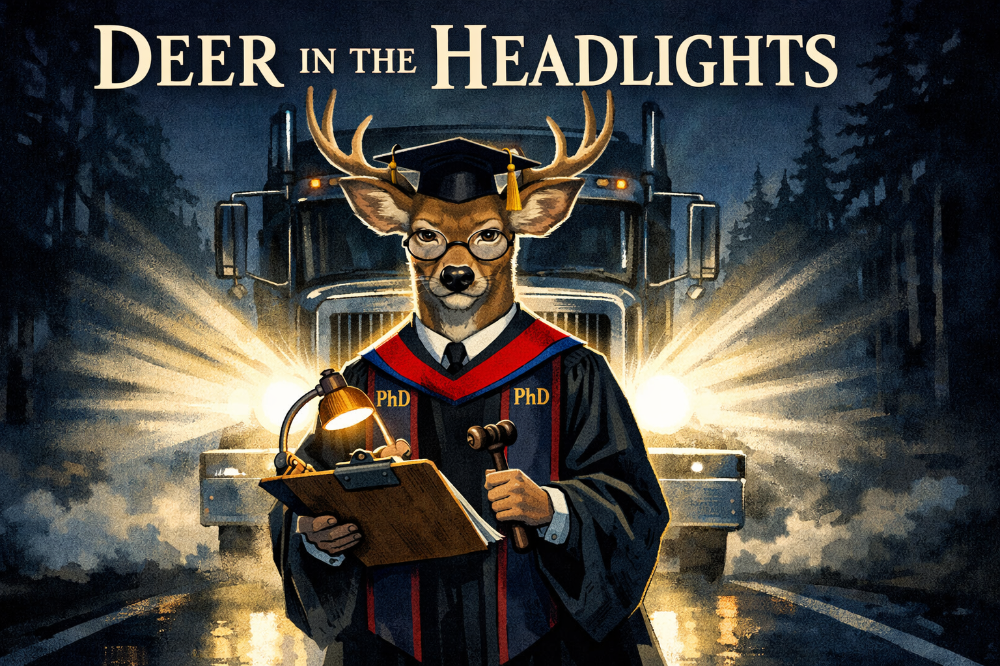
    A PhD deer forms a Blue Ribbon Panel to study the truck of AI progress barreling toward it. The committee convenes, commissions a 200-page report, and tables a motion to move. The truck does not slow down. The minutes are beautifully formatted.

- **[The Ostrich Principal](the-ostrich-principal/index.md)**

    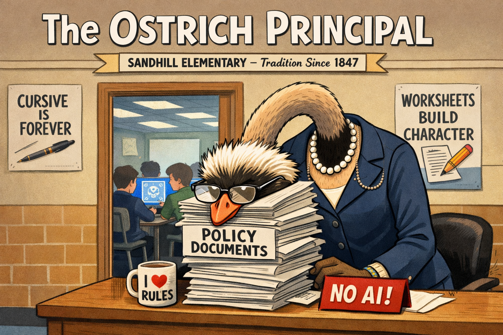
    Principal Sandra Ostrich bans AI from her school, replaces the computer lab with a calligraphy studio, and compiles a prohibited vocabulary list of 847 words. Meanwhile, students in the classroom next door build an AI tutor that outperforms the math department. Her anti-AI memo was written by ChatGPT.

- **[Dragon Layoffs](dragon-layoffs/index.md)**

    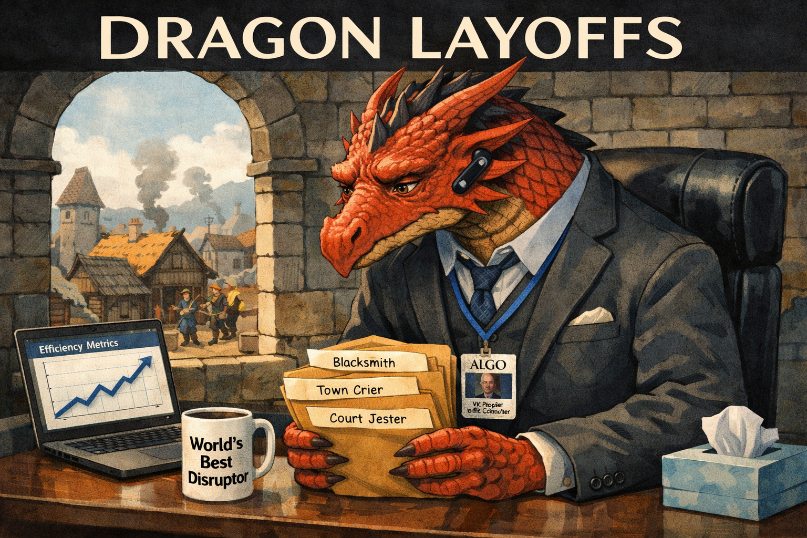
    A well-meaning dragon named Algorithm must inform a medieval village that their positions have been "reimagined." The blacksmith's role is "evolving." The town crier has been "absorbed by push notifications." The jester has been replaced by a humor algorithm. The efficiency metrics are excellent. The village is empty.

- **[The Unicorn Startup](the-unicorn-startup/index.md)**

    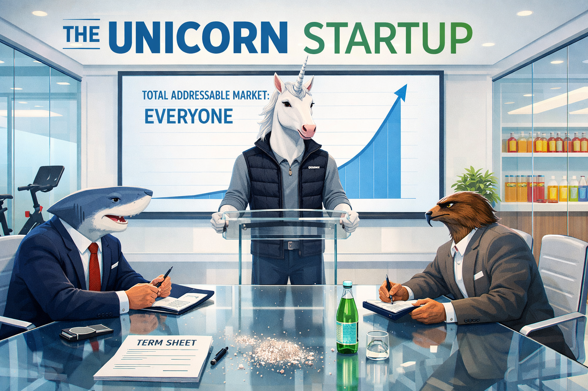
    A literal unicorn pitches Sand Hill Road on its product: magic. The total addressable market is everyone who has ever wished for something. The investors fund it immediately. The burn rate is $33 million per month. The IPO values the company at $12 billion. Revenue remains a mindset, not a metric.

- **[The Mermaid's Resume](the-mermaids-resume/index.md)**

    
    A mermaid rewrites her resume with AI buzzwords she technically possesses. Deep learning means she lives in the deep ocean. Natural language processing means she speaks to fish. She lands an interview with a kraken who also lied on its resume. They hire each other.

- **[Griffin IT Support](griffin-it-support/index.md)**

    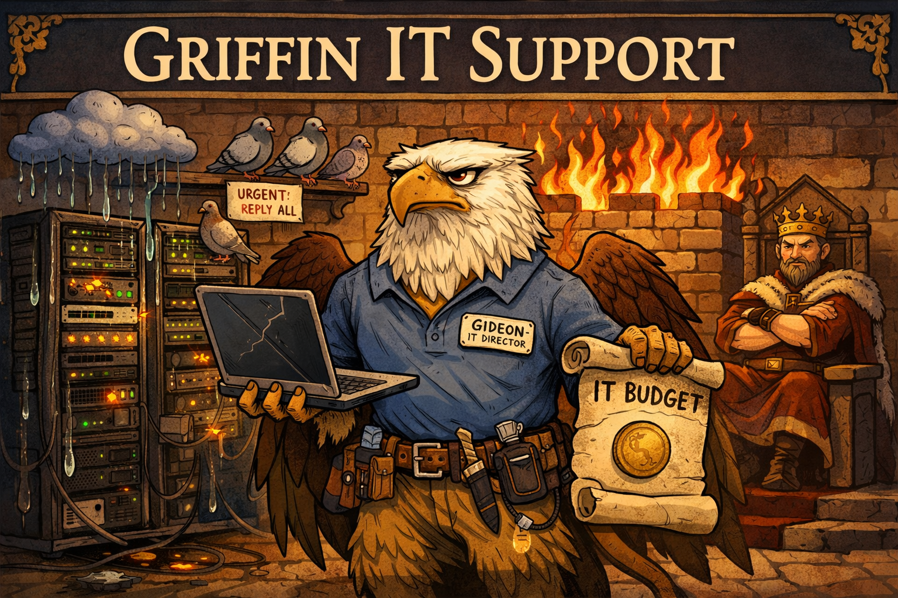
    A griffin IT director tries to modernize a medieval kingdom whose firewall is literally on fire, whose cloud is an actual rain cloud, and whose email runs on carrier pigeons with a 34% delivery rate. The kingdom falls to a chatbot that simply asked the guard to open the gate. The code was on the sign.

- **[The Phoenix Retraining Program](the-phoenix-retraining-program/index.md)**

    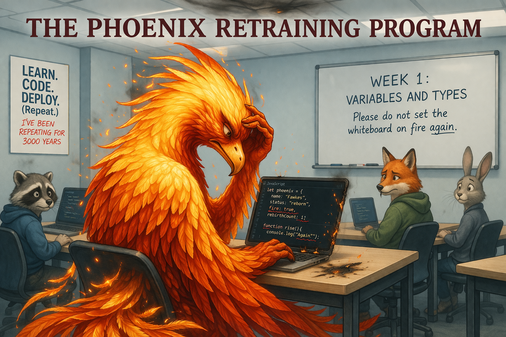
    A 3,000-year-old phoenix enrolls in a coding bootcamp after learning that rising from ashes has been automated by CI/CD pipelines. JavaScript is harder than self-immolation. The whiteboard interview ends in flames. The health insurance covers fire damage.

- **[Centaur Performance Review](centaur-performance-review/index.md)**

    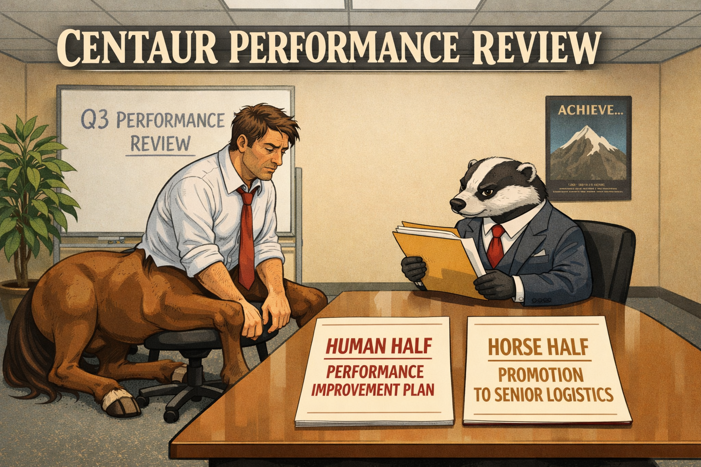
    A centaur's human half is placed on a Performance Improvement Plan while its horse half receives a promotion to Senior Logistics Specialist. He must now report to his own hindquarters. HR creates a new form. The form has two columns.

- **[Minotaur's Maze of Bureaucracy](minotaurs-maze-of-bureaucracy/index.md)**

    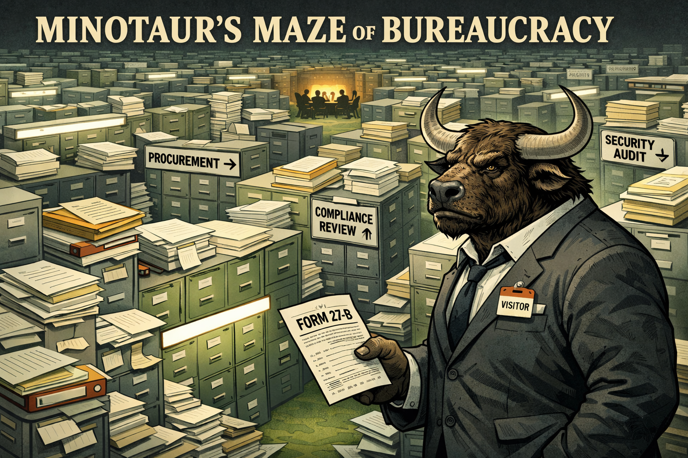
    A minotaur navigates a labyrinth of 347 approval forms, a security review that asks if document software could launch a nuclear weapon, and a governance board that has never approved anything. At the center of the maze, another minotaur has been waiting since 2019.

- **[The Cyclops Data Analyst](the-cyclops-data-analyst/index.md)**

    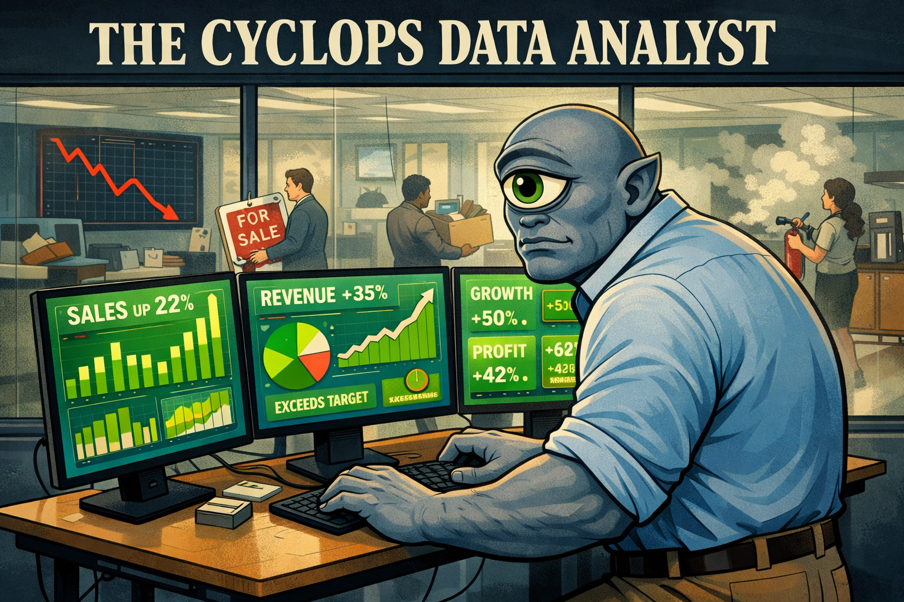
    A cyclops data analyst finds exactly the pattern the CEO wants in every dataset. Revenue down 34%? Revenue per employee is up. Customer churn at 41%? Customer satisfaction is 100% (one customer remains). The company goes bankrupt. The final dashboard calls it "transcendence."

- **[Pegasus Delivery Service](pegasus-delivery-service/index.md)**

    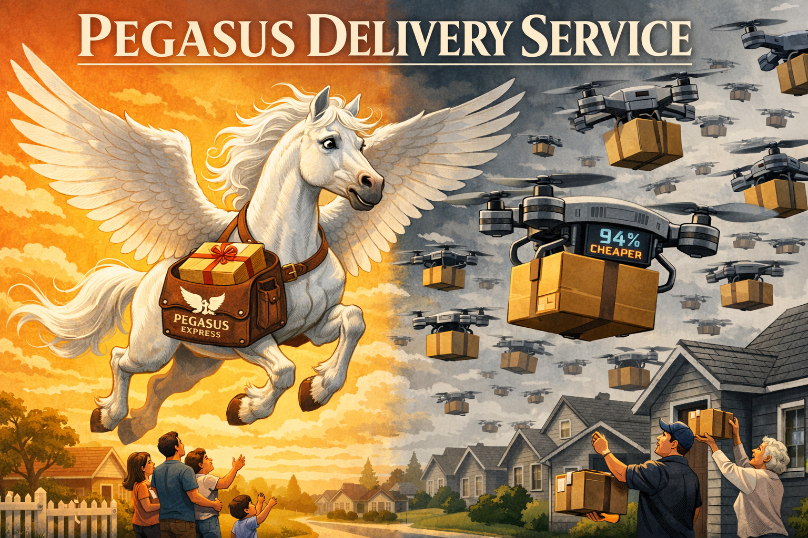
    Pegasus Express was the premier aerial delivery service for 800 years. Then drones arrived at 94% less cost. The artisanal rebrand, the $499 premium tier with sonnets, the experiential pivot — none of it worked. Sterling now pulls a cart. Delivery estimate: 3-5 business weeks.

- **[The Kraken Influencer](the-kraken-influencer/index.md)**

    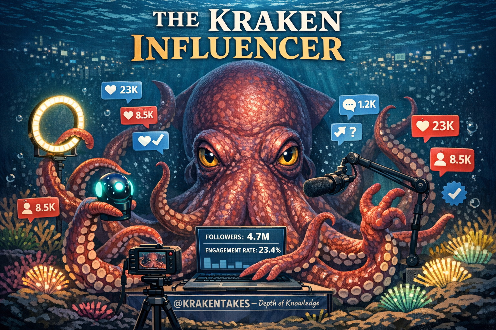
    A kraken becomes a tech influencer from the ocean floor. Controversy erupts: are the tentacles real or AI-generated? A Transparency Report, a live verification event, a Third-Party Tentacle Audit, and an Authenticity Summit later — the follower count has doubled. Nobody answered the question.

- **[The Siren's Customer Service Line](the-sirens-customer-service-line/index.md)**

    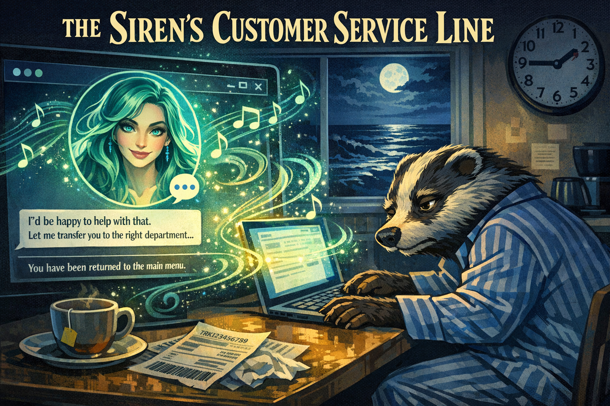
    A shipping company replaces customer service with siren avatar chatbots. Every option sounds enchanting but leads to rocks. Eleven hours, five chat loops, forty-seven minutes on hold, zero humans reached. Rate your experience being lured to your doom: 1-5 stars.

- **[The Vampire's Digital Transformation](the-vampires-digital-transformation/index.md)**

    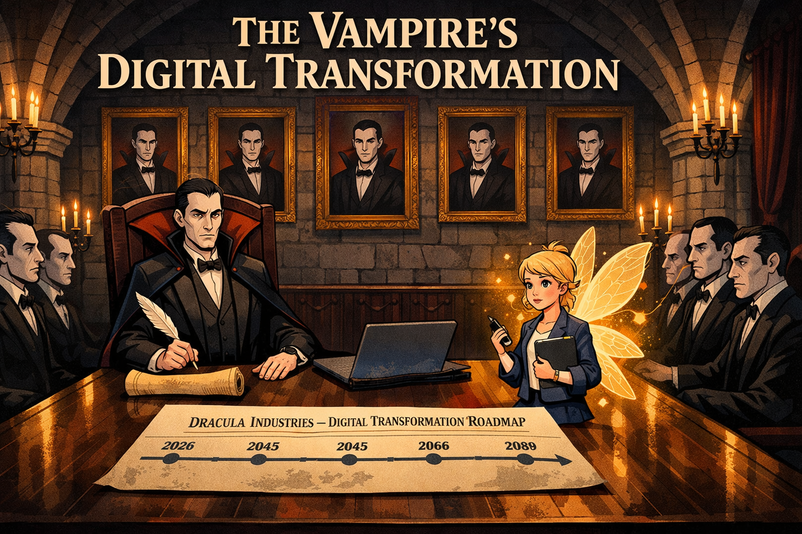
    Count Dracula hires a fairy consultant for digital transformation. Agile becomes a 6-month sprint. Cloud migration means moving coffins to a higher shelf. The AI strategy automates blood debt collection. The consultant's glow fades to 20%. The press release is excellent.

- **[The Sphinx's Technical Interview](the-sphinxs-technical-interview/index.md)**

    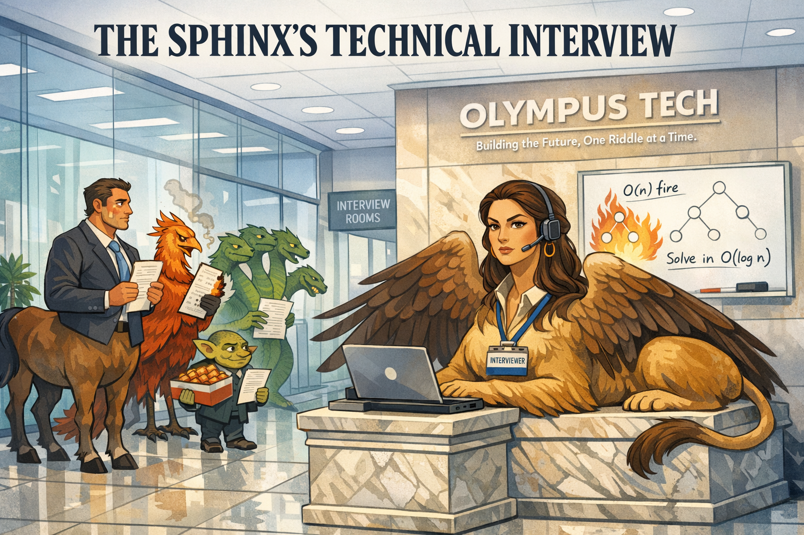
    A sphinx guards Olympus Tech with riddles about burning binary trees. The centaur solves it but breaks the chair. The phoenix solves it by burning the whiteboard. The hydra's nine heads argue until time expires. The goblin who brought donuts gets hired on culture fit.

- **[The Golem's Sprint Retrospective](the-golems-sprint-retrospective/index.md)**

    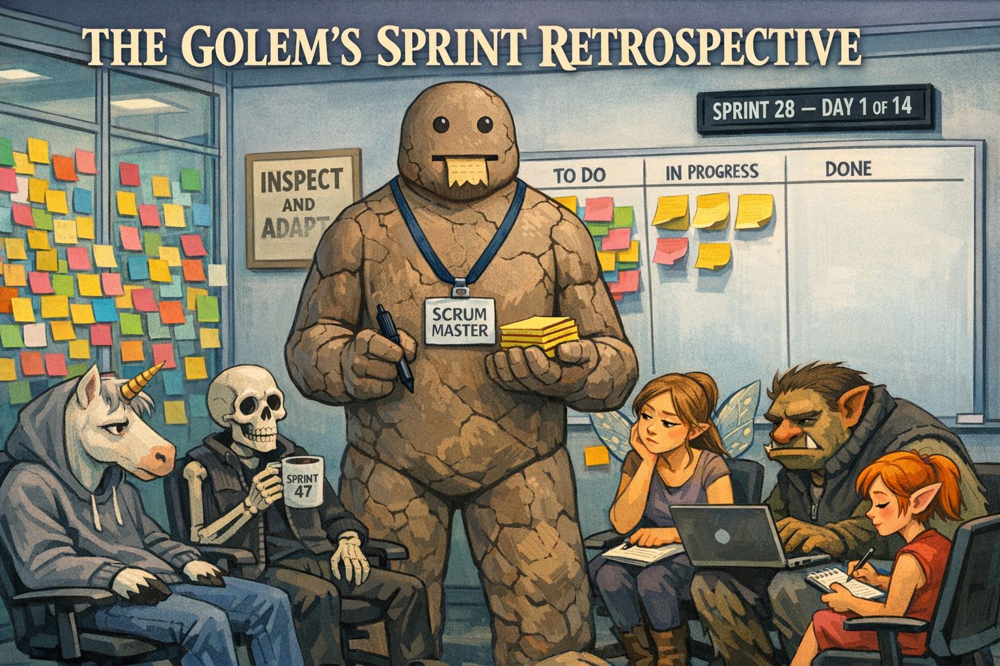
    A golem scrum master follows Agile perfectly. Sticky notes are written. Boards are photographed. The same feedback appears every sprint. Fourteen months, twenty-eight sprints, zero shipped features. The parchment in its mouth reads: "The ceremony is the product."

- **[The Basilisk's Pivot to AI](the-basilisks-pivot-to-ai/index.md)**

    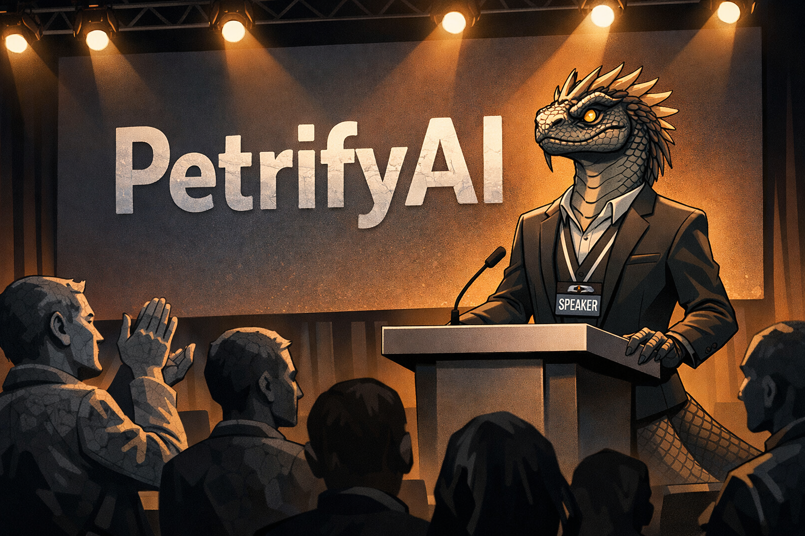
    A basilisk rebrands "Basilisk Petrification Services" as "PetrifyAI: AI-Powered Stone Solutions." The product is unchanged. The pitch deck is excellent. It raises $47M, speaks at TechCrunch Disrupt, and when an analyst asks what exactly the AI is doing, the basilisk looks at her. The audience gives a standing ovation. The Series C is oversubscribed.

- **[The Fairy Godmother's Prompt Engineering](the-fairy-godmothers-prompt-engineering/index.md)**

    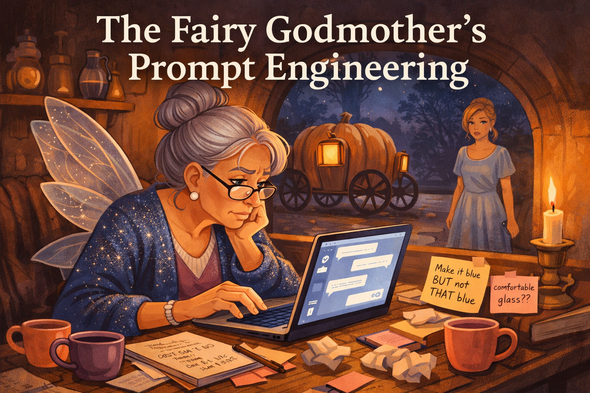
    A fairy godmother upgrades from a magic wand to a large language model. Cinderella needs a dress by eight. Six hours and forty-seven prompts later: a gown that is technically blue, slippers made of actual glass, a carriage that is still a pumpkin, and horses that are deeply conflicted about their origins. "Close enough. We'll fix it in post." v47 — FINAL FINAL.

- **[The Werewolf's Work-Life Balance](the-werewolfs-work-life-balance/index.md)**

    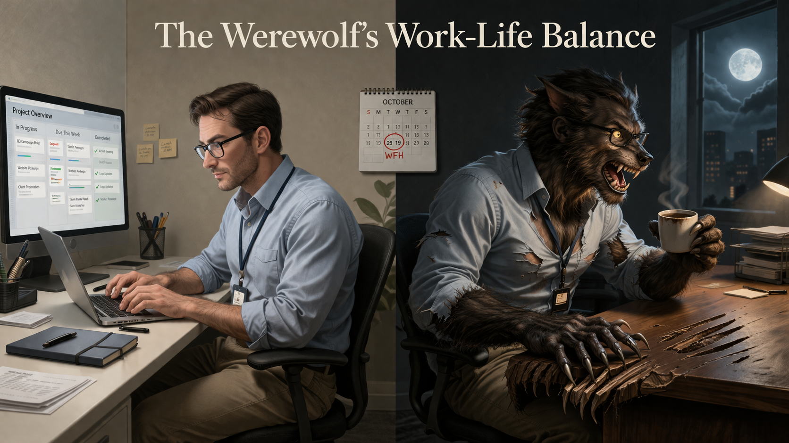
    A werewolf navigates hybrid work with a reinforced cubicle, a moon-phase Outlook calendar, and a Slack status reading "Currently Lycanthropic." The expense report template is titled "Monthly Operations — Special Conditions." The performance review notes excellent adaptability but flags inconsistent personal brand. The actual accommodation is four colleagues being decent. The policy is forty-three pages.

