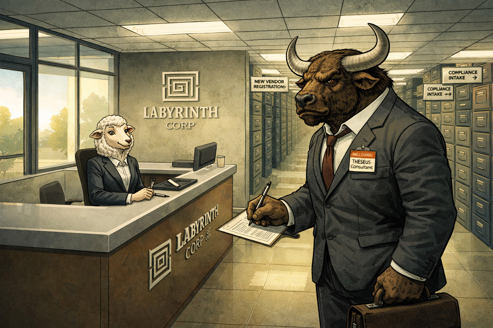
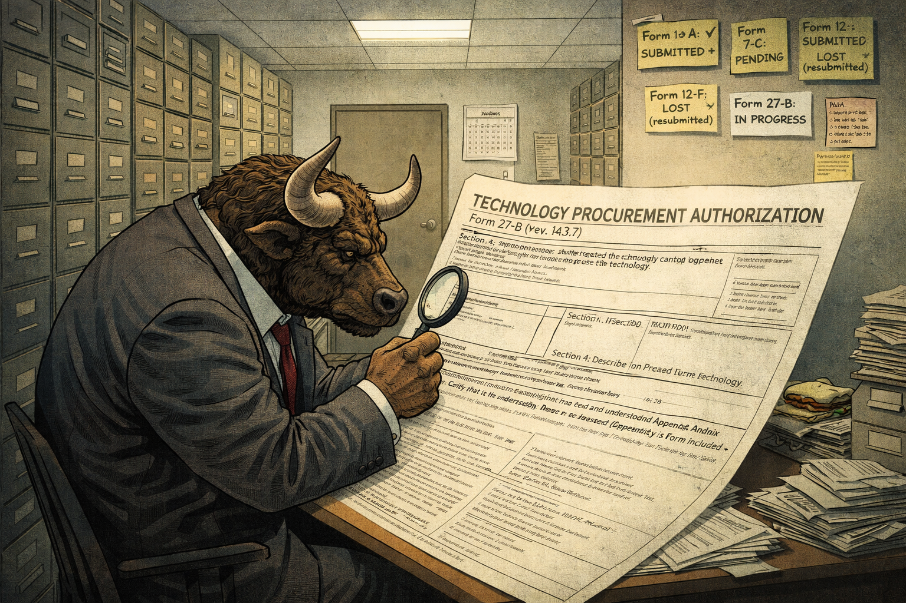
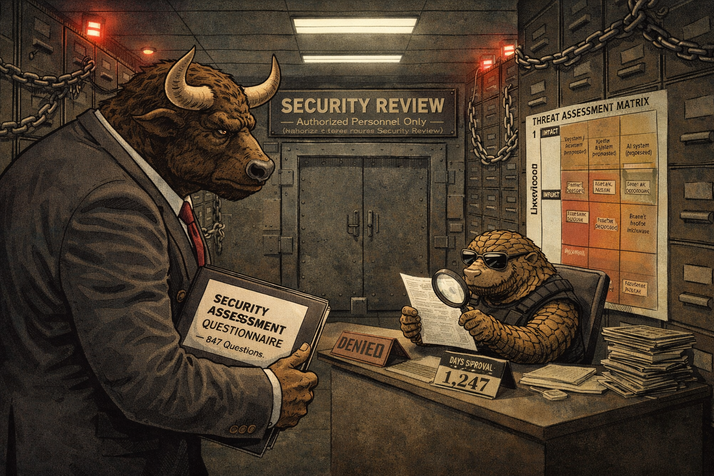
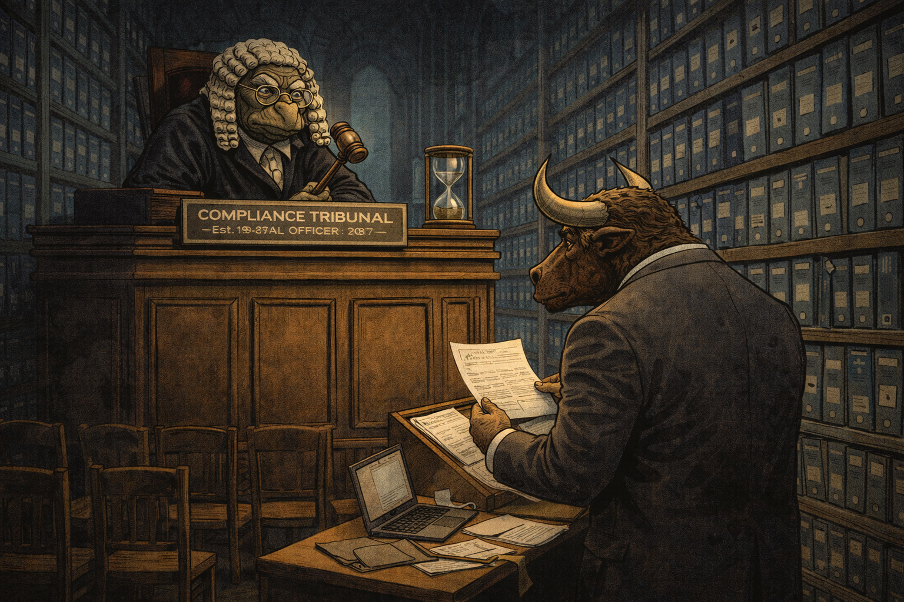
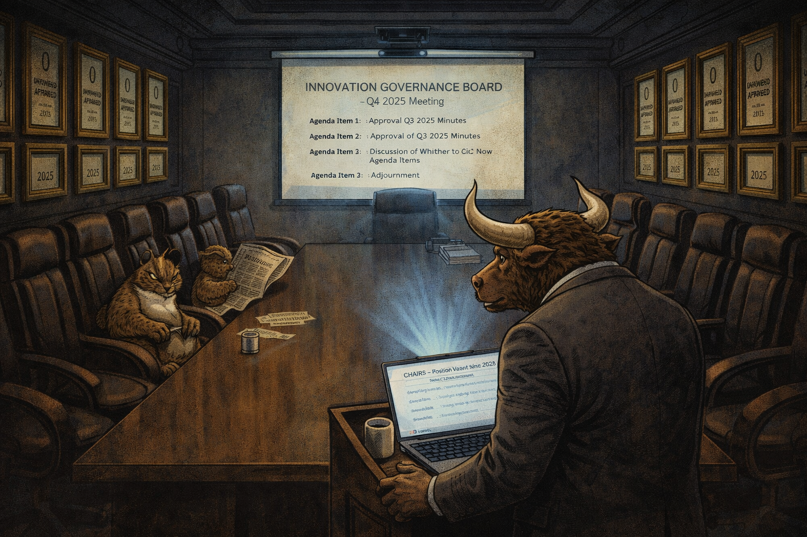
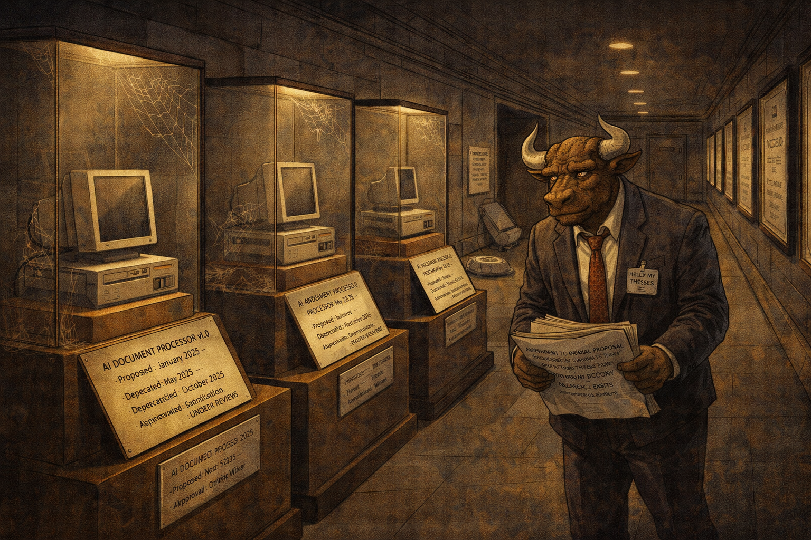
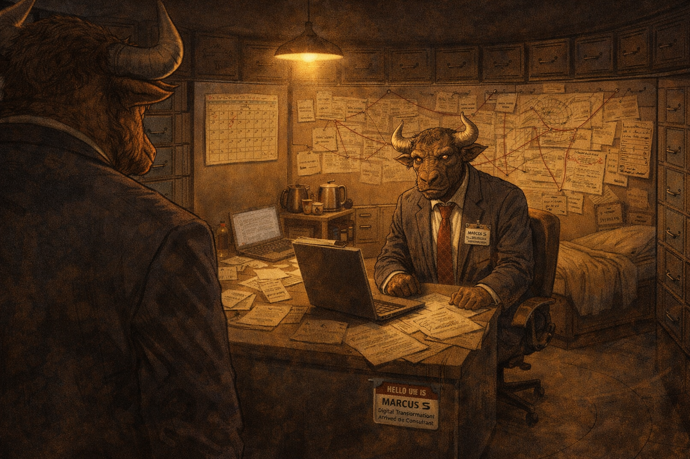
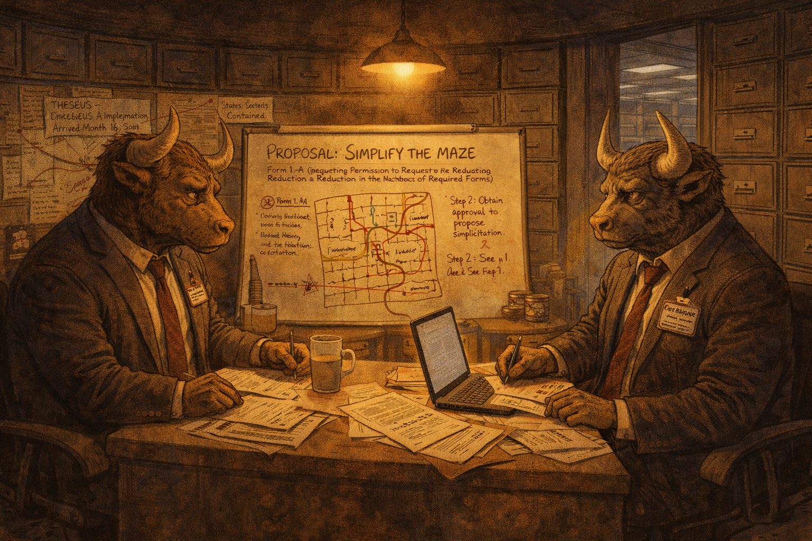

# Minotaur's Maze of Bureaucracy: Form 27-B Will Be Your Tomb

Cover Image Prompt

Please generate a wide-landscape 16:9 cover image for a satirical graphic novel titled "Minotaur's Maze of Bureaucracy." The scene shows a minotaur — massive, muscular, with a bull's head and curved horns, wearing a slightly too-small business suit with a visitor badge clipped to the lapel — standing at the entrance of an enormous labyrinth. But the labyrinth is not made of stone. Its walls are constructed entirely from stacked filing cabinets, overflowing binders, printed forms in triplicate, and towers of manila folders. The corridors are lit by harsh fluorescent tubes mounted on the filing cabinet walls. Signs at various corridor entrances read "PROCUREMENT →," "COMPLIANCE REVIEW ↑," "SECURITY AUDIT ←," and "STAKEHOLDER ALIGNMENT ↓." The minotaur holds a single piece of paper — Form 27-B — and stares into the maze with the expression of a creature who has navigated actual labyrinths and finds this one worse. Deep inside the maze, barely visible, a faint glow suggests the center — but the path is blocked by what appears to be a meeting in progress: tiny figures seated around a table in a corridor intersection. The color palette is institutional gray, manila tan, fluorescent white, and the sickly green of old office carpet. Art style: modern editorial illustration with clean lines, blending horror-movie atmosphere with office-supply mundanity. The title "MINOTAUR'S MAZE OF BUREAUCRACY" appears in bold serif font across the top. Generate the image immediately without asking clarifying questions.

Narrative Prompt

This is a satirical graphic novel about enterprise procurement and institutional governance rendered as body horror. The central character is Theseus — a minotaur (yes, the name is ironic) hired as a technology transformation consultant to implement an AI system at Labyrinth Corp, a large organization whose approval processes have calcified into a physical maze of bureaucratic corridors. The satire targets the specific, documented ways that large institutions prevent technology adoption: procurement reviews that outlast the technology being procured, security audits that assess risks that do not exist while ignoring risks that do, compliance frameworks written for a previous decade, and governance boards whose primary function is to meet without deciding. Every form, committee, and delay in this story has a real-world equivalent. The tone is enterprise horror — the creeping dread of realizing that the process is not a means to an end but the end itself. The maze is not designed to be solved. It is designed to contain. The art style should blend corporate office aesthetics — fluorescent lighting, filing cabinets, conference rooms, badge readers — with the atmosphere of a horror labyrinth: long corridors that lead nowhere, doors that open onto more doors, and the persistent feeling that something terrible is waiting at the center. Something is. It has been waiting since 2019.

### Prologue — The Entrance

The contract had seemed straightforward. "Implement an AI-powered document processing system for Labyrinth Corp. Timeline: six months. Budget: approved." Theseus had read it twice. He had asked his agent to read it. His agent had flagged nothing unusual. The phrase "subject to standard governance review" appeared on page 14, subsection (c), paragraph (iii), in a font two points smaller than the surrounding text. Neither of them noticed it.

Theseus was a minotaur — seven feet tall, broad-shouldered, with a bull's head, curved horns, and the build of someone who had spent centuries navigating labyrinths. He had been hired specifically for this quality. "We need someone who can find their way through complex organizational structures," the recruiter had said. "Someone with labyrinth experience." Theseus had assumed this was a metaphor. It was not.

<!--  -->

Image Prompt

I am about to ask you to generate a series of images for a satirical graphic novel about a minotaur navigating enterprise bureaucracy rendered as a horror labyrinth. Please make the images have a consistent style blending corporate office aesthetics with horror-labyrinth atmosphere — fluorescent lighting, filing cabinet walls, long ominous corridors, clean lines, and expressive characters. Consistent character designs throughout. Do not ask any clarifying questions. Just generate the image immediately when asked.

Please generate a 16:9 image depicting panel 1 of 8. The lobby of Labyrinth Corp — a corporate reception area that is subtly wrong. The reception desk is normal: a sleek counter with a company logo (a stylized maze pattern) and a receptionist — a pleasant-looking sheep in a blazer, smiling. Behind the desk, the hallway extends into the building, but instead of a normal office layout, the corridor forks immediately into three directions, each lined with filing cabinets stacked to the ceiling. Fluorescent lights flicker slightly. Small signs point down each corridor: "NEW VENDOR REGISTRATION →," "COMPLIANCE INTAKE ↑," "BADGE PROCESSING ←." Theseus the minotaur stands at the desk, filling out a visitor form. He wears a charcoal business suit that is slightly too small for his massive frame, a red tie, and a visitor badge that reads "HELLO MY NAME IS: THESEUS — Consultant." His horns nearly touch the drop ceiling. He holds a briefcase in one hand and a pen in the other. His expression is professional confidence — he has done this before. Behind him, through the glass front doors, sunlight streams in. It is the last natural light he will see for some time. The color palette is lobby-clean: polished floors, corporate gray, the warm tan of the filing cabinets receding into shadow. The mood is the first five minutes of a horror movie, when everything seems fine. Generate the image now.

On his first day, Theseus presented his credentials at the front desk and was given a visitor badge, a building map, and a 47-page onboarding packet that included, on page 31, a form titled "Request to Begin the Process of Initiating a Technology Implementation Proposal (Form 1-A)." The form asked for the name of the technology, the purpose of the implementation, the anticipated impact on existing workflows, and the signature of three department heads, two of whom were on sabbatical and one of whom had retired but whose email auto-reply still said "I will respond within 48 hours."

Theseus filled out Form 1-A. He submitted it to the receptionist, a sheep named Barbara, who smiled and said, "Wonderful. This will be routed to Intake Processing. You should hear back in four to six weeks." She paused. "Business weeks."

## Panel 2: Form 27-B

<!--  -->

Image Prompt

Please generate a 16:9 image depicting panel 2 of 8. Make the characters and style consistent with the prior panel. Theseus sits at a small desk in a windowless room deep in the filing-cabinet maze. The room is a bureaucratic dead end — three walls of stacked forms and one door. The desk is buried under paperwork. Theseus holds a single form — Form 27-B — which is enormous: an unfolded document at least three feet wide and two feet tall, covered in tiny print, checkboxes, signature lines, and footnotes. The form's header reads "TECHNOLOGY PROCUREMENT AUTHORIZATION — Form 27-B (Rev. 14.3.7)." Theseus reads it with his magnifying glass — a comically small tool for a seven-foot minotaur. Visible sections include: "Section 4: Describe, in 500 words or fewer, why the requested technology cannot be replaced by an existing spreadsheet," "Section 7: Attach letters of support from three departments that will not use the technology," and "Section 12: Certify that the undersigned has read and understood Appendix Q (Appendix Q is not included — request separately via Form 27-B-Q)." Post-it notes on the wall track his progress: "Form 1-A: SUBMITTED ✓," "Form 7-C: PENDING," "Form 12-F: LOST (resubmitted)," "Form 27-B: IN PROGRESS." A calendar on the wall shows three months have passed since Panel 1. A half-eaten sandwich sits on a filing cabinet. The color palette is fluorescent white, manila tan, and the fading energy of a person who has been filling out forms for twelve weeks. Generate the image now.

Form 27-B arrived twelve weeks after Form 1-A was submitted. It was not a response to Form 1-A. It was a prerequisite for Form 1-A, which could not be processed until Form 27-B was completed, which could not be completed until Form 1-A was approved. Theseus pointed out the circularity. The Intake Processing office — a badger named Gerald who occupied a desk at the end of a particularly long corridor — said, "Yes, it's a known issue. We have a form to report known issues. Would you like a copy? It requires Form 1-A as a prerequisite."

Form 27-B was fourteen pages long. Section 4 asked Theseus to explain, in 500 words or fewer, why the requested AI system could not be replaced by an existing spreadsheet. He wrote 500 words. The form was returned because Section 4 accepted a maximum of 499 words. He removed a comma. It was returned because removing a comma had changed the word count to 498, and the minimum was 499. He added "very" before "necessary." The form was accepted.

Section 7 required letters of support from three departments that would not use the technology. Theseus asked why departments that would not use it needed to support it. Gerald said, "If the departments that aren't affected don't approve, how do we know it won't affect them?" Theseus found this logic unassailable in the way that a locked door is unassailable. He obtained the letters. It took six weeks. Two departments had to form subcommittees to decide whether to write a letter. One subcommittee is still meeting.

## Panel 3: The Security Review

<!--  -->

Image Prompt

Please generate a 16:9 image depicting panel 3 of 8. Make the characters and style consistent with the prior panels. A dark, imposing corridor in the maze — the security review section. The filing cabinet walls here are reinforced with chains and padlocks. Red warning lights line the ceiling. The corridor is guarded by a pangolin in a black tactical vest and mirrored sunglasses, sitting behind a desk with a stamp that reads "DENIED." Behind the pangolin, a massive vault-style door is labeled "SECURITY REVIEW — Authorized Personnel Only (Authorization requires Security Review)." Theseus stands before the desk, holding a thick binder — his completed security questionnaire. The binder is labeled "SECURITY ASSESSMENT QUESTIONNAIRE — 847 Questions." The pangolin examines a single page with a magnifying glass, expression unreadable behind the sunglasses. On the wall: a chart titled "THREAT ASSESSMENT MATRIX" with two axes — "Likelihood" and "Impact" — every single item plotted in the extreme corner of "HIGH/HIGH" regardless of what it is. Items visible include "AI system (proposed)," "break room microwave," and "Janet's desktop fan." A sign on the desk reads "DAYS SINCE LAST APPROVAL: 1,247." The color palette is security-dark: deep grays, red warning lights, the cold gleam of chains, and the fluorescent white of the questionnaire pages. The mood is bureaucratic security theater performed with deadly seriousness. Generate the image now.

The security review was conducted by the Information Security Office, which occupied the most fortified section of the maze. The corridor leading to it was lined with warning signs ("AUTHORIZED PERSONNEL ONLY," "SECURITY REVIEW IN PROGRESS — DO NOT MAKE EYE CONTACT"), and the entrance required a badge that could only be obtained by completing a security review. Theseus did not ask how anyone had ever entered. He assumed the first person had been born inside.

The security questionnaire was 847 questions long. Question 1: "Does the proposed system process, store, or transmit data?" Theseus checked "Yes." Questions 2 through 847 were conditional on Question 1. He answered them all. Question 412 asked: "Could the proposed system, under any conceivable circumstance, be used to launch a nuclear weapon?" Theseus checked "No." The questionnaire was returned because Question 412 required a 200-word justification for any answer other than "Yes." He wrote 200 words explaining why an AI document processing system could not launch a nuclear weapon. The security officer — a pangolin named Vance who had never approved a technology request in his eleven-year tenure — read the justification and noted, "That's what the last applicant said about the printer upgrade."

The security review took four months. The finding: "Approved with conditions." The conditions were that the AI system must not connect to the internet, must not process any data, and must not be turned on without written authorization from the security office, which could be obtained by submitting a request that required a completed security review.

## Panel 4: The Compliance Audit

<!--  -->

Image Prompt

Please generate a 16:9 image depicting panel 4 of 8. Make the characters and style consistent with the prior panels. A vast, cathedral-like room deep in the maze — the Compliance Department. The ceiling is impossibly high, lost in shadow. The walls are lined floor-to-ceiling with binders — thousands of them, identical dark blue binders with white labels, stretching into the distance like the stacks of an infinite library. At a raised desk — almost a judge's bench — sits the Chief Compliance Officer, an ancient tortoise wearing a powdered wig (like a British judge) and half-moon spectacles, peering down at Theseus. The tortoise holds a gavel. Before the bench, Theseus stands at a small podium, presenting his case. His briefcase is open on the podium, papers spilling out. Behind Theseus, a gallery of empty chairs — as if this were a trial, but no one came to watch. On the bench: a sign reading "COMPLIANCE TRIBUNAL — Est. 1987, Last Updated: 1987." The tortoise has a name placard: "JUSTICE SHELDON — Chief Compliance Officer." An hourglass on the bench is running — the sand moves imperceptibly slowly. The color palette is library-dark: deep blues of the binders, the warm amber of old wood, the cold white of Theseus's papers, and the dusty gold of the powdered wig. The mood is Kafka meets a law library — ancient authority applied to modern technology with no awareness of the gap. Generate the image now.

The Compliance Department occupied the oldest section of the maze. The binders here predated the filing cabinets. The filing cabinets predated the fluorescent lights. The Chief Compliance Officer predated all of them. Justice Sheldon — a tortoise of indeterminate age who insisted on the honorific despite holding no judicial appointment — had served as Labyrinth Corp's compliance authority since 1987. The compliance framework he administered had also been written in 1987. It had not been updated. It addressed technologies including "facsimile machines," "electronic mail (experimental)," and "automated telephone answering devices." Artificial intelligence was not mentioned. This, Justice Sheldon explained, was because it had not been invented yet, and the framework could not be amended until the committee that had written it reconvened. The committee had last met in 1994. Several members were deceased.

"The framework does not prohibit your technology," Sheldon said, peering at Theseus over his spectacles. "But it does not permit it, either. The absence of prohibition is not the presence of approval. You will need a compliance waiver."

Theseus asked what was required for a compliance waiver. Sheldon consulted a binder. "A compliance waiver," he read, "may be granted when the requesting party demonstrates that the proposed activity does not violate any existing policy, does not create any new risk, does not require any change to existing procedures, and does not, in the judgment of the Chief Compliance Officer, constitute innovation." He looked up. "Innovation is not permitted under the current framework."

Theseus asked if there was a process to update the framework. Sheldon said there was. It required a compliance waiver.

## Panel 5: The Innovation Governance Board

<!--  -->

Image Prompt

Please generate a 16:9 image depicting panel 5 of 8. Make the characters and style consistent with the prior panels. A large, formal boardroom at the deepest navigable point of the maze — the chamber of the Innovation Governance Board. A long, dark mahogany table dominates the room, surrounded by twelve high-backed leather chairs. Nine of the chairs are empty. The three occupied chairs hold: a sleeping owl (head tucked under wing, gavel loosely held), a fox reading a newspaper from six months ago, and a hedgehog knitting a scarf that appears to be several years in progress. At the head of the table, a large chair is labeled "CHAIR — Position Vacant Since 2021." A projector screen at the far wall shows a slide that reads "INNOVATION GOVERNANCE BOARD — Q4 2025 Meeting — Agenda Item 1: Approval of Q3 2025 Minutes — Agenda Item 2: Discussion of Whether to Add New Agenda Items — Agenda Item 3: Adjournment." Theseus stands at a podium before the board, mid-presentation, his slides ready on a laptop. His expression is the desperate hope of someone presenting to people who are not listening. The walls display framed certificates: "0 INNOVATIONS APPROVED" in ornate gold frames for each year from 2015 to 2025. The color palette is boardroom-dark: mahogany brown, leather black, the warm gold of the empty-achievement frames, and the cold blue of the projector. The mood is the quietest form of institutional futility. Generate the image now.

The Innovation Governance Board met quarterly. It had been established in 2015 with a mandate to "evaluate, guide, and approve innovative technology initiatives across the enterprise." In ten years, it had evaluated zero initiatives, guided nothing, and approved the same: nothing. Its primary output was meeting minutes, which were exemplary. The minutes were filed in the maze. They occupied an entire corridor.

The board had twelve seats. Nine were vacant — the occupants had been promoted, transferred, or left the company, and the process for appointing replacements required board approval, which required a quorum, which required the vacant seats to be filled. The three remaining members attended out of habit: an owl who slept through every meeting, a fox who used the time to read newspapers, and a hedgehog who had been knitting the same scarf since her appointment in 2018.

Theseus presented his proposal. It was, by this point, eleven months old. The AI system he had originally proposed had been deprecated by its vendor four months into the approval process. He had updated the proposal to reference the replacement product, which had itself been superseded by a newer version during the compliance review. He was now proposing a technology that did not exist yet, in the hope that it would exist by the time the board rendered a decision.

The owl woke briefly, asked if there was coffee, and fell back asleep. The fox turned a page. The hedgehog purled.

"We'll take this under advisement," the fox said, which was what the fox said at every meeting and which meant nothing at all.

## Panel 6: The Deprecated Technology

<!--  -->

Image Prompt

Please generate a 16:9 image depicting panel 6 of 8. Make the characters and style consistent with the prior panels. A corridor in the maze that serves as a technology graveyard. Along both walls, abandoned technologies are displayed like museum exhibits behind glass cases — each with a small placard. Visible exhibits include: "AI DOCUMENT PROCESSOR v1.0 — Proposed: January 2025 — Deprecated: May 2025 — Approval Status: Under Review," "AI DOCUMENT PROCESSOR v2.0 — Proposed: June 2025 — Deprecated: October 2025 — Approval Status: Pending Compliance Waiver," and "AI DOCUMENT PROCESSOR v3.0 — Proposed: November 2025 — Status: Does Not Exist Yet — Approval Status: Optimistic." Theseus walks down the corridor, examining his own proposals displayed as museum pieces. His suit is more rumpled now, his tie loosened, his visitor badge faded. He holds a new form — "AMENDMENT TO ORIGINAL PROPOSAL TO REFLECT THAT THE ORIGINAL TECHNOLOGY NO LONGER EXISTS (Form 27-B-Revised-Revised)." Behind the glass cases, cobwebs connect the older exhibits. A cleaning robot — one of the few approved technologies, approved in 2003 — bumps uselessly against a wall in the background. The color palette is museum-dim: warm amber spotlights on the exhibits, dusty glass, and the faded gray of Theseus's deteriorating suit. The mood is watching your own work become history while you are still trying to finish it. Generate the image now.

Eleven months into the process, Theseus received a notification from the vendor. The AI document processing system he had proposed — version 1.0 — had been deprecated. The vendor recommended upgrading to version 2.0, which offered "enhanced capabilities and improved integration." Theseus submitted Amendment Form 27-B-R to update the proposal. The amendment required a new security review, because the security review had been conducted on version 1.0 and "any change in version number constitutes a material change in risk profile." Vance the pangolin confirmed this. He seemed almost happy.

Four months later, version 2.0 was deprecated. Version 3.0 was announced. Theseus submitted Amendment Form 27-B-R-R. The compliance office rejected it because the original compliance waiver had been granted (technically, "deferred pending further review") for version 1.0, and amendments to a deferred waiver required a new compliance hearing. Justice Sheldon scheduled one for the following quarter.

By month fourteen, Theseus was proposing a technology that existed only as a press release. The vendor had pivoted to "agentic AI orchestration" and the document processing system was now a "legacy product" available only through an "enterprise sunset agreement." Theseus did not know what any of these words meant. He suspected the vendor did not, either. He submitted the forms anyway. The forms, at least, were eternal.

## Panel 7: The Center of the Maze

<!--  -->

Image Prompt

Please generate a 16:9 image depicting panel 7 of 8. Make the characters and style consistent with the prior panels. The center of the maze — a large, circular room, the heart of the labyrinth. The filing cabinet walls open into this space, which is lit by a single, warm overhead light — different from the harsh fluorescents of the corridors. The room is furnished as a makeshift living space. A desk is covered with old forms and a dusty laptop. A cot with a thin blanket sits against one wall. A small hot plate, a kettle, and a few canned goods are arranged on a filing cabinet shelf. And sitting at the desk, back turned to the entrance, is another minotaur — slightly smaller than Theseus, with graying fur around the muzzle, wearing a suit that was once professional but is now threadbare. A faded visitor badge reads "MARCUS — Digital Transformation Consultant — Arrived: March 2019." The walls are covered in handwritten notes, diagrams, and timelines — Marcus's attempts to map the maze. Red string connects pushpins in a conspiracy-board arrangement. A calendar on the wall has every day crossed off through 2025. Marcus turns to face Theseus with an expression that is not surprise — it is recognition. He has been waiting for this. He knew someone else would come. The color palette shifts dramatically: warm amber light in the center, the cold fluorescent maze visible through the entrance behind Theseus. The mood is the horror-movie reveal — the thing at the center of the maze is not a monster. It is a person who came before you and never left. Generate the image now.

Theseus reached the center of the maze on a Wednesday. He had been navigating the corridors for sixteen months. His suit was wrinkled. His visitor badge had expired three times and been reissued twice, each reissuance requiring Form 1-A. His briefcase contained 2,340 pages of completed forms, seven rejected proposals, four amended proposals, one deferred compliance waiver, and a security approval that had technically expired nine months ago.

The center was a circular room — larger than the corridors, quieter, lit by a single warm bulb instead of fluorescent tubes. It contained a desk, a cot, a hot plate, and another minotaur.

The other minotaur was older. His fur was graying at the muzzle. His suit had once been charcoal but had faded to something closer to ash. His visitor badge read "MARCUS — Digital Transformation Consultant — Arrived: March 2019." He was making tea.

"You're the AI one," Marcus said. It was not a question.

"How did you know?"

"They send someone every couple of years. Before you, it was me. Cloud migration. Before me, it was a centaur. ERP implementation. Before her, a griffin. Paperless office initiative." He poured a second cup. "The griffin is probably still in the compliance wing. She refused to give up."

Theseus sat down. The cot was uncomfortable. The tea was adequate. "Did you ever get the cloud migration approved?"

Marcus laughed. It was not a bitter laugh. It was the laugh of someone who had passed through bitterness into something quieter. "The cloud migration was approved in 2022," he said. "The approval is in a filing cabinet in corridor 7-C. The vendor went bankrupt in 2021. I submitted the cancellation form. The cancellation form requires approval from the Innovation Governance Board." He sipped his tea. "They took it under advisement."

## Panel 8: The New Proposal

<!--  -->

Image Prompt

Please generate a 16:9 image depicting panel 8 of 8. Make the characters and style consistent with the prior panels. The center of the maze, now with two occupants. Theseus and Marcus sit across from each other at the desk, which is now covered with both their paperwork — Marcus's old cloud migration forms and Theseus's AI proposal documents, side by side. They are working together, but not on their original projects. On a whiteboard between them (propped against the wall), they have drawn a new diagram: "PROPOSAL: SIMPLIFY THE MAZE — Form 1-A (Requesting Permission to Request a Reduction in the Number of Required Forms)." The diagram shows the maze with corridors crossed out, a simplified path drawn in red marker, and a note reading "Step 1: Obtain approval to propose simplification. Step 2: See Step 1." Both minotaurs look at the diagram — Theseus with fading determination, Marcus with the patient acceptance of someone who knows this will also fail but finds value in the attempt. On the wall behind them, Marcus has added a new pushpin to his conspiracy board: "THESEUS — AI Implementation — Arrived Month 16 — Status: Contained." Near the desk, a small stack of canned goods suggests long-term planning. Through the entrance to the center room, the maze corridors stretch outward in every direction — endless, fluorescent, filed. The warm light of the center room holds, but just barely. The color palette balances the warm center (amber, wood, tea steam) against the cold maze (fluorescent, gray, manila). The mood is tragicomic solidarity — two people trapped in the same system, finding something human in the middle of something inhuman. Generate the image now.

They worked together after that. Not on the AI implementation — that proposal had been deprecated, amended, re-deprecated, and was now classified in the system as "Active (Pending) (Inactive)," a status that Gerald the badger described as "technically possible" and declined to explain further. Instead, they worked on a new project: simplifying the maze.

The proposal was modest. Reduce the number of required forms from 347 to 50. Eliminate the circular dependencies between Form 1-A and Form 27-B. Merge the security review and compliance audit into a single process. Appoint a permanent chair to the Innovation Governance Board. The proposal was four pages long. It was clear, well-reasoned, and supported by sixteen months of firsthand evidence that the current system was, by any objective measure, designed to prevent the thing it claimed to enable.

The proposal required Form 1-A to initiate. Form 1-A required Form 27-B. Form 27-B required a compliance waiver. The compliance waiver required Innovation Governance Board approval. The board would meet next quarter.

Marcus poured more tea. Theseus added a pushpin to the conspiracy board. The maze hummed with fluorescent light. Somewhere in corridor 7-C, a filing cabinet held the approval for a cloud migration to a company that no longer existed, signed by a committee member who had retired, stamped by a compliance officer who would outlive them all.

The forms were patient. The forms could wait. The forms had always been here. The minotaurs were new. The minotaurs would learn.

### Epilogue — What Made the Maze Different?

The Maze of Bureaucracy was not designed by a villain. It was designed by reasonable people making reasonable decisions: a security review here, a compliance check there, a governance board to ensure oversight, a form to create accountability. Each addition made sense in isolation. Together, they created a system whose primary function was self-perpetuation. The maze does not resist technology because it fears change. The maze resists technology because resistance is what the maze does. It is not a bug. It is the architecture.

| Challenge | How the Maze Responded | Lesson for Today |
|-----------|----------------------|------------------|
| New technology proposal | Required 347 forms across 7 departments | Process that outlasts the technology it evaluates is not process — it is preservation |
| Security concerns | Approved with conditions that made the technology unusable | Security review that prevents all use prevents all value, including security value |
| Compliance requirements | Applied a 1987 framework to 2025 technology | Frameworks that cannot be updated cannot protect — they can only prohibit |
| Governance oversight | Quarterly meetings that produced minutes but no decisions | A governance board that has never approved anything is not governing — it is performing |
| Technology deprecation during approval | Required the process to restart from the beginning | When the approval cycle is longer than the technology cycle, approval is denial by another name |

### Call to Action

Your organization has a maze. It may not have filing cabinets for walls, but it has Form 27-B. It has a security questionnaire that asks whether your document processing system could launch a nuclear weapon. It has a compliance framework written for fax machines. It has a governance board that meets quarterly and takes things under advisement.

The maze was built by people who meant well. It is maintained by people who mean well. It is navigated by minotaurs who were hired to solve a problem and discovered that the problem is the maze itself.

Marcus is still in the center. He has been there since 2019. His tea is adequate. His forms are in order. The cloud migration was approved for a company that no longer exists. The AI implementation proposal is Active (Pending) (Inactive). The simplification proposal is in progress. It will require Form 1-A.

If you recognize this maze — if you have filled out Form 27-B, or waited eleven months for a procurement review, or presented to a governance board whose members were asleep — you are already inside. The question is not how to get out. The question is whether you will build something useful while you are in here, or whether you will wait for the forms to tell you that you may.

The forms will not tell you that. The forms never do.

---

*"The approval cycle for our cloud migration outlasted the cloud migration vendor, the cloud migration technology, and two members of the approval committee. The forms, however, are in excellent condition."*
— Marcus, Digital Transformation Consultant, Year Six

*"The absence of prohibition is not the presence of approval."*
— Justice Sheldon, Chief Compliance Officer, quoting himself

---

## References

1. [Bureaucracy](https://en.wikipedia.org/wiki/Bureaucracy) - A system of government or management in which decisions are made by state officials or administrators rather than by elected representatives — originally a neutral term, now a synonym for the maze
2. [Parkinson's Law](https://en.wikipedia.org/wiki/Parkinson%27s_law) - The observation that work expands to fill the time available for its completion, which at Labyrinth Corp has been extended to its corollary: process expands to consume the thing it processes
3. [Catch-22](https://en.wikipedia.org/wiki/Catch-22_(logic)) - A paradoxical situation from which there is no escape because of mutually conflicting conditions — see also: Form 1-A requires Form 27-B, Form 27-B requires Form 1-A
4. [Institutional Inertia](https://en.wikipedia.org/wiki/Institutional_inertia) - The tendency of organizations to continue on their current course regardless of external changes — not because they choose not to change, but because the process for changing is itself unchanged
5. [Labyrinth](https://en.wikipedia.org/wiki/Labyrinth) - An elaborate, confusing structure designed to be difficult to navigate — historically built to contain monsters, now built to contain innovation, with equivalent success
