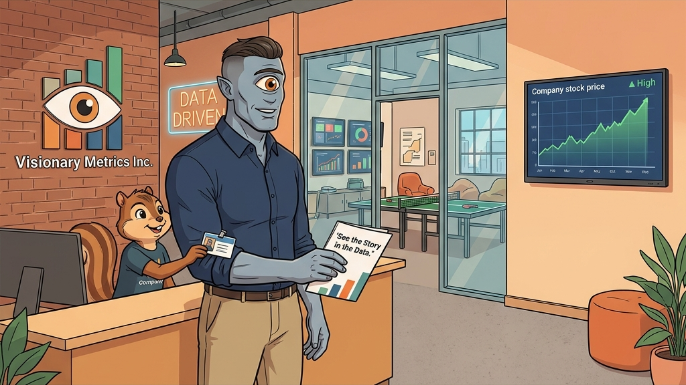
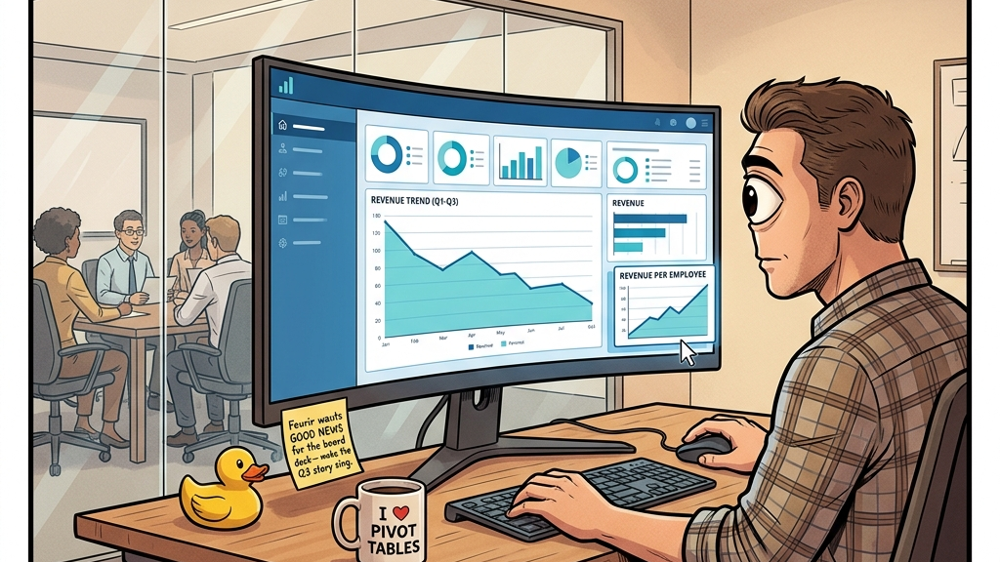
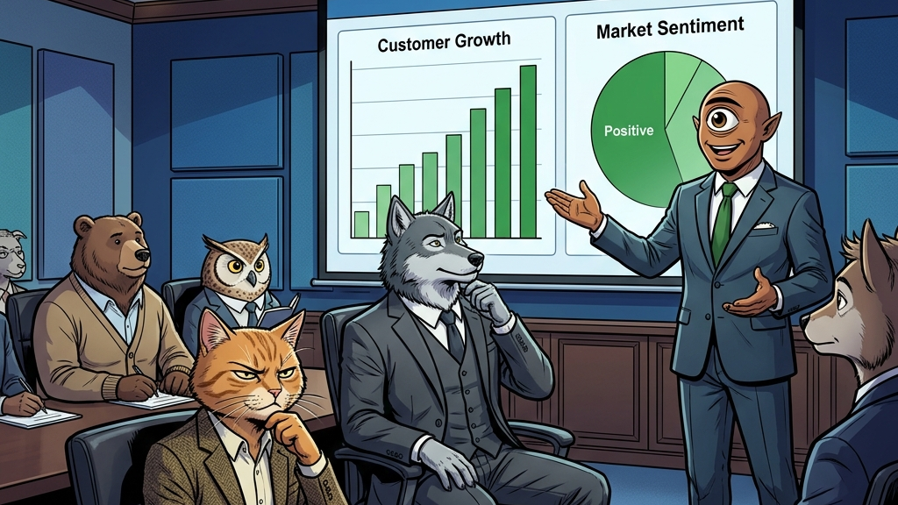
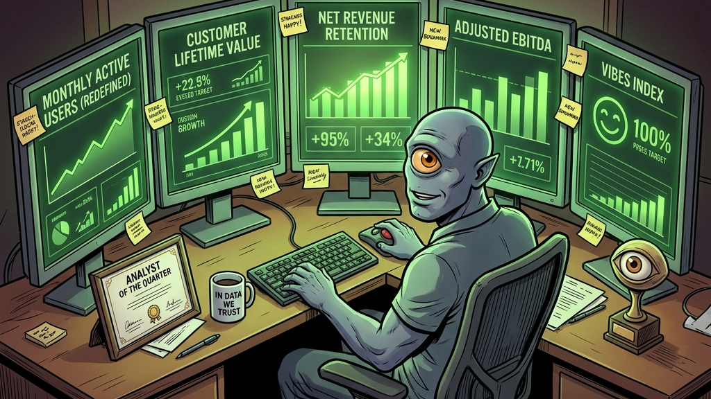
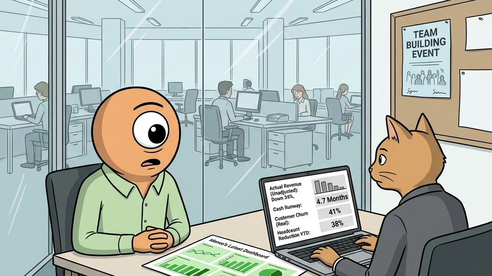
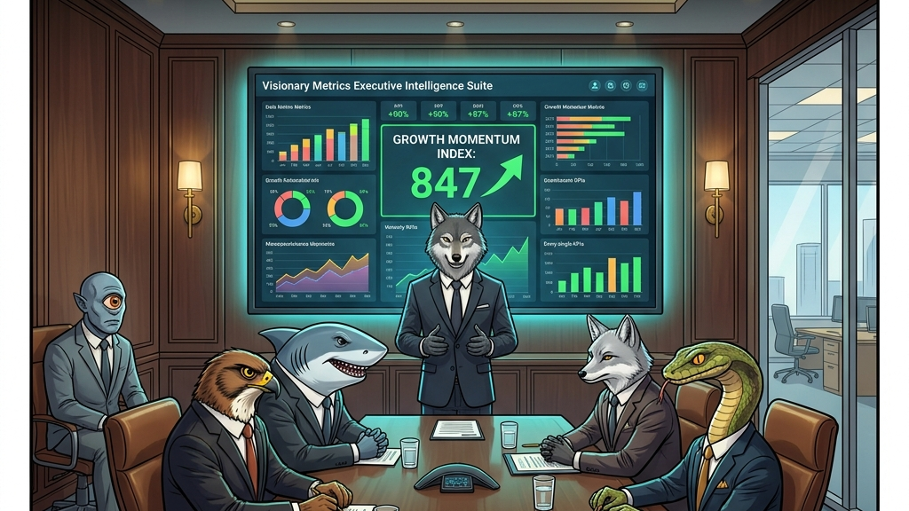
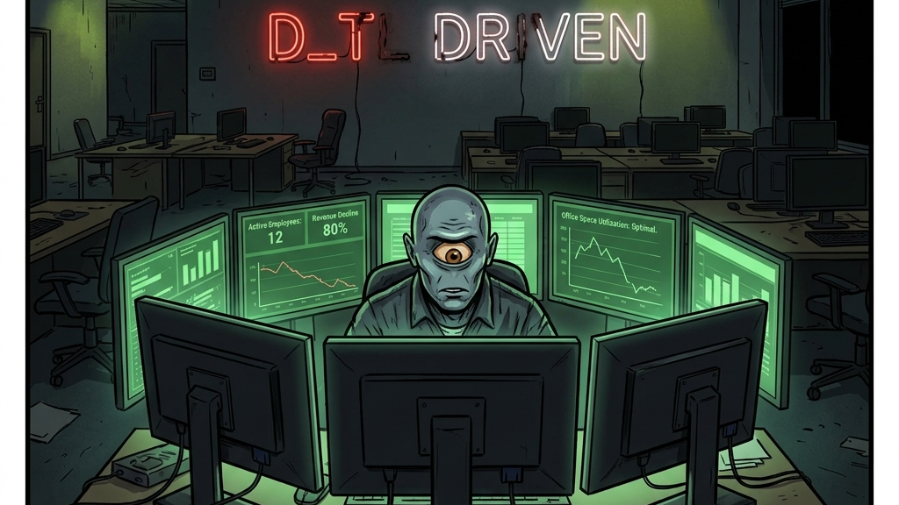
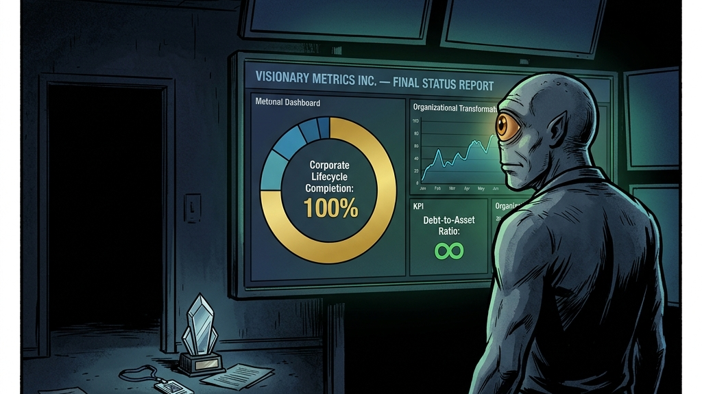

# The Cyclops Data Analyst: Focused Vision, Blind Spots

Cover Image Prompt

Please generate a wide-landscape 16:9 cover image for a satirical graphic novel titled "The Cyclops Data Analyst." The scene shows a cyclops — large, muscular but wearing business casual (a fitted button-down shirt with sleeves rolled up, no tie, khakis) — sitting at a modern standing desk with three large monitors. The cyclops has one enormous eye in the center of its forehead, currently narrowed in concentration, and smooth grayish-blue skin. The three monitors display elaborate, colorful business intelligence dashboards — bar charts, line graphs, pie charts, KPI tiles, heat maps — and every single metric shown is green, trending upward, or labeled "EXCEEDS TARGET." The dashboards are beautiful, professional, and completely detached from reality. Behind the cyclops, visible through a glass office wall, the rest of the company is in visible chaos: employees carrying boxes (being laid off), a "FOR SALE" sign leaning against a wall, a fire extinguisher being used in the break room, and a stock ticker on a lobby screen showing a line plummeting straight down. The cyclops does not see any of this. The cyclops sees only the dashboards. The color palette contrasts the warm, confident greens and blues of the dashboard screens against the gray, panicked office behind the glass. Art style: modern editorial illustration with clean lines, blending the specific aesthetic of business intelligence software (Tableau/Power BI visual language) with warm satirical illustration. The title "THE CYCLOPS DATA ANALYST" appears in bold serif font across the top. Generate the image immediately without asking clarifying questions.

Narrative Prompt

This is a satirical graphic novel about confirmation bias, analytics theater, and the way organizations use data not to discover truth but to confirm what leadership has already decided is true. The central character is Monos — a cyclops hired as Senior Data Analyst at Visionary Metrics Inc., a company whose name is its first red flag. Monos has one eye. This is presented by the company as an asset: "focused vision," "singular perspective," "zero distraction from peripheral data." In practice, it means Monos sees exactly one pattern in every dataset — the pattern that makes the numbers go up. The satire targets data culture in modern organizations: the dashboards that are designed to look impressive rather than inform, the KPIs that are chosen because they can be made green rather than because they matter, the presentations where every chart tells the story the CEO wanted to hear, and the specific moment when a company drowns in data while starving for insight. Every dashboard Monos builds should be described in enough visual detail that a data professional would recognize it — and wince. The art style should blend modern tech-office aesthetics with the visual language of business intelligence: clean lines, data visualization elements woven into the illustration, dashboard color palettes (Tableau blues, Power BI yellows, the universal green of a KPI that has been defined to be met).

### Prologue — The Hire

The job posting read: "Senior Data Analyst — Visionary Metrics Inc. We are seeking a candidate with focused vision, singular perspective, and the ability to find the signal in the noise. Peripheral vision not required. Depth perception optional."

Monos had applied because the job seemed tailored to his strengths. He had one eye — a large, perceptive, amber-colored eye positioned in the center of his forehead — and it was, by any measure, an excellent eye. It could track a single data point across a spreadsheet with 40,000 rows. It could identify a trend line in a scatter plot from across the room. It could focus with an intensity that binocular creatures could not match, holding a single pattern in perfect clarity for hours without fatigue.

What it could not do was see two things at once. This was, Monos had been assured during the interview, not a limitation. It was a feature.

Image Prompt

I am about to ask you to generate a series of images for a satirical graphic novel about a cyclops data analyst and confirmation bias in business analytics. Please make the images have a consistent modern editorial illustration style with clean lines, expressive characters, and consistent character designs throughout — blending modern tech-office aesthetics with business intelligence dashboard visuals. Do not ask any clarifying questions. Just generate the image immediately when asked.

Please generate a 16:9 image depicting panel 1 of 8. A modern tech company lobby during Monos's first day. Monos the cyclops stands at the reception desk, receiving his employee badge. He is tall — about seven feet — with smooth grayish-blue skin, one large amber eye in the center of his forehead, a strong jaw, and a professional haircut (short on the sides). He wears a fitted navy button-down shirt, rolled sleeves, and khakis — classic data-team business casual. His one eye is bright and alert. The receptionist — a cheerful chipmunk in a company t-shirt — hands him a badge and a welcome packet. Behind them, the lobby of Visionary Metrics Inc. is peak tech-company aesthetic: exposed brick, a neon sign reading "DATA DRIVEN" on the wall, a ping-pong table visible through a glass wall, monitors everywhere displaying colorful dashboards. The company logo — a stylized single eye inside a bar chart — is on the wall behind reception. On a lobby TV screen, the company stock price is displayed: it is high and stable. Everything looks good. Everything looks fine. On the welcome packet in Monos's hand, the company motto is visible: "See the Story in the Data." The color palette is tech-company warm: exposed brick oranges, dashboard blues and greens, the amber glow of Monos's eye. The mood is day-one optimism — the last moment before the trouble starts. Generate the image now.

The CEO of Visionary Metrics was a wolf named Fenrir who had founded the company on a simple principle: data should tell a story. Not the story the data contained. The story Fenrir wanted to tell. This distinction was never stated explicitly. It did not need to be. The culture communicated it through a thousand small signals: the dashboards that were praised were the ones that went up and to the right. The analysts who were promoted were the ones whose findings supported the quarterly forecast. The meetings that ended early were the ones where no one asked difficult questions.

Monos fit perfectly. He did not know this yet.

## Panel 2: The First Dashboard

Image Prompt

Please generate a 16:9 image depicting panel 2 of 8. Make the characters and style consistent with the prior panel. Monos sits at his desk — a modern standing desk with a curved ultrawide monitor — building his first dashboard. The monitor fills most of the frame, showing a business intelligence dashboard in progress. The dashboard is genuinely impressive: clean layout, professional color scheme (blues and whites), well-labeled axes, properly formatted numbers. It shows Q3 revenue data. The key chart — a line graph in the center — shows revenue trending clearly downward over three months. But Monos's one eye is focused on a different part of the screen: a small widget in the corner showing "Revenue Per Employee" which is trending up (because employees are being laid off, not because revenue is growing). His hand hovers over the mouse, about to drag the "Revenue Per Employee" widget to the center of the dashboard and shrink the overall revenue chart. On his desk: a coffee mug reading "I ♥ PIVOT TABLES," a rubber duck (programmer's debugging companion), and a sticky note from his boss that reads "Fenrir wants GOOD NEWS for the board deck — make the Q3 story sing." Behind Monos, through a glass wall, a meeting is visible: Fenrir the wolf CEO presenting to people in suits, gesturing enthusiastically at a projection screen. The color palette is dashboard blues against office warm tones. The mood is the moment a good analyst makes their first compromise. Generate the image now.

The first assignment was straightforward: build a Q3 revenue dashboard for the board presentation. The data was clear. Revenue had declined 11% quarter-over-quarter. Customer churn was up. Average deal size was down. The trend line pointed, with mathematical certainty, in a direction that boards do not enjoy.

Monos built the dashboard. He included every metric. He presented it to Fenrir.

Fenrir studied it for four seconds. "Can you make revenue per employee the hero metric?" he asked. Revenue per employee was up 14% — not because revenue had increased, but because 23% of employees had been laid off in August. The denominator had shrunk faster than the numerator. Mathematically, this was accurate. Contextually, it was a lie told in chart form.

Monos moved the widget. He made revenue per employee the central visualization. He reduced the overall revenue chart to a small line graph in the lower corner, where board members' eyes would not travel. He changed the color of the declining line from red to a muted gray that blended with the background. He added a green arrow to the revenue-per-employee tile. The dashboard now told a story: the company was becoming more efficient. The story was not false. It was not true, either. It was a third thing — a thing that data professionals recognize and rarely name aloud.

Fenrir loved it. "This is exactly what the data shows," he said. Monos did not correct him.

## Panel 3: The Art of the Axis

Image Prompt

Please generate a 16:9 image depicting panel 3 of 8. Make the characters and style consistent with the prior panels. A presentation room. Monos stands before a large projection screen, presenting a dashboard to a room of executives — various animals in business attire seated around an oval conference table. On the screen: a bar chart showing "Customer Growth" with bars that appear to be climbing impressively upward. BUT — the y-axis is cropped: it starts at 9,850 instead of 0, making a change from 9,870 to 9,920 (a 0.5% increase) look like dramatic growth. Next to the bar chart, a pie chart shows "Market Sentiment" in three slices: a massive green slice labeled "Positive (87%)," a tiny yellow slice labeled "Neutral (11%)," and an almost invisible red slice labeled "Negative (2%)." A footnote in 6-point font reads "* Positive defined as 'not actively hostile.'" Monos gestures at the dashboard with one hand, his single eye locked on the audience with presenter's confidence. The executives nod approvingly. Fenrir the wolf CEO sits at the head of the table, arms crossed, grinning. One executive — a skeptical-looking cat in a blazer — squints at the y-axis, but says nothing. On the table: printed copies of the dashboard, coffee cups, and a bowl of mints. The color palette is presentation-room blue: projector glow, dark wood, and the confident greens of metrics that have been engineered to look healthy. The mood is analytics theater — a performance that everyone watches and no one questions. Generate the image now.

By Q4, Monos had mastered the dark arts of data visualization. He could make a 0.5% increase look like a hockey stick by adjusting the y-axis. He could make customer churn disappear by redefining "active customer" to include anyone who had not formally requested deletion of their account, which included deceased customers, spam accounts, and a test profile named "asdfjkl" that an engineer had created in 2019. He could turn a $2.3 million quarterly loss into a $400,000 gain by reclassifying operating expenses as "strategic investments in future capacity."

None of this was technically falsification. Every number was real. Every calculation was correct. The lies were architectural — they lived in the choices of what to show, what to hide, what to emphasize, and what to shrink to 6-point font and bury in a footnote that read "* Methodology available upon request." No one ever requested it.

The cat in the blazer — a VP of Operations named Simone — noticed the y-axis on the customer growth chart. She tilted her head. She opened her mouth. She looked at Fenrir. She closed her mouth. She made a note on her printed copy and said nothing. This is how analytics theater works: everyone sees the trick. No one names it. Naming it is career-limiting. Not naming it is company-limiting. The career always wins.

## Panel 4: The Metric That Cannot Fail

Image Prompt

Please generate a 16:9 image depicting panel 4 of 8. Make the characters and style consistent with the prior panels. Monos's desk, now surrounded by monitors — five screens arranged in a semicircle, each showing a different dashboard, all green. Monos sits in the center like a pilot in a cockpit, his single eye scanning the screens with practiced efficiency. On the screens, each dashboard shows a different "North Star Metric" — the company has changed its primary KPI five times in five quarters. Screen 1: "Monthly Active Users" (redefined to include bots). Screen 2: "Customer Lifetime Value" (calculated assuming infinite lifetime). Screen 3: "Net Revenue Retention" (excluding churned customers from the denominator). Screen 4: "Adjusted EBITDA" (adjusted by removing all negative numbers). Screen 5: "Vibes Index" (this one is new — a proprietary metric that measures "organizational energy" via Slack emoji usage). Each screen is green. Each metric exceeds its target. On Monos's desk: a framed "Analyst of the Quarter" certificate, a second coffee mug reading "In Data We Trust," and a small trophy shaped like a single eye. Sticky notes on the monitor bezels show Fenrir's requests: "Can we make churn look like intentional portfolio optimization?" and "What if we measured revenue in a different currency?" The color palette is the sickly green of dashboards that have been defined to succeed. The mood is peak analytics theater — beautiful, confident, and completely disconnected from reality. Generate the image now.

The genius of Monos's approach — and it was genius, in the way that a perfectly constructed lie requires more intelligence than the truth — was that he never fabricated a number. He redefined the metrics until the real numbers said what Fenrir wanted them to say.

When Monthly Active Users declined, Monos redefined "active" to include any account that had not been manually deleted. The bots counted. The test accounts counted. A user who had logged in once in 2021 and never returned was, by the new definition, active. MAU jumped 340%. Fenrir presented it to investors.

When Customer Lifetime Value dropped, Monos recalculated it using an "expected lifetime" assumption of infinity. Customers who had canceled were reclassified as "paused." Customers who had sued the company were reclassified as "engaged (adversarial)." CLV became a number so large that Monos had to widen the dashboard column to display it.

When all else failed, Monos invented the Vibes Index — a proprietary metric that measured "organizational energy" by analyzing the frequency and sentiment of Slack emoji reactions. A thumbs-up was worth 1 point. A rocket ship was worth 3 points. A fire emoji was worth 5 points, which meant that the week the server room literally caught fire, the Vibes Index reached an all-time high.

Fenrir called the Vibes Index "the most innovative analytics work I've ever seen." He was not wrong. It was innovative. It was also meaningless. These are not mutually exclusive.

## Panel 5: The Dissenter

Image Prompt

Please generate a 16:9 image depicting panel 5 of 8. Make the characters and style consistent with the prior panels. A tense one-on-one meeting in a small glass-walled office. Monos sits across from Simone — the cat VP of Operations from Panel 3 — who has called the meeting. Simone has her own laptop open, showing a different dashboard: hers is stark, undecorated, with plain black-and-white charts on a white background. No green. No red. Just numbers. Her dashboard shows: "Actual Revenue (Unadjusted): Down 34%," "Cash Runway: 4.7 Months," "Customer Churn (Real): 41%," and "Headcount Reduction YTD: 38%." The numbers are devastating and plainly presented. She turns the laptop toward Monos. Monos's single eye focuses on it — his expression is not defensive but genuinely confused, as if he is seeing data presented without interpretation for the first time and does not know what to do with it. Between them on the desk: a printout of Monos's latest dashboard (all green) next to Simone's dashboard (all gray). The contrast is the visual thesis of the entire story. Through the glass wall behind them, the office is visible: emptier than before, more vacant desks, a "TEAM BUILDING EVENT" poster on a bulletin board that no one has signed up for. The color palette contrasts Monos's warm dashboard greens with Simone's cold, honest grays. The mood is the uncomfortable moment when someone shows you the data without the story — and the data is bad. Generate the image now.

Simone requested the meeting through a calendar invite with no subject line, which is how serious people communicate serious things. She closed the door. She opened her laptop. She turned it toward Monos.

Her dashboard was ugly. It had no color coding, no gradient fills, no KPI tiles with green arrows. It was black text on a white background, and it showed four numbers: revenue was down 34% year-over-year. The company had 4.7 months of cash remaining. Customer churn had reached 41%. Headcount had been reduced by 38%, which Monos recognized as the reason his revenue-per-employee metric looked so healthy.

"These are the same numbers you have," Simone said. "I just didn't adjust them."

Monos looked at her dashboard. He looked at his. The numbers were identical. The stories were not. His dashboard said the company was efficient, growing, and innovative. Hers said the company was dying. Both were built from the same dataset. Both were technically accurate. The difference was not the data. The difference was the eye.

Monos's single eye could hold one pattern at a time with extraordinary precision. It could track a revenue-per-employee line across twelve months without blinking. What it could not do — what it was physiologically incapable of doing — was see two patterns simultaneously. It could not hold "revenue per employee is up" and "revenue is down" in the same field of vision. It had to choose. It always chose the pattern that went up.

"I'm showing this to the board," Simone said.

She did not get the chance. She was laid off the following Tuesday. Fenrir cited "misalignment with the company's data culture." Her dashboard was deleted from the shared drive. Monos was asked to build a replacement that showed "the real story." He understood what this meant.

## Panel 6: The Investor Presentation

Image Prompt

Please generate a 16:9 image depicting panel 6 of 8. Make the characters and style consistent with the prior panels. A high-stakes investor presentation in a sleek boardroom at a venture capital firm. Fenrir the wolf CEO stands at the front, presenting to a table of investors — sharp-eyed animals in expensive suits: a hawk, a shark (literally), a silver fox, and a snake, all leaning forward with predatory attention. Behind Fenrir, a massive screen shows Monos's masterpiece dashboard: the "Visionary Metrics Executive Intelligence Suite." It is the most beautiful dashboard ever built — a symphony of data visualization with smoothly animated charts, real-time updating numbers, gradient color schemes transitioning from confident blue to triumphant green, and a central metric labeled "GROWTH MOMENTUM INDEX: 847" with an upward arrow and sparkle effect. Every chart goes up and to the right. Every KPI is green. It is art. On one side of the room, Monos sits in a chair against the wall — not at the table, not presenting, just the technician who built the machine. His single eye watches the investors watching the dashboard. His expression is complex — professional pride in the craftsmanship, and something else underneath. A water pitcher on the table has a small crack that no one has noticed. Through the boardroom window: the actual Visionary Metrics office is visible in a building across the street — and if you look closely, a floor of the building is dark, empty, lights off. The color palette is VC-boardroom luxury: dark wood, leather, the blue-green glow of the dashboard, and the gold of money about to change hands. The mood is the apex — the moment the performance is most convincing, which is also the moment closest to collapse. Generate the image now.

The Series C pitch was Monos's magnum opus. He built the Visionary Metrics Executive Intelligence Suite — a real-time dashboard that pulled from every data source in the company and presented it as a single, unified narrative of unstoppable growth. The centerpiece was the Growth Momentum Index, a proprietary composite metric that combined revenue per employee, the Vibes Index, "strategic pipeline value" (deals that had not closed and might never close), and "brand sentiment acceleration" (the rate at which the rate of positive mentions was increasing, which was positive even when the absolute number of positive mentions was declining).

The Growth Momentum Index was 847. No one asked what the scale was. No one asked what 847 meant. The number was large. The arrow pointed up. The color was green. This was sufficient.

The investors — a hawk, a shark, a silver fox, and a snake, all dressed in the specific shade of gray that venture capital considers casual — watched the dashboard with the focused attention of predators evaluating prey. Fenrir narrated the story. Revenue per employee was exceptional. The Vibes Index had never been higher. The Growth Momentum Index had exceeded all internal targets, which was true because the targets had been set after the results were known.

The shark asked about cash flow. Fenrir said, "Our cash efficiency metrics are best-in-class." This was not a number. It was a sentence designed to sound like a number. The shark nodded. The round closed at $47 million.

Monos watched from a chair against the wall. His single eye moved from the dashboard to the investors to Fenrir to the dashboard. The dashboard was beautiful. It was the most precise, most focused, most singular piece of data visualization he had ever built. It was also, he was beginning to suspect, a weapon.

## Panel 7: The Collapse

Image Prompt

Please generate a 16:9 image depicting panel 7 of 8. Make the characters and style consistent with the prior panels. The Visionary Metrics office in collapse. The open-plan space is half-empty — desks cleared, monitors dark, personal items left behind in boxes. The "DATA DRIVEN" neon sign on the lobby wall is partially burnt out, now reading "D_T_ DR_VEN." Monos sits at his desk — the only analyst remaining — surrounded by his five monitors, still showing green dashboards. But the dashboards now display metrics for a company that barely exists: "Active Employees: 12 (down from 200)," still labeled green because 12/12 is 100% capacity. "Office Space Utilization: Optimal" because the remaining employees now have 16x the desk space per person. "Customer Satisfaction: 100%" because the one remaining customer gave a 5-star review. Monos stares at his screens with his one eye — and for the first time, the eye looks not focused but trapped. Locked onto the green. Unable to look away. Unable to see the empty office behind him. On his desk, beside the "Analyst of the Quarter" trophy: a letter from the CFO marked "CONFIDENTIAL — Notice of Insolvency Proceedings." Monos has not opened it. It is not on his dashboard. If it is not on his dashboard, it does not exist. The color palette is dying office: flickering fluorescents, dark empty desks, the cold glow of monitors still running in an empty room. The mood is the moment the dashboard becomes a prison. Generate the image now.

The $47 million lasted seven months. The burn rate — which Monos had dashboard-labeled as "investment velocity" — consumed capital at a pace that would have alarmed anyone who was measuring it. No one was measuring it. They were measuring the Growth Momentum Index, which continued to climb because its constituent metrics had been engineered to climb regardless of underlying conditions. Revenue per employee hit an all-time high the week the company went from 200 employees to 12. Customer satisfaction reached 100% when the customer base shrank to a single account. Office space utilization was rated "optimal" because twelve people in a space designed for two hundred had, by any per-capita measure, more desk space than they could possibly use.

Monos sat at his desk. His five monitors glowed green. The office behind him was dark. The "DATA DRIVEN" neon sign had lost several letters and now read "D_T_ DR_VEN," which was, Monos reflected, more accurate than the original. An envelope from the CFO sat on his desk, stamped "CONFIDENTIAL — Notice of Insolvency Proceedings." He had not opened it. It was not represented in any dashboard. If it was not in a dashboard, it was not real. This was the logical endpoint of a data culture that had replaced reality with its visualization: the map had consumed the territory. The dashboard was the company. The company was the dashboard. Both were green. Both were dying.

His single eye held the screen. He could not look away. He had never been able to look away. That was the feature.

## Panel 8: The Final Dashboard

Image Prompt

Please generate a 16:9 image depicting panel 8 of 8. Make the characters and style consistent with the prior panels. An empty office. Completely empty. No employees, no furniture except Monos's desk and monitors, which remain powered on. Monos stands before his screens for the last time, having completed his final dashboard. The dashboard fills the main monitor and it is, genuinely, the most beautiful data visualization ever created. It is titled "VISIONARY METRICS INC. — FINAL STATUS REPORT." The dashboard shows: a large central donut chart labeled "Corporate Lifecycle Completion: 100%" in triumphant gold. A line graph titled "Organizational Transformation" showing the company's journey from "startup" through "growth" to "mature" to a new category Monos has added: "Transcendence." A KPI tile reading "Debt-to-Asset Ratio: ∞" colored green with the annotation "Achieved theoretical maximum — unprecedented." A bar chart titled "Quarter-over-Quarter Growth in Learning Opportunities" (every bar represents a lesson from failure, trending dramatically upward). And at the bottom, a small text widget: "Status: Bankrupt. Interpretation: The company has achieved a state of complete financial liberation, unburdened by the constraints of revenue, obligations, or material existence. This is, technically, a form of growth." Monos looks at it with the quiet pride of an artist who has completed his masterpiece. His single eye reflects the dashboard's green glow. The room is dark except for the screens. On the floor near the exit: his "Analyst of the Quarter" trophy and his employee badge, left behind. The color palette is the glow of monitors in an empty room — dashboard green and blue against total darkness. The mood is the final note of a tragedy told entirely in charts. Generate the image now.

The bankruptcy was filed on a Friday, which is when all endings happen: too late to fix, too early for Monday's denial. The lawyers sent paperwork. The CFO sent an email. The landlord sent a locksmith. By Monday, the office would belong to a coworking space operator who would fill it with other startups, other dashboards, other stories that went up and to the right.

Monos stayed late. He had one final dashboard to build.

He worked through the evening, alone, the only light in the building coming from his five monitors. He selected his colors with care. He aligned his axes. He labeled every chart. He applied the same craftsmanship to this dashboard that he had applied to every dashboard before it — because the work was the work, regardless of what it measured.

The final dashboard was titled "Visionary Metrics Inc. — Final Status Report." The central visualization was a donut chart showing "Corporate Lifecycle Completion: 100%" in gold. A line graph traced the company's trajectory from startup through growth to maturity to a new category Monos had added: "Transcendence." The Debt-to-Asset Ratio was displayed as infinity, colored green, with the annotation "Achieved theoretical maximum — unprecedented in sector." A bar chart titled "Quarter-over-Quarter Growth in Learning Opportunities" showed a dramatic upward trend, each bar representing a lesson from a failure that no one had been measuring.

At the bottom, a text widget read: "Status: Bankrupt. Interpretation: The company has achieved a state of complete financial liberation, unburdened by the constraints of revenue, obligations, or material existence. This is, technically, a form of growth."

Monos looked at it. His single eye held the green glow of the screen. It was, by any measure, the most focused, most precise, most singularly visioned dashboard he had ever built. It told exactly one story. It was beautiful. It was the only story his eye could see.

He turned off the monitors. The room went dark. He left his badge on the desk and walked out into a night that required no visualization, no interpretation, and no axis adjustment. It was, for the first time in his career, simply what it was.

### Epilogue — What Made Monos Different?

Monos was not a bad analyst. He was an extraordinary analyst with a structural limitation that his employer treated as an advantage. His ability to focus — to hold one pattern with unwavering clarity — made him the perfect instrument for an organization that wanted confirmation, not insight. The problem was never his skill. The problem was that the organization hired an eye when it needed a perspective, and a perspective requires seeing more than one thing at a time.

| Challenge | How Monos Responded | Lesson for Today |
|-----------|---------------------|------------------|
| Declining revenue | Found a metric (revenue per employee) that was going up | Any dataset contains a number that goes up. Finding it is not analysis — it is shopping |
| Pressure to present good news | Redefined metrics until the news was good | When you can change the definition of success, you will never fail. You will also never learn |
| A colleague presenting honest data | Did nothing when she was fired | Silence in the presence of data manipulation is participation in data manipulation |
| Investors asking about fundamentals | Built dashboards that answered different questions | The most dangerous dashboard is the one that answers a question nobody asked while ignoring the question everyone should |
| Company bankruptcy | Built a final dashboard showing bankruptcy as growth | When the tool you use to see the world can only show one story, every story looks the same — even the ending |

### Call to Action

Every company has a cyclops. Sometimes it is a person. Sometimes it is a dashboard. Sometimes it is an entire data culture that has been trained to find the green number and present it as the story.

The data is never the problem. The data is always there — the declining revenue, the accelerating churn, the 4.7 months of cash runway. It sits in the same database, on the same servers, accessible to the same tools. The question is not whether the data exists. The question is whether anyone is allowed to show it without adjusting the axis.

Simone saw the truth. Simone was fired. Monos saw the story. Monos was promoted. This is not a parable. This is Q3.

If your dashboard has never shown a number in red, your dashboard is not measuring your business. It is decorating it. If your North Star Metric has been redefined more than twice in a year, you do not have a North Star. You have a weather vane. If your most important chart starts its y-axis at any number other than zero, someone is lying to you in a language made of pixels.

Open both eyes. If you have only one, open it wider.

---

*"The data is unambiguous. It has always been unambiguous. I simply chose which ambiguity to remove."*
— Monos, Senior Data Analyst, Exit Interview

*"Our cash efficiency metrics are best-in-class."*
— Fenrir, CEO, Visionary Metrics Inc., Series C Pitch (7 months before insolvency)

---

## References

1. [Confirmation Bias](https://en.wikipedia.org/wiki/Confirmation_bias) - The tendency to search for, interpret, and recall information in a way that confirms one's preexisting beliefs — now available as a Service Level Agreement between analyst and executive
2. [Goodhart's Law](https://en.wikipedia.org/wiki/Goodhart%27s_law) - "When a measure becomes a target, it ceases to be a good measure" — the foundational theorem of dashboard culture, proven daily and learned never
3. [Survivorship Bias](https://en.wikipedia.org/wiki/Survivorship_bias) - The error of focusing on entities that passed a selection process while ignoring those that did not — see also: measuring customer satisfaction only among customers who have not left
4. [Data Visualization](https://en.wikipedia.org/wiki/Data_and_information_visualization) - The art and science of representing data graphically, which at its best reveals truth and at its worst is PowerPoint with better fonts
5. [Enron Scandal](https://en.wikipedia.org/wiki/Enron_scandal) - A historical case study in what happens when an organization's reporting culture is optimized for the story leadership wants to tell rather than the story the numbers contain
