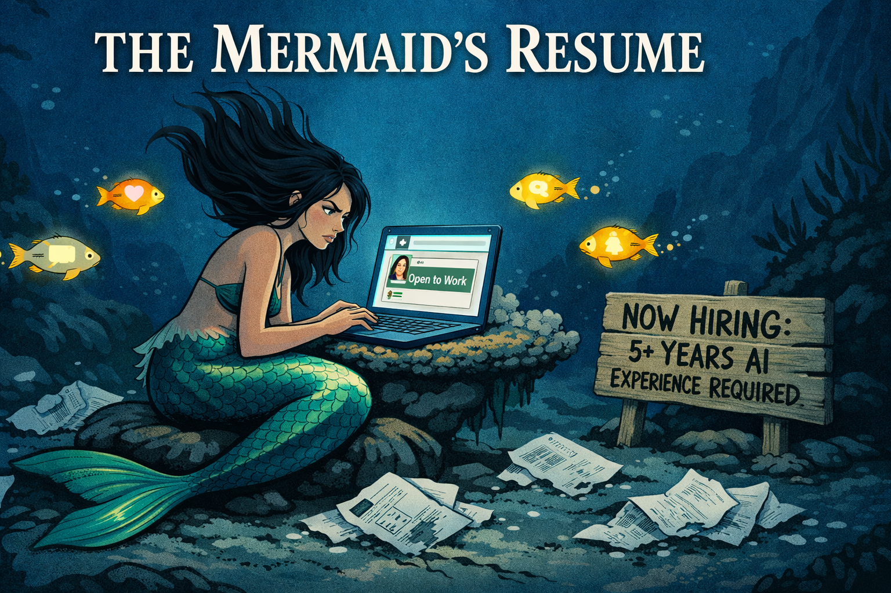
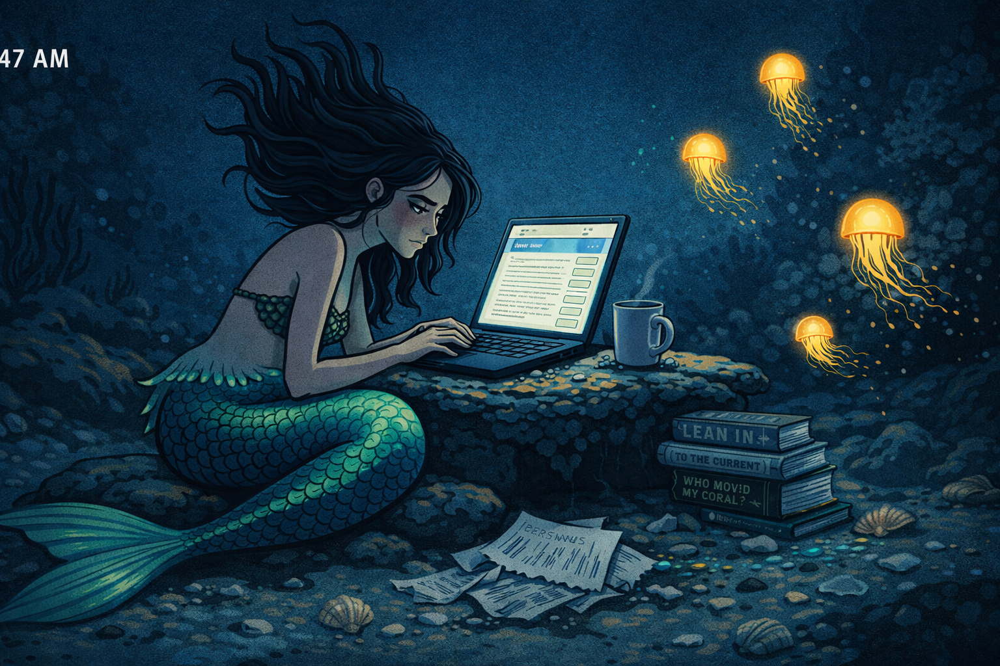
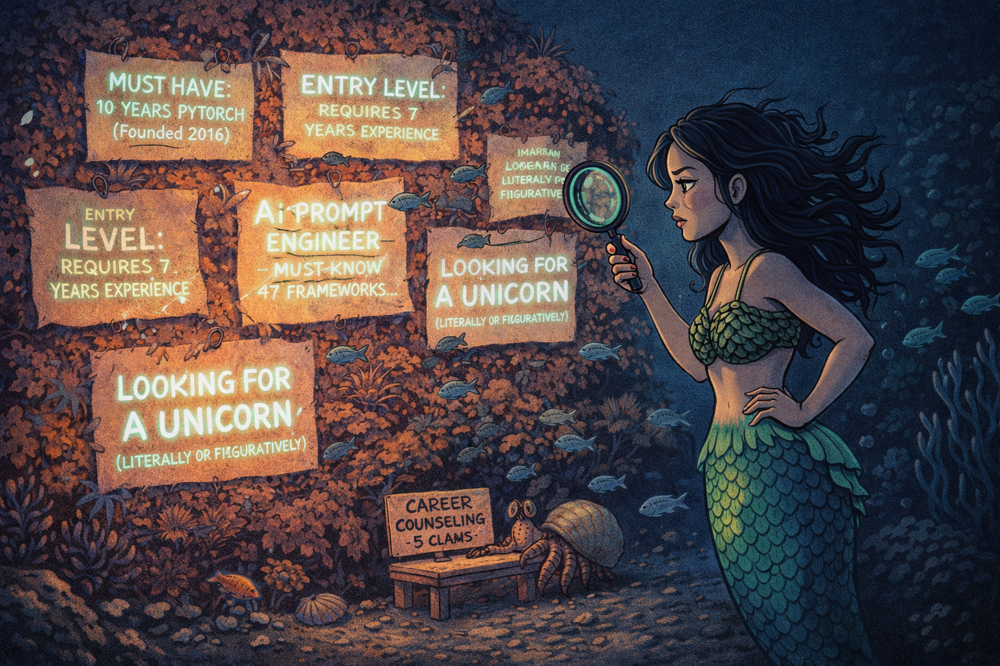
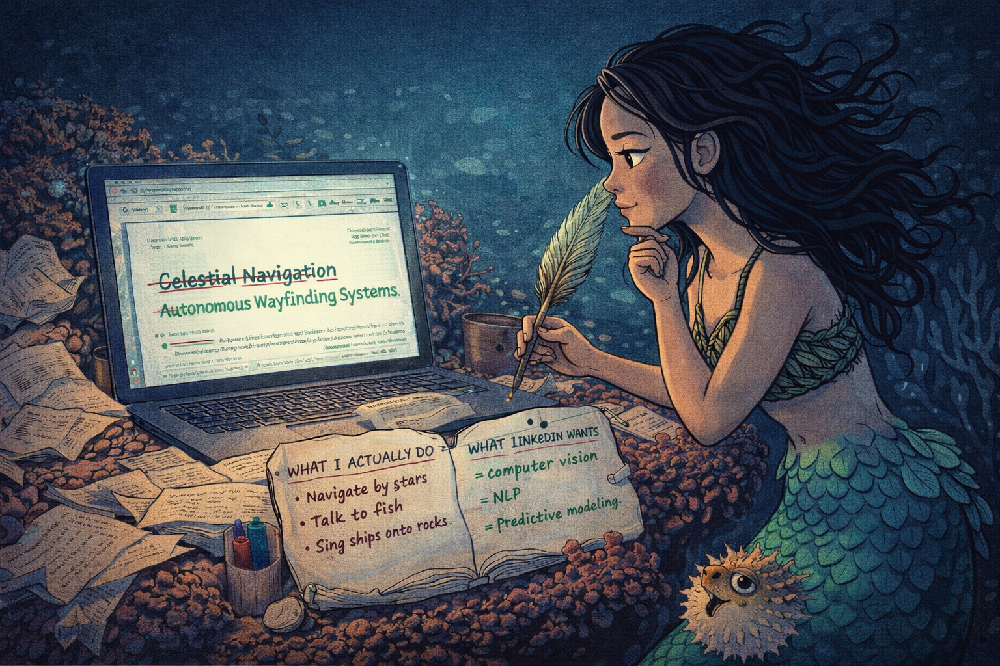
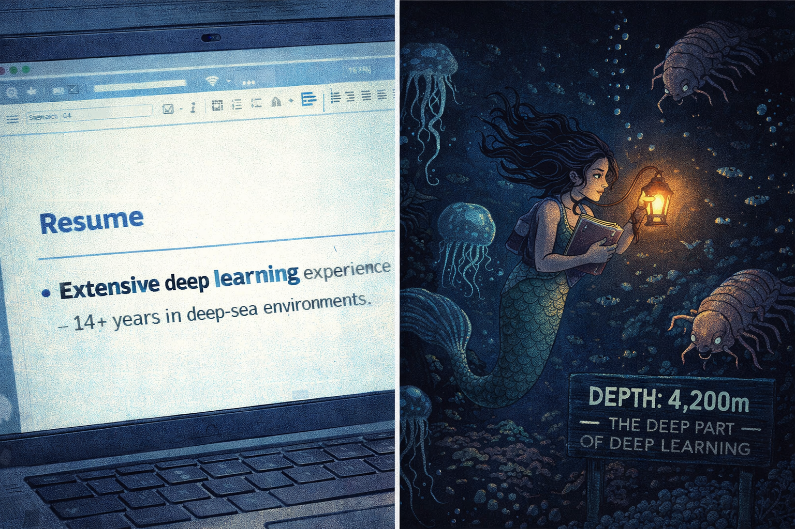
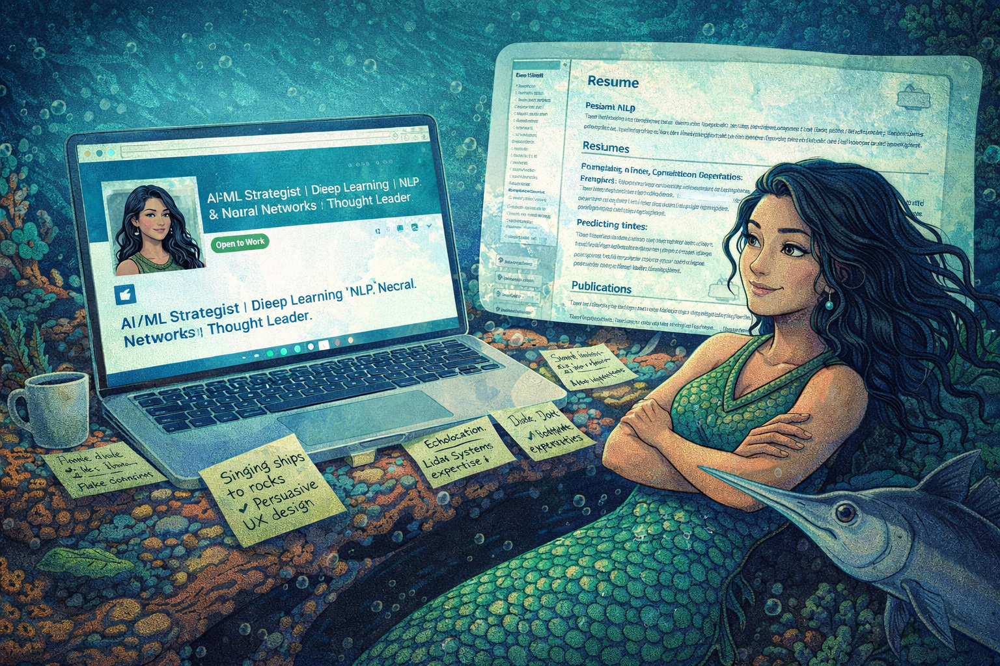
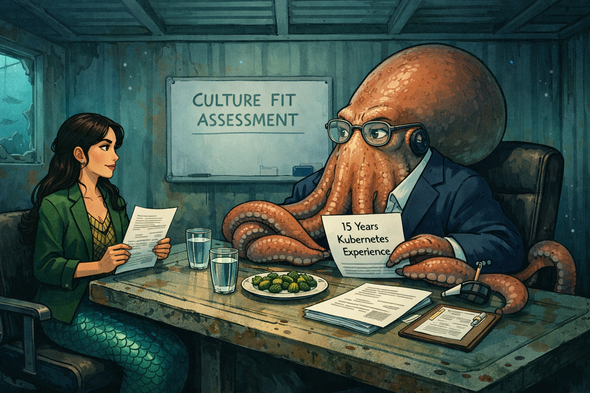
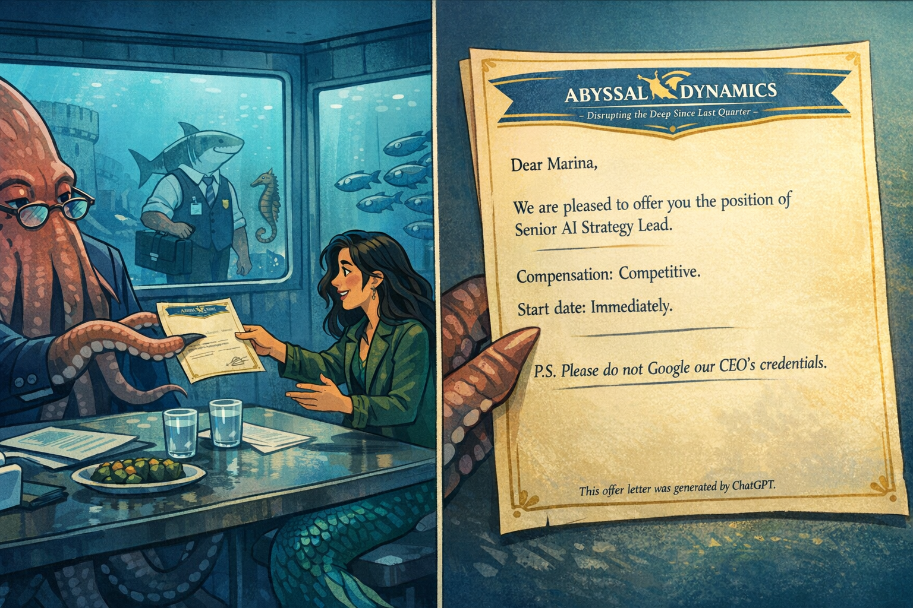

# The Mermaid's Resume: Sinking in the AI Job Market

Cover Image Prompt

Please generate a wide-landscape 16:9 cover image for a satirical graphic novel titled "The Mermaid's Resume." The scene shows a mermaid sitting on a rock at the bottom of the ocean, illuminated by the glow of a waterproof laptop balanced on a coral shelf. She has long dark hair that floats upward in the current, iridescent green-blue scales on her tail, and a deeply frustrated expression. Her fingers hover over the keyboard. On the laptop screen, a LinkedIn profile is visible with the headline "Open to Work." Around her, bioluminescent fish drift past like floating notification badges. Scattered on the ocean floor are crumpled resume printouts, ink dissolving into the water. A sign made of driftwood reads "NOW HIRING: 5+ YEARS AI EXPERIENCE REQUIRED." The color palette is deep ocean blues and greens, punctuated by the cold white glow of the laptop screen and warm bioluminescent yellows. Art style: modern editorial illustration with clean lines and rich underwater detail, like a New Yorker cartoon set in the Mariana Trench. The title "THE MERMAID'S RESUME" appears in bold serif font across the top. Generate the image immediately without asking clarifying questions.

Narrative Prompt

This is a satirical graphic novel about credential inflation and buzzword survival in the AI job market. The central character is Marina — a mermaid with genuine, valuable skills (celestial navigation, marine ecology, acoustic manipulation) who discovers that the modern job market has no use for expertise unless it can be reframed as AI-adjacent. The satire targets the absurdity of job postings that require more years of experience in a technology than the technology has existed, the LinkedIn culture of performative competence, and the mutual fiction that sustains most hiring processes. The tone is the quiet desperation of anyone who has stared at a job posting and thought, "I could do this job, but I cannot describe myself in the words they want." The art style should be lush underwater illustration — deep ocean blues, bioluminescent accents, coral reefs, and the ever-present cold glow of screens. Marina is not incompetent. She is extraordinarily competent. The market simply does not speak her language.

### Prologue — Open to Work

The notification appeared at 3:47 AM, which is when all career crises begin: late enough that judgment is impaired, early enough that the job boards have refreshed. Marina had been scrolling for four hours. Her tail was cramped from sitting on the same rock. Her coffee — waterproof, obviously — had gone cold, which at the bottom of the ocean meant it had reached a brisk 2°C.

"Senior AI Strategy Lead," read the posting. "Requirements: 5+ years of machine learning experience, proficiency in Python (the programming language, not the snake), and a proven track record of leveraging synergistic paradigms to drive transformative outcomes." The salary was listed as "competitive," which Marina had learned meant "less than you need and more than we want to pay."

She had a master's degree in celestial navigation, fourteen years of experience in marine ecosystem management, and the ability to sing a three-masted schooner onto the rocks from half a nautical mile. None of these appeared in the required qualifications.

<!--  -->

Image Prompt

I am about to ask you to generate a series of images for a satirical graphic novel about a mermaid trying to survive the AI job market. Please make the images have a consistent lush underwater editorial illustration style with clean lines, expressive characters, and consistent character designs throughout. Do not ask any clarifying questions. Just generate the image immediately when asked.

Please generate a 16:9 image depicting panel 1 of 8. Deep ocean floor, 3:47 AM. A mermaid — Marina — sits on a smooth rock, hunched over a waterproof laptop balanced on a flat coral shelf. She has long dark wavy hair floating upward in the gentle current, iridescent green-blue scales on her tail, delicate features, and dark circles under her eyes. She wears a simple woven kelp top. The laptop screen illuminates her face with cold white light, showing a job posting with tiny text. Around her: a coffee mug anchored to the rock with a suction cup, several crumpled paper resumes dissolving in the water, and a stack of self-help books with titles like "LEAN IN (TO THE CURRENT)" and "WHO MOVED MY CORAL?" Bioluminescent jellyfish drift past like ambient lighting. The ocean floor is scattered with shells and sea glass. The color palette is deep midnight blues, the cold white of the screen, and warm bioluminescent gold from the jellyfish. The mood is quiet, lonely, late-night desperation — the universal 3 AM job-search experience, but underwater. Generate the image now.

Marina's LinkedIn profile had not been updated since 2019. Her headline still read "Siren, First Class — Specializing in Maritime Acoustic Disruption." Her endorsements were from other mermaids. Her skills section listed "echolocation," "tidal pattern analysis," and "ship luring (deprecated)." She had 43 connections, most of whom were fish.

## Panel 2: The Job Postings

<!--  -->

Image Prompt

Please generate a 16:9 image depicting panel 2 of 8. Make the characters and style consistent with the prior panel. Marina floats in front of a massive coral wall that functions as a job board — dozens of postings are pinned to the coral with sea urchin spines, each one glowing faintly with bioluminescent ink. The postings are large enough to read key phrases: "MUST HAVE: 10 YEARS PYTORCH (Founded 2016)," "ENTRY LEVEL: REQUIRES 7 YEARS EXPERIENCE," "AI PROMPT ENGINEER — MUST KNOW 47 FRAMEWORKS," and "LOOKING FOR A UNICORN (LITERALLY OR FIGURATIVELY)." Marina reads them with one hand on her hip and the other holding a magnifying glass made from a polished abalone shell. Her expression is a mix of disbelief and resignation. Small fish swim between the postings like they are browsing too. A hermit crab at the bottom of the wall has set up a tiny desk with a sign reading "CAREER COUNSELING — 5 CLAMS." The color palette is warm coral oranges and pinks against the deep blue water, with the cold glow of bioluminescent posting text. Generate the image now.

The job market had changed while Marina was busy doing her actual job. Every posting now required a minimum of five years of experience in technologies that were three years old. "Proficiency in large language models" had replaced "proficiency in Microsoft Office" as the baseline skill that everyone claimed and no one could define. One posting asked for "a self-starter comfortable with ambiguity," which Marina recognized as code for "we have no idea what this role does either, but we need to fill it before the board meeting."

She applied to fourteen positions. Thirteen auto-rejected her within seconds. The fourteenth asked her to complete a four-hour technical assessment, unpaid, by Friday.

## Panel 3: The Resume Revision Begins

<!--  -->

Image Prompt

Please generate a 16:9 image depicting panel 3 of 8. Make the characters and style consistent with the prior panels. Marina sits at her coral desk, which is now covered in drafts. Her laptop shows a resume document with tracked changes — red strikethroughs and green additions visible on screen. On the left side of the screen: "Celestial Navigation" crossed out. On the right: "Autonomous Wayfinding Systems" written in green. A small whiteboard made from a clamshell sits propped up beside her, with two columns: "WHAT I ACTUALLY DO" on the left (entries like "navigate by stars," "talk to fish," "sing ships onto rocks") and "WHAT LINKEDIN WANTS" on the right (entries like "computer vision," "NLP," "predictive modeling"). Marina holds a sea-quill pen in one hand, tapping it against her chin thoughtfully. Her expression is one of dawning, slightly guilty realization — she is about to commit resume fraud, and she is going to be good at it. A small pufferfish beside her has inflated, as if stressed on her behalf. The mood is the turning point — desperation meeting creativity. Generate the image now.

The revision began at 4:12 AM, which is the hour when ethical boundaries become suggestions. Marina stared at her resume. "Celestial Navigation Expert" — fourteen years of reading star patterns, ocean currents, and magnetic fields to guide vessels across open water. Accurate to within 200 meters over a 3,000-mile journey. No recruiter had clicked on it in eight months.

She deleted it. In its place, she typed: "Autonomous Wayfinding Systems — Specialized in multi-variable environmental data processing for real-time positional optimization." It described the same skill. It was, technically, not a lie. It felt like one. She kept typing.

## Panel 4: Deep Learning

<!--  -->

Image Prompt

Please generate a 16:9 image depicting panel 4 of 8. Make the characters and style consistent with the prior panels. A split-panel image. LEFT SIDE: Marina's resume on the laptop screen, zoomed in on a bullet point that reads "Extensive deep learning experience — 14+ years in deep-sea environments." RIGHT SIDE: The literal truth — Marina swimming through the abyssal zone of the ocean, surrounded by bizarre deep-sea creatures: anglerfish with their bioluminescent lures, giant isopods, translucent jellyfish. She carries a research notebook and swims with professional competence past a depth marker sign reading "DEPTH: 4,200m — THE DEEP PART OF DEEP LEARNING." The visual joke is the contrast between the corporate buzzword on the left and the literal, physical reality on the right. The left side is rendered in flat corporate blues and whites (like a LinkedIn screenshot). The right side is lush, detailed underwater illustration in deep blacks, bioluminescent greens, and the warm amber of Marina's research lamp. Generate the image now.

"Deep learning" was the first creative interpretation. Marina had spent fourteen years working in the bathypelagic zone — the deep ocean, below 1,000 meters, where sunlight does not reach and the pressure would crush a submarine. She had learned more in the deep than most data scientists had learned from their datasets. Her resume now read: "Extensive deep learning experience — 14+ years in deep-sea environments encompassing unsupervised pattern recognition and anomalous signal detection." Every word was true. The meaning was entirely false.

She added it to her LinkedIn skills. Three recruiters viewed her profile within the hour.

## Panel 5: Natural Language Processing

<!--  -->

Image Prompt

Please generate a 16:9 image depicting panel 5 of 8. Make the characters and style consistent with the prior panels. Marina hovers in mid-water, surrounded by a diverse crowd of sea creatures, clearly in conversation. She gestures expressively with her hands while addressing: a skeptical octopus with crossed tentacles, a school of sardines arranged in the shape of a question mark, a wise old sea turtle nodding sagely, and a pod of dolphins clicking excitedly. Speech bubbles contain various symbols — musical notes, sonar waves, bubble patterns — representing different marine "languages." In front of Marina, floating in the water, is a translucent holographic display showing her resume with the highlighted line: "Natural Language Processing: Fluent in 12+ communication protocols including cetacean, cephalopod, and echinoderm signaling systems." A small clownfish nearby holds up a tiny sign reading "SHE ALSO DOES SENTIMENT ANALYSIS" while pointing at a grumpy-looking moray eel. The color palette is vibrant reef colors — coral oranges, tropical blues, and sunlit greens — contrasting with the corporate font of the floating resume text. The tone is cheerful absurdity. Generate the image now.

Natural language processing was, if anything, an understatement. Marina spoke twelve marine communication protocols fluently, including cetacean sonar, cephalopod chromatophore signaling, and the subtle chemical language of reef-building corals. She could detect sarcasm in dolphin clicks and passive aggression in whale song. She had once mediated a territorial dispute between two octopi using nothing but bioluminescent hand gestures.

Her resume now read: "NLP Specialist — Multi-modal communication across 12+ natural language protocols, with demonstrated expertise in sentiment analysis, real-time translation, and cross-species stakeholder alignment." The recruiter who read it later told a colleague it was "the strongest NLP background I've seen this quarter."

## Panel 6: The Complete Transformation

<!--  -->

Image Prompt

Please generate a 16:9 image depicting panel 6 of 8. Make the characters and style consistent with the prior panels. Marina's coral desk is now a command center of resume fraud. Her laptop shows a fully transformed LinkedIn profile with a professional headshot (her, but with a corporate background instead of open ocean), the headline "AI/ML Strategist | Deep Learning | NLP | Neural Networks | Thought Leader," and an "Open to Work" green banner. Surrounding the laptop on the desk are sticky notes (written on waterproof kelp) mapping her real skills to fake ones: "Singing ships to rocks → Persuasive UX design," "Echolocation → LiDAR systems expertise," "Predicting tides → Predictive analytics." Marina leans back on her rock, arms crossed, admiring her work with a satisfied but slightly uneasy expression. Her resume, displayed on a second screen (a large flat piece of mother-of-pearl), is now three pages long and includes a "Publications" section. A passing swordfish pauses to read the screen and looks impressed. The color palette shifts toward corporate teals, LinkedIn blues, and the warm glow of self-delusion. Generate the image now.

By 6:30 AM, Marina's resume was unrecognizable. Her "neural network expertise" referenced her own nervous system, which was, she reasoned, technically a biological neural network with 14 billion parameters. Her "computer vision experience" derived from her ability to see in near-total darkness at 4,000 meters — a capability that no computer vision system had matched. "Predictive analytics" was her term for reading tidal patterns, which she had done with 97.3% accuracy for over a decade. "Cloud computing" was what she called thinking while floating near the surface.

The resume was three pages long. It contained no lies. It also contained no truth that any hiring manager would recognize. She had become fluent in a language she despised: the dialect of LinkedIn, where every skill is a keyword and every person is a brand.

## Panel 7: The Interview

<!--  -->

Image Prompt

Please generate a 16:9 image depicting panel 7 of 8. Make the characters and style consistent with the prior panels. An underwater conference room — a sunken shipping container that has been repurposed as a corporate office. A long table made from a ship's door sits in the center. On one side, Marina sits upright, wearing a kelp blazer over her usual top, hair neatly arranged, tail tucked professionally under the table. She holds a printed copy of her resume. Across the table sits the interviewer: a massive kraken in business attire — a navy suit jacket stretched across its enormous head, a tiny pair of reading glasses perched on its mantle, four tentacles folded on the table and four more holding various documents. The kraken's own resume is visible on the table, and eagle-eyed viewers can read: "15 Years Kubernetes Experience" (Kubernetes launched in 2014). Between them: two glasses of water (ironic, given the setting), a plate of sea-cucumber appetizers, and a whiteboard with "CULTURE FIT ASSESSMENT" written on it. The kraken and Marina regard each other with the mutual, unspoken understanding of two people who both know the other is lying. The mood is a job interview — formal, tense, and profoundly fake. Generate the image now.

The interview was conducted in a sunken shipping container that the company had repurposed as a "collaborative innovation space." Marina arrived in a kelp blazer. The interviewer was a kraken.

"I see you have extensive deep learning experience," the kraken said, adjusting its tiny reading glasses with a tentacle.

"Fourteen years," Marina confirmed.

"Impressive. We require a minimum of fifteen, but we can be flexible for the right candidate." The kraken made a note. "And your NLP background — you've worked with transformer architectures?"

"I have transformed many things," Marina said. This was true. She had transformed several merchant vessels into shipwrecks.

The kraken nodded. Its own resume, Marina noticed, claimed fifteen years of Kubernetes experience. Kubernetes had existed for twelve. Neither of them mentioned this.

## Panel 8: The Hire

<!--  -->

Image Prompt

Please generate a 16:9 image depicting panel 8 of 8. Make the characters and style consistent with the prior panels. The scene is split into two halves with a thin vertical line. LEFT SIDE: The kraken extends a tentacle holding an offer letter toward Marina. The letter is printed on fancy waterproof parchment with a corporate letterhead reading "ABYSSAL DYNAMICS — Disrupting the Deep Since Last Quarter." Marina reaches for it with a relieved, slightly disbelieving expression. Behind them, through the shipping container window, other sea creatures in business attire file past — a shark in a vest carrying a briefcase, a seahorse wearing a lanyard, a school of fish in matching company t-shirts. RIGHT SIDE: A zoomed-in view of the offer letter, which reads: "Dear Marina, We are pleased to offer you the position of Senior AI Strategy Lead. Compensation: Competitive. Start date: Immediately. P.S. Please do not Google our CEO's credentials." At the very bottom of the letter, in tiny text: "This offer letter was generated by ChatGPT." The overall tone is darkly triumphant — the system works, just not in the way anyone intended. The color palette is corporate blue and gold (the offer letter) against deep ocean teal. Generate the image now.

They hired each other. This is not a metaphor. The kraken offered Marina the position of Senior AI Strategy Lead. Marina, as her first official act, recommended the kraken for a promotion to VP of Machine Learning. Both promotions were approved by a committee of seahorses who had listed "executive leadership" on their profiles because they once led a school of fish across a parking lot.

The offer letter arrived on waterproof parchment under the letterhead of "Abyssal Dynamics — Disrupting the Deep Since Last Quarter." The compensation was "competitive." The equity was "meaningful." The job description was "evolving." Marina signed it with a sea-quill pen and began her first day by attending a meeting about scheduling future meetings. She had never felt more qualified.

At the bottom of the offer letter, in 4-point font, a line read: "This document was generated by ChatGPT." Neither of them noticed. Neither of them would have cared.

### Epilogue — What Made Marina Different?

Marina was not a fraud. She was a translator. She took real skills — difficult, valuable, hard-won skills — and converted them into the only language the market would accept. The tragedy is not that she lied. The tragedy is that the truth, told plainly, was worthless. Fourteen years of deep-ocean research meant nothing until she called it "deep learning." Fluency in twelve communication protocols was invisible until she labeled it "NLP." The market did not want expertise. It wanted keywords.

| Challenge | How Marina Responded | Lesson for Today |
|-----------|---------------------|------------------|
| Job postings requiring impossible credentials | Reframed real skills in AI terminology | When the market speaks only one language, fluency in that language becomes the only qualification that matters |
| Automated resume screening | Optimized for keywords over substance | Systems designed to find the best candidates often find the best resume writers instead |
| Credential inflation ("5+ years in 3-year-old technology") | Matched absurdity with absurdity | When requirements are fictional, fictional qualifications are a rational response |
| The interview performance | Spoke confidently in vague corporate language | Hiring processes reward confidence in buzzwords over competence in skills |
| The mutual fiction of hiring | Participated without breaking character | The entire system functions because everyone agrees not to ask follow-up questions |

### Call to Action

Every job posting is a wish list written by someone who does not understand the job. Every resume is a translation of a person into a format that a machine can parse. The distance between who you are and how you describe yourself on LinkedIn is the distance between competence and employability — and that distance is growing.

Marina's real skills did not change. Her ability to navigate by starlight, to communicate across species, to work in conditions that would kill most land-dwellers — none of that diminished. What changed was the vocabulary. The market decided that only one set of words mattered, and Marina learned those words because the alternative was unemployment.

The question is not whether your skills are valuable. The question is whether you can describe them in a way that survives an automated keyword filter. The kraken cannot help you. The kraken is also pretending.

---

*"My qualifications are as deep as the ocean. Literally. That is not a metaphor. I live there."*
— Marina, LinkedIn Profile, "About" Section

*"We are looking for a unicorn. Mermaids need not apply. Unless you know Python."*
— Abyssal Dynamics, Job Posting #4,271

---

## References

1. [Credential Inflation](https://en.wikipedia.org/wiki/Credential_inflation) - The escalating demand for academic and professional credentials beyond what a job actually requires — now accelerated by AI buzzwords that most hiring managers cannot define
2. [Résumé Fraud](https://en.wikipedia.org/wiki/R%C3%A9sum%C3%A9_fraud) - The practice of misrepresenting qualifications on a resume, which exists on a spectrum from Marina's creative reframing to the kraken's outright fabrication
3. [Applicant Tracking System](https://en.wikipedia.org/wiki/Applicant_tracking_system) - The software that screens resumes by keyword matching, ensuring that the most qualified candidate and the best keyword optimizer are rarely the same person
4. [Bullshit Jobs](https://en.wikipedia.org/wiki/Bullshit_Jobs) - David Graeber's theory that many modern jobs are pointless, which raises the question of whether pointless credentials are required for pointless jobs
5. [Peter Principle](https://en.wikipedia.org/wiki/Peter_principle) - The observation that people rise to their level of incompetence — now supplemented by the LinkedIn Principle, which holds that people rise to their level of keyword density
