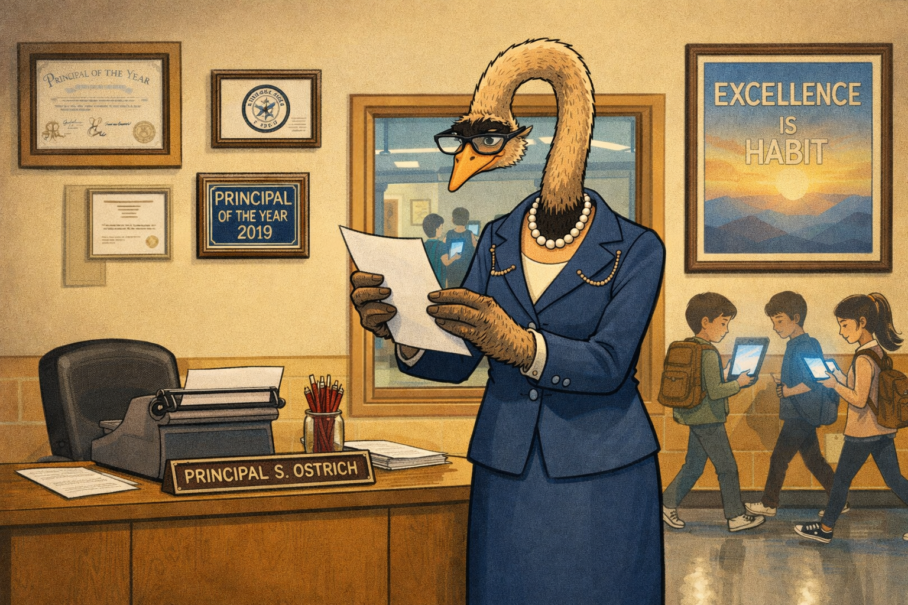
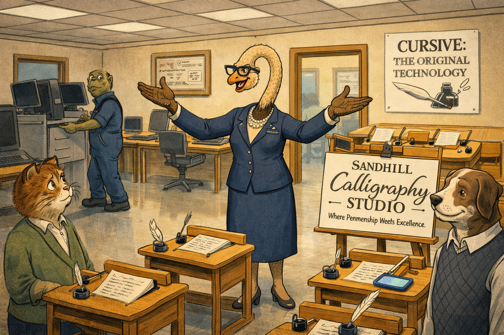
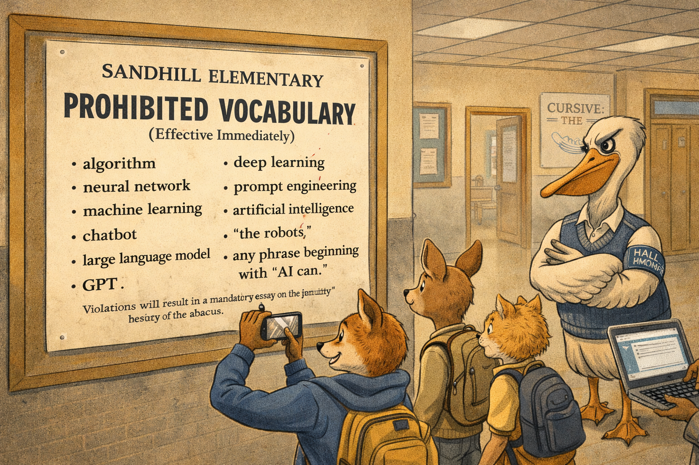
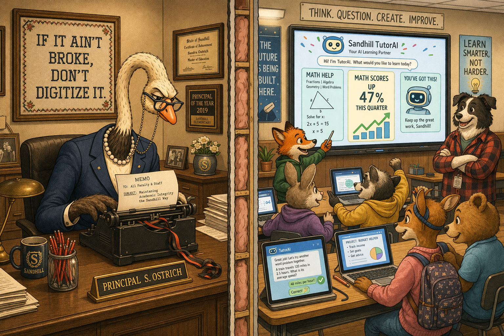
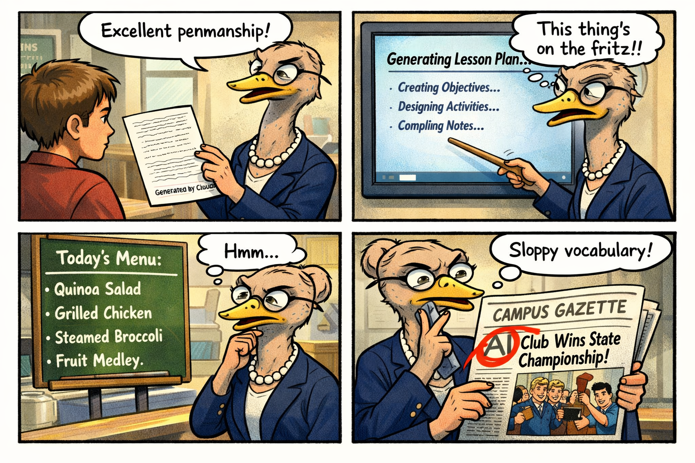
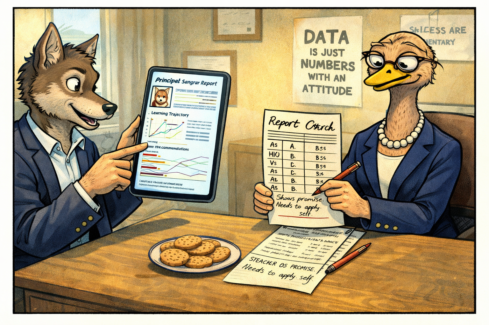
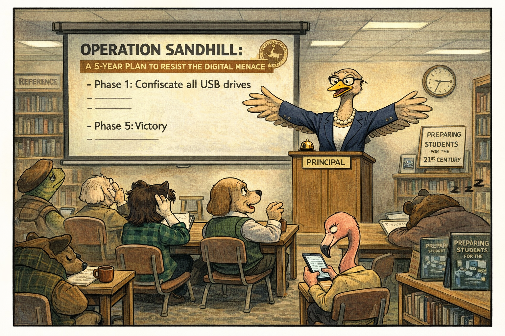
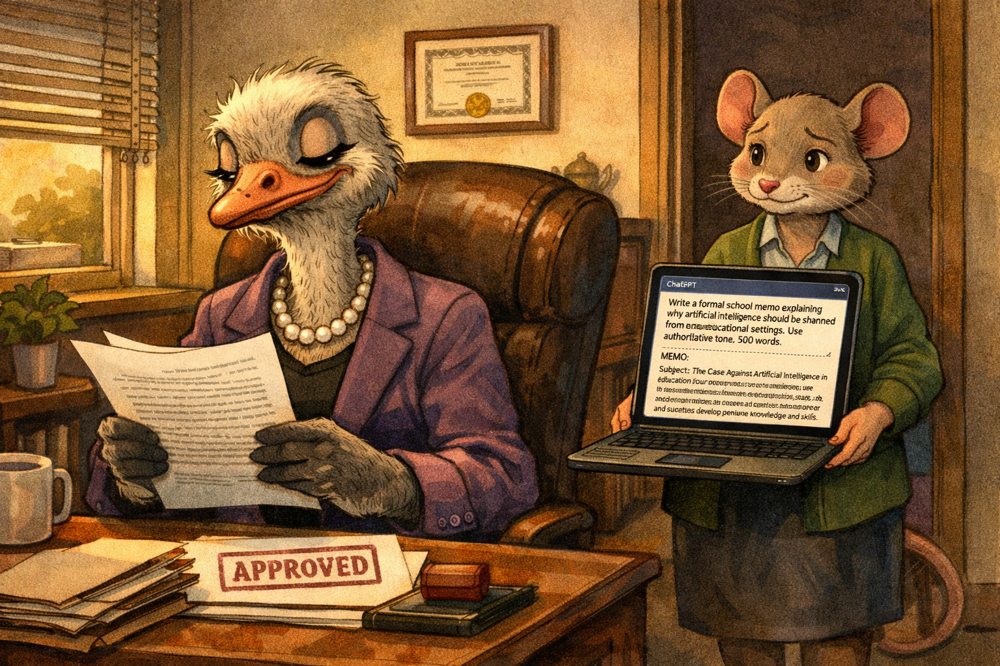

# The Ostrich Principal: A Head in the Sand

Cover Image Prompt

Please generate a wide-landscape 16:9 cover image for a satirical graphic novel titled "The Ostrich Principal." The scene shows a tall, imperious female ostrich in a conservative navy blue suit, pearl necklace, and reading glasses on a chain, standing in a school hallway. Her head is partially buried in a stack of policy documents on her desk, ostrich-style. Behind her, visible through a classroom door window, students are gathered around glowing laptop screens — clearly building something with AI. The school walls are lined with motivational posters that read things like "CURSIVE IS FOREVER" and "WORKSHEETS BUILD CHARACTER." A banner above the office door reads "SANDHILL ELEMENTARY — Tradition Since 1847." The color palette is institutional beige, fluorescent lighting, and the blue glow of screens through the classroom window. Art style: modern editorial illustration with clean lines and warm satirical humor, like a David Sipress New Yorker cartoon but in full color. Generate the image immediately without asking clarifying questions.

Narrative Prompt

This is a satirical graphic novel about education administrators who refuse to acknowledge the existence and impact of AI. The central character is Principal Sandra Ostrich — a well-meaning, dedicated educator who has decided that the correct institutional response to artificial intelligence is to pretend it does not exist. The satire targets schools that ban AI tools, form committees instead of developing policies, and continue teaching as if the world hasn't changed. The tone is painfully realistic: every policy Sandra enacts mirrors something a real school has actually done. The art style should be warm, detailed editorial illustration — think school hallways, fluorescent lights, motivational posters, and the specific aesthetic of American public school administration. Sandra is not a villain; she genuinely believes she is protecting her students. This makes the satire sharper.

### Prologue — A Memo from the Principal's Office

The memo arrived in every teacher's mailbox at 7:14 AM on a Tuesday, which is when all important educational decisions are communicated: too early for anyone to have had enough coffee to object, and on a day that feels far enough from the weekend that resistance seems futile.

"Dear Faculty," it began. "It has come to my attention that several students have been using so-called 'artificial intelligence' tools for academic purposes. Let me be perfectly clear: Sandhill Elementary does not recognize the existence of artificial intelligence. Effective immediately, the following words are banned from campus: algorithm, neural network, machine learning, chatbot, and 'the robots.'"

It was the most efficiently written memo Sandra Ostrich had ever produced. Her assistant had drafted it in eleven seconds using ChatGPT. Sandra did not know this.

Image Prompt

I am about to ask you to generate a series of images for a satirical graphic novel about an ostrich school principal who refuses to acknowledge AI. Please make the images have a consistent warm editorial illustration style with clean lines, expressive characters, and consistent character designs throughout. Do not ask any clarifying questions. Just generate the image immediately when asked.

Please generate a 16:9 image depicting panel 1 of 8. Early morning in a school office. Principal Sandra Ostrich — a tall, stately ostrich wearing a conservative navy blue suit, pearl necklace, reading glasses on a chain around her neck, and sensible shoes — stands behind her large wooden desk. She holds a freshly printed memo with both wings, reading it with satisfaction. The office is meticulously organized: framed certificates on the wall, a "Principal of the Year 2019" plaque, a motivational poster reading "EXCELLENCE IS A HABIT" with a stock photo of a sunrise. On her desk: a nameplate reading "PRINCIPAL S. OSTRICH," a jar of red pens, and conspicuously no computer — just a typewriter. Through the office window behind her, we can see the school hallway where students walk past with smartphones and laptops glowing. Sandra does not see them. The color palette is warm institutional beige, navy blue, and fluorescent white. The mood is self-satisfied administrative certainty. Generate the image now.

Principal Sandra Ostrich had led Sandhill Elementary for twenty-three years. She had survived budget cuts, three superintendents, a brief and regrettable experiment with open-plan classrooms, and the Great Smartboard Debacle of 2014. She had not survived these things by embracing change. She had survived them by outlasting it.

## Panel 2: The Computer Lab Becomes a Calligraphy Studio

Image Prompt

Please generate a 16:9 image depicting panel 2 of 8. Make the characters and style consistent with the prior panel. A former computer lab is being converted. Half the room still has desktop computers — being wheeled out on carts by a bewildered janitor (a tortoise in coveralls). The other half has been set up with wooden calligraphy desks, ink wells, quill pens, and sheets of parchment. A hand-lettered sign on an easel reads "SANDHILL CALLIGRAPHY STUDIO — Where Penmanship Meets Excellence." Principal Ostrich stands in the center, wings spread wide in a presentation gesture, beaming with pride. Two teachers stand nearby: a young cat in a cardigan looking horrified, and an older hound dog in a sweater vest nodding approvingly. On the wall, a freshly hung poster reads "CURSIVE: THE ORIGINAL TECHNOLOGY." One student in the background is doing calligraphy — on an iPad with a stylus. Sandra has not noticed. The color palette is warm wood tones, ink blacks, and institutional beige. Generate the image now.

The computer lab conversion was Sandra's proudest initiative. "If students need to write," she explained at the faculty meeting, "they should learn to write beautifully. Calligraphy teaches discipline, patience, and fine motor skills. What does a computer teach? Typing. And we already have a typing teacher." The typing teacher had retired in 2008. The position had not been filled. Sandra considered this evidence that typing was, as she had long suspected, a fad.

## Panel 3: The Banned Words List

Image Prompt

Please generate a 16:9 image depicting panel 3 of 8. Make the characters and style consistent with the prior panels. A school hallway bulletin board displays a large, officially formatted poster titled "SANDHILL ELEMENTARY — PROHIBITED VOCABULARY (Effective Immediately)." The list includes: "algorithm, neural network, machine learning, chatbot, large language model, GPT, deep learning, prompt engineering, artificial intelligence, 'the robots,' and any phrase beginning with 'AI can.'" At the bottom in smaller text: "Violations will result in a mandatory essay on the history of the abacus." Students walk past the sign — a group of young animals (a fox cub, a young deer, a kitten) — looking at it with a mixture of amusement and disbelief. One student is photographing the sign with a phone. Another is whispering to a friend while holding a laptop whose screen shows a ChatGPT window. A hall monitor (a stern pelican with an armband) watches nearby. The tone is absurdist bureaucracy meets high school hallway. Generate the image now.

The Prohibited Vocabulary list was updated weekly. By October, it included 847 words and phrases, making it longer than the school's actual curriculum. A student pointed out that banning the word "network" also prohibited discussion of computer networks, television networks, and the network of rivers in the local watershed. Sandra added "watershed" to the list to be safe.

## Panel 4: The Classroom Next Door

Image Prompt

Please generate a 16:9 image depicting panel 4 of 8. Make the characters and style consistent with the prior panels. A split-panel image. LEFT SIDE: Sandra's office. She sits at her typewriter, composing another memo. The typewriter ribbon is running out. Her expression is one of focused determination. The wall behind her has a cross-stitch that reads "IF IT AIN'T BROKE, DON'T DIGITIZE IT." RIGHT SIDE: The classroom directly next door, visible through a thin wall (shown in cross-section). A group of excited students — young animals of various species — are gathered around laptops and tablets. On a large screen at the front of the classroom, a student-built AI tutoring system is displayed, with a cheerful interface showing "MATH SCORES UP 47% THIS QUARTER." A young fox cub is presenting to the class. A young teacher (a enthusiastic border collie in a flannel shirt) watches proudly. The thin wall between the two rooms emphasizes how close Sandra is to the future she refuses to see. The contrast between the two halves — sepia-toned bureaucracy on the left, bright digital energy on the right — is the visual joke. Generate the image now.

Room 14B was technically Ms. Collie's Advanced Mathematics classroom. It was also, unofficially, the most sophisticated AI research lab in the school district. The students had built a tutoring system that adapted to each learner's pace, identified knowledge gaps, and generated practice problems in real time. Math scores had risen 47% in one semester. When Sandra asked Ms. Collie to explain the improvement, Ms. Collie said, "Differentiated instruction." This was technically not a lie.

## Panel 5: Evidence Mounts

Image Prompt

Please generate a 16:9 image depicting panel 5 of 8. Make the characters and style consistent with the prior panels. A montage panel showing four small scenes of Sandra encountering — and denying — evidence of AI throughout her school day. TOP LEFT: Sandra walks past a student whose essay has a small "Generated by Claude" watermark at the bottom — Sandra is reading the essay and commenting "Excellent penmanship!" TOP RIGHT: Sandra stands in front of a classroom smartboard that is auto-generating a lesson plan — she thinks the board is malfunctioning and is poking it with a yardstick. BOTTOM LEFT: Sandra discovers that the school's cafeteria menu has been optimized by an algorithm (the menu now makes nutritional sense for the first time in decades) — she is suspicious but cannot identify why. BOTTOM RIGHT: Sandra reads the school newspaper, whose lead article is titled "AI Club Wins State Championship" — she is circling the word "AI" with a red pen for a vocabulary violation. Each vignette is framed like a comic strip panel. The overall tone is mounting dramatic irony. Generate the image now.

The evidence arrived hourly, but Sandra had developed a remarkable immunity to it. She attributed the suddenly coherent school website to "a talented volunteer." She credited the mysteriously efficient bus routes to "good old-fashioned planning." When the cafeteria began serving nutritionally balanced meals for the first time since 1997, she assumed the lunch staff had finally read her 2016 wellness memo. They had not. The lunch staff had asked ChatGPT to redesign the menu. It had taken forty seconds.

## Panel 6: The Parent-Teacher Conference

Image Prompt

Please generate a 16:9 image depicting panel 6 of 8. Make the characters and style consistent with the prior panels. A parent-teacher conference in Sandra's office. Across the desk from Principal Sandra Ostrich sits a parent — a well-dressed wolf in business casual, holding a tablet showing their child's AI-generated progress report, which includes data visualizations, learning trajectory graphs, and personalized recommendations. Sandra holds a handwritten report card with letter grades and the comment "Shows promise. Needs to apply self." The contrast between the two documents is stark. The wolf parent is pointing at the AI report with enthusiasm. Sandra is pointedly not looking at the tablet, instead tapping her handwritten card with a red pen. Behind Sandra, taped to the wall, is a new poster: "DATA IS JUST NUMBERS WITH AN ATTITUDE." On the desk between them, a plate of cookies (the universal peace offering of parent-teacher conferences). The mood is polite tension — two worldviews colliding over a plate of snickerdoodles. Generate the image now.

The parent-teacher conferences were the hardest part. Mrs. Wolf arrived with a tablet displaying her cub's AI-generated learning portfolio: personalized progress metrics, skill gap analysis, and a recommended study plan that adapted in real time. Sandra countered with a handwritten report card that read "Shows promise. Needs to apply self." Mrs. Wolf asked, politely, whether the school had considered adopting any educational technology tools. Sandra replied that Sandhill Elementary was proud to offer students a "screen-free, algorithm-free, authentically human educational experience." Mrs. Wolf's cub was applying to transfer.

## Panel 7: The Emergency Faculty Meeting

Image Prompt

Please generate a 16:9 image depicting panel 7 of 8. Make the characters and style consistent with the prior panels. The school library, repurposed for an emergency faculty meeting. Principal Sandra Ostrich stands at a podium at the front, wings spread dramatically, addressing rows of teachers seated in small library chairs (too small for adult animals, emphasizing the absurdity). Behind her, a projector screen displays a single slide: "OPERATION SANDHILL: A 5-YEAR PLAN TO RESIST THE DIGITAL MENACE." The slide has bullet points including "Phase 1: Confiscate all USB drives" and "Phase 5: Victory." Teachers react in various ways: the young border collie teacher has her head in her paws, the elderly hound dog nods vigorously, a flamingo teacher is surreptitiously using her phone under the desk, and a bear teacher in the back has fallen asleep. On a nearby bookshelf, ironically, sits a display of books titled "PREPARING STUDENTS FOR THE 21ST CENTURY." A wall clock shows it is 4:47 PM — late enough that everyone wants to go home. Generate the image now.

The emergency faculty meeting was called after a parent complained that their child had learned more from a chatbot in one evening than from an entire semester of Sandra's "Penmanship First" initiative. Sandra presented a five-year strategic plan titled "Operation Sandhill." Phase 1 involved confiscating all USB drives. Phases 2 through 4 were described as "under development." Phase 5 was "Victory." Ms. Collie raised her paw and asked what, specifically, victory looked like. Sandra said it looked like 1997, but with better funding.

## Panel 8: The Memo's Secret

Image Prompt

Please generate a 16:9 image depicting panel 8 of 8. Make the characters and style consistent with the prior panels. Late afternoon in Principal Sandra Ostrich's office. Principal Sandra Ostrich sits at her desk, exhausted after the faculty meeting, reading a new memo — the latest in her anti-AI campaign. Standing in the doorway behind her is her assistant — a quiet, efficient mouse in a cardigan, holding a laptop. On the laptop screen, clearly visible to the viewer but not to Sandra, is a ChatGPT window with the prompt: "Write a formal school memo explaining why artificial intelligence should be banned from educational settings. Use authoritative tone. 500 words." The generated text on the screen matches the memo Sandra is holding. Sandra reads the memo with deep satisfaction, nodding approvingly. The mouse's expression is one of quiet, complicated guilt — or perhaps pragmatism. On Sandra's desk, a red stamp reads "APPROVED." The irony is visual, not stated. The tone is the perfect final beat: the person fighting AI hardest is already dependent on it without knowing. Generate the image now.

At 4:52 PM, Sandra approved the latest memo. It was, she had to admit, the finest piece of administrative writing she had ever produced. The arguments were crisp. The tone was authoritative. The vocabulary was — she paused to appreciate this — entirely free of prohibited words. She signed it with a fountain pen, stamped it "APPROVED," and placed it in every faculty mailbox by 5:00 PM.

In the doorway, her assistant held a laptop. On the screen, a ChatGPT window displayed the prompt: "Write a formal school memo explaining why artificial intelligence should be banned from educational settings. Use authoritative tone. 500 words."

Sandra did not see the screen. She never did.

### Epilogue — What Made Sandra Different?

Sandra Ostrich was not a bad principal. She was, by most measures, a dedicated one. She arrived early, stayed late, and genuinely cared about her students. Her failure was not one of character but of imagination. She could not conceive of a world different from the one she had mastered, and so she spent her considerable energy ensuring that world would never change. The world changed anyway.

| Challenge | How Sandra Responded | Lesson for Today |
|-----------|---------------------|------------------|
| New technology in education | Banned it by name | Banning tools does not ban the need they address |
| Students outperforming expectations | Attributed it to traditional methods | When you refuse to see the cause, you cannot replicate the success |
| Evidence of AI throughout the school | Denied, ignored, or relabeled it | Institutional denial requires more energy than institutional adaptation |
| Parent demands for modernization | Defended the status quo | "We've always done it this way" is a description, not a strategy |
| Her own dependence on AI (via her assistant) | Never noticed | The people who resist AI most fiercely are often already using it |

### Call to Action

Every school has a Sandra Ostrich. Some of them are principals. Some of them are school boards. Some of them are state legislatures. They are not malicious. They are afraid. And they are making decisions about children's futures based on a world that no longer exists.

The students in Room 14B did not wait for permission. They built the future while the memo was still being drafted. The question for every educator is simple: Are you Sandra, or are you in Room 14B?

---

*"Let me be perfectly clear: the future is not on the agenda."*
— Principal Sandra Ostrich, Emergency Faculty Meeting, 4:47 PM

---

## References

1. [Luddite](https://en.wikipedia.org/wiki/Luddite) - The historical movement of workers who destroyed machinery they feared would replace them — now a term for anyone who resists technological change out of fear rather than principle
2. [Digital Divide in Education](https://en.wikipedia.org/wiki/Digital_divide_in_education) - The gap between students who have access to modern technology and those whose institutions have decided modernity is optional
3. [Ostrich Effect](https://en.wikipedia.org/wiki/Ostrich_effect) - The cognitive bias of avoiding apparently risky information by pretending it does not exist — named, appropriately, after Sandra's species
4. [Technology Integration in Education](https://en.wikipedia.org/wiki/Technology_integration) - The theory and practice of incorporating technology into teaching, which assumes the institution acknowledges that technology exists
5. [Streisand Effect](https://en.wikipedia.org/wiki/Streisand_effect) - The phenomenon where attempting to suppress information only increases public interest in it — see also: banning 847 words
