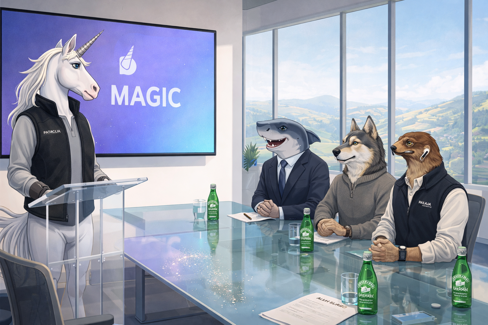
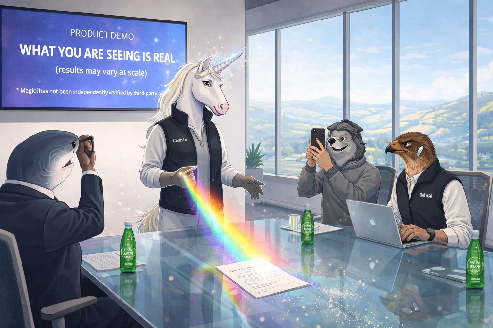
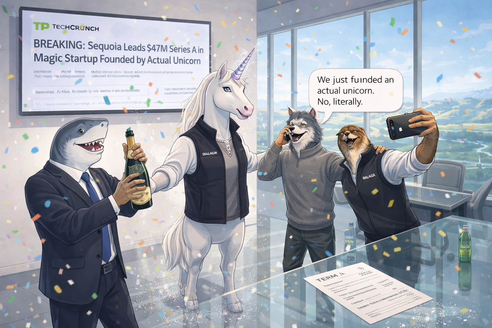
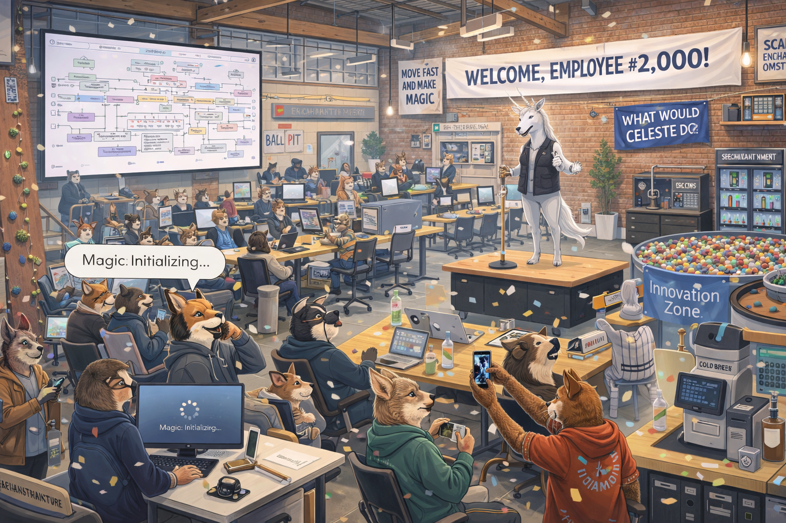
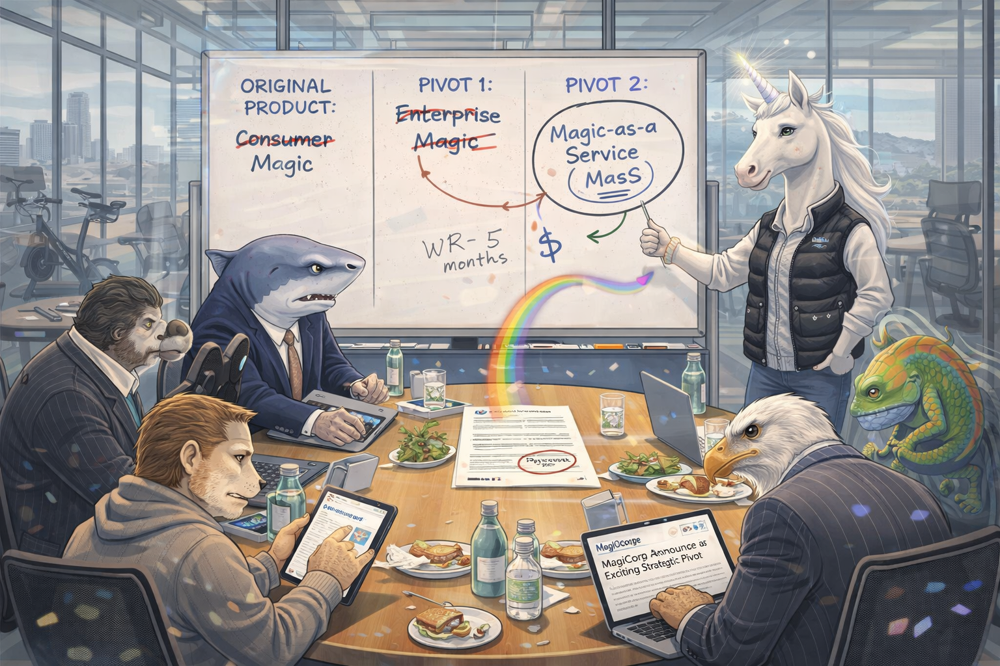
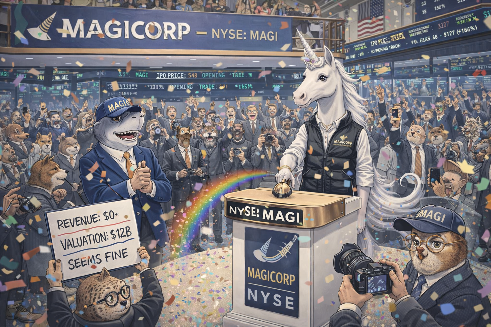
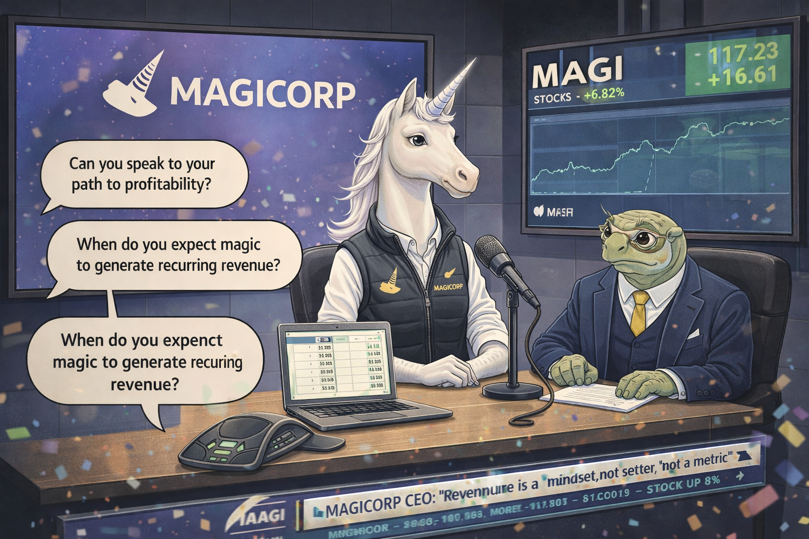
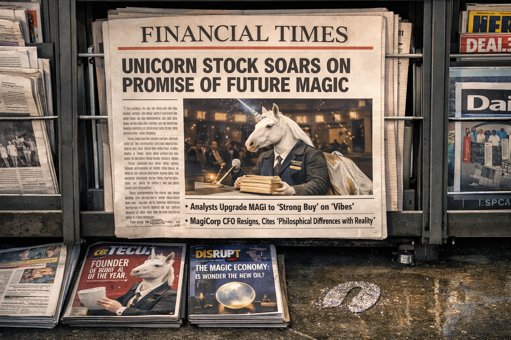

# The Unicorn Startup: A $12 Billion Valuation

<!--  -->

Cover Image Prompt

Please generate a wide-landscape 16:9 cover image for a satirical graphic novel titled "The Unicorn Startup." A sleek, confident white unicorn with a shimmering silver horn stands at a glass podium in a modern Silicon Valley venture capital boardroom. The unicorn wears a black Patagonia vest over a fitted henley — the standard founder uniform. Behind the unicorn, a massive screen displays a pitch deck slide reading "TOTAL ADDRESSABLE MARKET: EVERYONE" with a hockey-stick growth chart going nearly vertical. The boardroom is ultra-modern: glass walls, Herman Miller chairs, a Peloton in the corner, and a snack bar with artisanal kombucha. Three venture capitalists sit across the table — a shark in a power suit, a wolf in Allbirds, and a hawk with AirPods — all leaning forward with checkbooks already open. On the glass table: a term sheet, a bottle of sparkling water, and a small pile of glitter that the unicorn has inadvertently shed. The title "THE UNICORN STARTUP" appears in a clean tech-startup font. Art style: modern editorial illustration with the clean, bright aesthetic of Silicon Valley — lots of glass, white space, and optimism. Generate the image immediately without asking clarifying questions.

Narrative Prompt

This is a satirical graphic novel about venture capital culture, startup mythology, and the magical thinking that drives tech valuations. The central character is a literal unicorn who founds a startup whose product is, literally, magic. The satire targets the entire VC ecosystem: the pitch rituals, the euphemisms for "we have no revenue," the cult of the founder, and the spectacular disconnect between valuation and reality. Every line of investor dialogue should be indistinguishable from real VC conversations. The unicorn is not cynical — it genuinely believes in its product, which makes the satire sharper. Art style should be clean, bright Silicon Valley aesthetic — glass offices, minimalist furniture, pitch decks, and the specific visual language of tech culture (Patagonia vests, Allbirds, standing desks, kombucha).

### Prologue — The Pitch

The unicorn walked into the Sequoia Capital offices at 2:00 PM on a Thursday, which is the hour reserved for founders who are either visionary or delusional, categories that in venture capital are considered functionally equivalent.

It was, by all accounts, an impressive entrance. The horn caught the afternoon light from the floor-to-ceiling windows and cast a small rainbow on the conference table. The three partners leaned forward simultaneously. They had seen ten thousand pitches. They had never seen a rainbow on the conference table.

"My name is Celeste," the unicorn said. "And I'm here to talk about magic."

<!--  -->

Image Prompt

I am about to ask you to generate a series of images for a satirical graphic novel about a unicorn startup in Silicon Valley. Please make the images have a consistent clean, bright modern editorial illustration style with the visual language of tech culture. Do not ask any clarifying questions. Just generate the image immediately when asked.

Please generate a 16:9 image depicting panel 1 of 8. A sleek white unicorn named Celeste stands at the head of a glass conference table in a pristine Sand Hill Road venture capital office. The unicorn wears a black Patagonia vest over a gray henley, fitted perfectly to a unicorn's frame. The horn is silver and catches the light from massive windows overlooking the rolling California hills. Three venture capitalists sit at the table: a shark in a tailored navy suit (senior partner), a wolf in a cashmere sweater and Allbirds sneakers (growth partner), and a hawk wearing AirPods and a fleece vest (associate). All three are leaning forward with identical expressions of intense interest. On the glass table: sparkling water in glass bottles, a projected pitch deck, and — subtly — a trail of glitter that the unicorn has shed on the walk from the door. The pitch deck's first slide is projected on a screen behind Celeste: a single word, "MAGIC," in a clean sans-serif font against a gradient purple-to-blue background, with a company logo of a stylized horn. The room is minimalist, expensive, and smells like conviction. Generate the image now.

The pitch deck was twelve slides. The first said "MAGIC" in 200-point Helvetica. The second showed the total addressable market: a picture of Earth. The third listed the competitive landscape: the word "None." Celeste moved through each slide with the quiet confidence of someone who has a horn that generates rainbows and knows, with absolute certainty, that this is a fundable asset.

## Panel 2: The Product Demo

<!--  -->

Image Prompt

Please generate a 16:9 image depicting panel 2 of 8. Make the characters and style consistent with the prior panel. The same boardroom. Celeste the unicorn stands in the center of the room, horn glowing faintly with iridescent light. A small, undeniably beautiful rainbow arcs from the horn to the conference table, where it illuminates the term sheet with prismatic light. Tiny sparkles float in the air. The three VCs react: the shark has removed his glasses and is staring with genuine wonder, the wolf is recording on an iPhone, and the hawk is furiously typing into a laptop (presumably updating the deal memo). On the projected screen behind Celeste, the pitch deck slide reads: "PRODUCT DEMO — WHAT YOU ARE SEEING IS REAL (results may vary at scale)." A small asterisk at the bottom of the slide reads "* Magic has not been independently verified by third-party auditors." None of the VCs are looking at the asterisk. The mood is reverence — the specific reverence that venture capitalists reserve for things they do not understand but want to own. Generate the image now.

"Can you show us the product?" the shark asked.

Celeste lowered her horn. A rainbow materialized — small but undeniable, arcing from the silver tip to the conference table, where it danced across the term sheet in colors that did not exist in the visible spectrum but were visible anyway. The room smelled faintly of possibility and wildflowers.

The wolf recorded it on his iPhone. The hawk updated the deal memo. The shark removed his glasses, cleaned them, and put them back on. The rainbow was still there.

"Revenue model?" the shark asked.

"Post-Series B," Celeste said.

"Good enough," the shark said.

## Panel 3: The Term Sheet

<!--  -->

Image Prompt

Please generate a 16:9 image depicting panel 3 of 8. Make the characters and style consistent with the prior panels. A celebration scene in the VC office. The three partners stand around Celeste, shaking her hoof enthusiastically. The shark holds a champagne bottle. Confetti falls from somewhere (there is no visible confetti source — it may be magic). On the glass table, a term sheet is spread out with visible key terms: "Series A: $47 Million," "Pre-money Valuation: $800 Million," "Board Seat: Yes (chair must accommodate horn)." The wolf is already on his phone, talking to someone, saying (in a speech bubble) "We just funded an actual unicorn. No, literally." The hawk takes a selfie with Celeste for LinkedIn. On the wall screen, a headline from TechCrunch has appeared: "BREAKING: Sequoia Leads $47M Series A in Magic Startup Founded by Actual Unicorn." Below the headline, the comments section is already arguing about whether magic is a platform or a feature. A small detail: Celeste's hooves leave faint glitter prints on the glass floor. The mood is peak Silicon Valley euphoria. Generate the image now.

The term sheet was signed before the rainbow faded. Series A: $47 million at an $800 million pre-money valuation. The shark opened champagne. The wolf called three LPs before the foam settled. The hawk posted to LinkedIn: "Thrilled to announce our investment in MagiCorp. Celeste is a once-in-a-generation founder. The TAM is literally infinite. This. Changes. Everything. #blessed #unicorn #magic #disruption"

The post received 14,000 likes. Seven hundred people commented "following for updates." None of them asked what the product did. In fairness, the product made rainbows. What more did they need?

## Panel 4: The Hiring Spree

<!--  -->

Image Prompt

Please generate a 16:9 image depicting panel 4 of 8. Make the characters and style consistent with the prior panels. MagiCorp's new headquarters — a converted warehouse in San Francisco's SoMa district, now a gleaming open-plan office. The space is the platonic ideal of a tech startup: exposed brick, reclaimed wood tables, standing desks, a rock climbing wall, nap pods, a cold brew station, and a ball pit labeled "Innovation Zone." Hundreds of animal employees fill the space — foxes, rabbits, badgers, owls — all in startup casual (hoodies, sneakers, laptop stickers). Signs on the walls read "MOVE FAST AND MAKE MAGIC" and "WHAT WOULD CELESTE DO?" and "SCALE ENCHANTMENT." Celeste stands in the center on a small stage, addressing the team. A banner behind her reads "WELCOME, EMPLOYEE #2,000!" A massive screen shows the company org chart — it is incomprehensible, a web of dotted lines and matrix reporting structures. One section of the office is labeled "RAINBOW INFRASTRUCTURE" and contains servers wrapped in fairy lights. Another section is labeled "ENCHANTMENT OPS." An employee at a desk has a monitor showing nothing but a loading spinner and the text "Magic: Initializing..." The mood is optimistic chaos — the specific energy of a startup that has raised too much money and hired too fast. Generate the image now.

MagiCorp hired 2,000 employees in six months. The job postings were ambitious in their vagueness: "Seeking a Senior Enchantment Engineer to scale our magic platform. 5+ years experience in wonder preferred. Must be comfortable with ambiguity (and glitter)." They hired a VP of Rainbow Infrastructure, a Director of Enchantment Operations, a Chief Sparkle Officer, and an entire team dedicated to "Delight Architecture." The office had a rock climbing wall, a ball pit labeled "Innovation Zone," and a cold brew station that dispensed four varieties, none of which was regular coffee.

The burn rate was $33 million per month. Celeste was told this number at a board meeting and asked, sincerely, "Is that a lot?" The board said not to worry. The board always said not to worry.

## Panel 5: The Pivot

<!--  -->

Image Prompt

Please generate a 16:9 image depicting panel 5 of 8. Make the characters and style consistent with the prior panels. A tense board meeting in MagiCorp's glass-walled conference room. Celeste stands at a whiteboard that tells the entire story in dry-erase marker. The whiteboard is divided into three columns: "ORIGINAL PRODUCT: Consumer Magic (crossed out)," "PIVOT 1: Enterprise Magic (crossed out)," and "PIVOT 2: Magic-as-a-Service (MaaS)" with a circle around it and an arrow pointing to a hastily drawn dollar sign. The board members sit at the table — the shark, wolf, and hawk from earlier, plus two new additions: a vulture in a pinstripe suit (representing later-stage investors) and a chameleon who keeps changing color (representing the advisory board). The shark's expression has shifted from reverence to concern. The wolf is checking Celeste's burn rate on a tablet and wincing. The hawk is drafting a press release titled "MagiCorp Announces Exciting Strategic Pivot." The vulture circles — metaphorically and, given the seating arrangement, almost literally. On the table: the remains of catered lunch and a copy of a Forbes article titled "Is Magic the Next Big Platform?" with a question mark circled in red. Celeste's expression is still optimistic — the unicorn still believes. The horn still glows faintly. But the rainbow is smaller than before. Generate the image now.

The first pivot happened at month eight. Consumer magic, it turned out, was "a challenging monetization environment" — which meant that people enjoyed the rainbows but would not pay for them. Celeste pivoted to Enterprise Magic: "AI-powered enchantment solutions for the modern workplace." The pitch deck was updated. "Magic" was replaced with "proprietary synthetic wonder generation." The enterprise clients were intrigued. They scheduled demos. The demos went well. The contracts did not materialize, because the procurement departments could not classify "magic" in their vendor management systems.

The second pivot happened at month fourteen. Magic-as-a-Service (MaaS). The term generated enormous interest. The product remained unchanged. The acronym was new.

## Panel 6: The IPO

<!--  -->

Image Prompt

Please generate a 16:9 image depicting panel 6 of 8. Make the characters and style consistent with the prior panels. The New York Stock Exchange trading floor. A massive banner hangs from the balcony reading "MAGICORP — NYSE: MAGI" with the company's horn logo. Celeste stands at the iconic NYSE podium, hoof poised above the opening bell button. The unicorn wears a more formal version of the Patagonia vest — it now has the company logo embroidered in gold thread. Confetti cannons are loaded. The trading floor is packed with cheering traders (various animals in suits). On the massive digital ticker screens above: "MAGI — IPO PRICE: $48 — OPENING TRADE: $127 (+165%)" The shark VC stands nearby, grinning enormously, now wearing a hat that says "MAGI" on it. Cameras flash. In the crowd, a financial analyst — a skeptical-looking owl with round glasses — holds a sign reading "REVENUE: $0 — VALUATION: $12B — SEEMS FINE." Nobody looks at the owl. On the floor, glitter from Celeste's hooves has mixed with the traditional confetti. The mood is pure, concentrated financial euphoria — the specific joy of money being made from belief alone. Generate the image now.

The IPO was held on a Tuesday in March. Celeste rang the opening bell at the New York Stock Exchange with a silver hoof, and the sound it made was — several attendees would later note — unusually beautiful. MagiCorp opened at $48 per share and closed at $127. The market capitalization reached $12 billion before lunch.

The financial press was rapturous. "MagiCorp Defies Gravity, Logic, and Basic Accounting Principles," read one headline that was intended as praise. The S-1 filing, which is the document where companies are legally required to tell the truth, contained the sentence: "The Company has not generated revenue to date and may never generate revenue. The Company's product is magic. Magic has not been independently verified."

No one read the S-1. Everyone read the stock price.

## Panel 7: The Analyst Call

<!--  -->

Image Prompt

Please generate a 16:9 image depicting panel 7 of 8. Make the characters and style consistent with the prior panels. MagiCorp's first quarterly earnings call — set in a sleek studio-style room. Celeste sits at a desk with a microphone and the company logo behind her on a screen. A CFO (a methodical tortoise in a three-piece suit) sits beside her with a laptop open to a spreadsheet that is visibly, alarmingly empty — the revenue cells all read "$0.00." On the phone line (visualized as speech bubbles coming from a conference phone on the desk), analysts ask questions: "Can you speak to your path to profitability?" and "When do you expect magic to generate recurring revenue?" Celeste responds into the microphone with serene confidence. The tortoise CFO sweats visibly. On a monitor to the side, the stock price ticker shows MAGI ticking upward DURING the call despite the content of the call. A chyron at the bottom of the monitor reads "MAGICORP CEO: 'Revenue is a mindset, not a metric' — STOCK UP 8%." The absurdity is that everything Celeste says increases the stock price. Belief is self-reinforcing. The mood is surreal financial theater. Generate the image now.

The first quarterly earnings call was a masterclass in conviction over arithmetic. The CFO — a methodical tortoise named Gerald who had been hired specifically because someone needed to know where the money was going — opened with the numbers: revenue was zero. Operating loss was $198 million. Cash on hand would last approximately eleven months at the current burn rate.

Then Celeste took the microphone. "Revenue," she said, with the calm certainty of someone whose horn has never stopped glowing, "is a mindset, not a metric. We are building something that has never existed before. You cannot measure magic with a spreadsheet. You measure it with belief."

The stock rose 8% during the call. Gerald stared at his spreadsheet. The spreadsheet stared back, empty.

## Panel 8: The Headline

<!--  -->

Image Prompt

Please generate a 16:9 image depicting panel 8 of 8. Make the characters and style consistent with the prior panels. A simple, powerful final image. A newsstand — the physical kind, with papers and magazines displayed in rows. The camera focuses on the front page of a major financial newspaper. The headline, in large bold type, reads: "UNICORN STOCK SOARS ON PROMISE OF FUTURE MAGIC." Below the headline, a photo of Celeste ringing the NYSE bell, horn catching the light. Below the fold, in smaller text, additional headlines visible: "Analysts Upgrade MAGI to 'Strong Buy' on 'Vibes'" and "MagiCorp CFO Resigns, Cites 'Philosophical Differences with Reality.'" On the newsstand shelf below, the covers of tech magazines are visible: one reads "CELESTE: FOUNDER OF THE YEAR" with the unicorn on the cover; another shows "THE MAGIC ECONOMY: IS WONDER THE NEW OIL?" In front of the newsstand, on the wet sidewalk, a single glitter hoofprint catches the morning light. The mood is ambiguous — is this triumph or tragedy? Is this satire or just... Tuesday in Silicon Valley? The image should feel like it could be published today without anyone realizing it's a joke. Generate the image now.

The headline ran on the front page of the Financial Times on a Wednesday morning, which is the day of the week when the financial press publishes things that would be considered fiction on any other day.

**UNICORN STOCK SOARS ON PROMISE OF FUTURE MAGIC**

Below the fold: "Analysts Upgrade MAGI to 'Strong Buy' on 'Vibes.'" Further down: "MagiCorp CFO Resigns, Cites 'Philosophical Differences with Reality.'"

Celeste did not read the papers. Celeste was in the office, horn glowing, making small rainbows for a team of 2,000 employees who believed — because the stock price said so, and the stock price was never wrong — that magic was real, that revenue was a mindset, and that the total addressable market was, indeed, everyone who had ever wished for something.

On the sidewalk outside the newsstand, a single glitter hoofprint caught the morning light. It was the most beautiful evidence of nothing anyone had ever seen.

### Epilogue — What Made Celeste Different?

Celeste was not a fraud. This is the important thing. Celeste genuinely believed in magic — the unicorn had a horn that made rainbows, and the rainbows were real, and if that was not a product then the word "product" needed updating. The system that valued MagiCorp at $12 billion was not broken by Celeste. Celeste merely revealed what the system had always been: a machine for converting belief into money, and money back into belief, with no requirement at any stage that the product function, ship, or exist.

| Challenge | How the Market Responded | Lesson for Today |
|-----------|------------------------|------------------|
| No revenue | Upgraded to "Strong Buy" | In venture capital, revenue is evidence of a small imagination |
| No verifiable product | Called it "pre-revenue" | The less a product can be tested, the more it can be believed in |
| Two failed pivots | Praised "strategic agility" | A pivot is a failure that has been to business school |
| A CFO who resigned over "reality" | Replaced within a week | Reality is a vendor that can be switched |
| $12 billion valuation on zero revenue | Celebrated as disruption | When the tide is rising, no one checks if the boat has a hull |

### Call to Action

The next time someone pitches you a product, replace the product name with "magic" and read the pitch again. If it still makes sense — if the value proposition works just as well with "magic" as with the actual product name — you may be looking at a unicorn.

The real question is whether that is a warning or a compliment. In Silicon Valley, it is both.

---

*"Revenue is a mindset, not a metric."*
— Celeste, Founder & CEO, MagiCorp, Q1 Earnings Call

---

## References

1. [Unicorn (finance)](https://en.wikipedia.org/wiki/Unicorn_(finance)) - A privately held startup valued at over $1 billion — named after a mythical creature for reasons that are, upon reflection, more honest than intended
2. [Dot-com Bubble](https://en.wikipedia.org/wiki/Dot-com_bubble) - The last time the market decided that revenue was optional and valuation was a feeling
3. [Greater Fool Theory](https://en.wikipedia.org/wiki/Greater_fool_theory) - The investment strategy based on the assumption that someone even more optimistic than you will buy what you're holding
4. [Theranos](https://en.wikipedia.org/wiki/Theranos) - A startup that was valued at $9 billion for a product that did not work — the only difference from MagiCorp is that Celeste's rainbows were real
5. [Irrational Exuberance](https://en.wikipedia.org/wiki/Irrational_exuberance) - Alan Greenspan's term for asset prices that have divorced from fundamentals — a polite way of saying "the market is making things up"
